# PRD-to-PRPROMPTS Generator

<div align="center">

[](https://www.npmjs.com/package/prprompts-flutter-generator)
[](https://www.npmjs.com/package/prprompts-flutter-generator)
[](https://opensource.org/licenses/MIT)
[](docs/NEW-FEATURES-V3.md)
[](#creating-your-prd)
[](#what-gets-generated)
[](#security--compliance)
[](#v40-full-automation-new)
[](#v40-full-automation-new)

[](CLAUDE.md)
[](QWEN.md)
[](GEMINI.md)
[](https://flutter.dev)

[](WINDOWS.md)
[](#)
[](#)

</div>

---

<div align="center">

## **Transform Your PRD into 32 Secure, Production-Ready Development Guides**

**Automatically generate customized PRPROMPTS files for Flutter projects with strict security patterns, Clean Architecture, and compliance-aware guidance.**

**⏱️ Setup: 30 seconds** • **🤖 NEW v4.0: Full Automation** • **⚡ 40-60x Faster** • **🔒 Security Audited**

</div>

<div align="center">

### **🚀 One Command. Complete Setup.**

**🆕 v4.0.0 - Now Published on npm! (Easiest!):**
```bash
# Install via npm (works on Windows/macOS/Linux)
npm install -g prprompts-flutter-generator

# Then use anywhere:
prprompts create       # Create PRD
prprompts generate     # Generate all 32 files
```

**✨ NEW: Includes all 3 AI extensions (Claude, Qwen, Gemini) with v4.0 automation!**

**Alternative Methods:**

**Windows PowerShell:**
```powershell
irm https://raw.githubusercontent.com/Kandil7/prprompts-flutter-generator/master/scripts/setup-gist.ps1 | iex
```

**Linux / macOS / Git Bash:**
```bash
curl -sSL https://raw.githubusercontent.com/Kandil7/prprompts-flutter-generator/master/scripts/smart-install.sh | bash
```

[📦 Quick Install](#installation) • [🪟 Windows Guide](WINDOWS-QUICKSTART.md) • [✨ v3.0 Features](#v30-new-features) • [📖 Docs](docs/PRPROMPTS-SPECIFICATION.md)

</div>

---

## 🤖 v4.0: Full Automation (NEW!)

<div align="center">

**🚀 Go from PRD to working code automatically!**

**Zero-touch automation with PRPROMPTS-guided implementation**

</div>

### Complete Automation Pipeline

```bash
# 1. Generate PRPROMPTS (60 seconds)
prprompts auto && prprompts generate

# 2. Start AI assistant
claude  # or qwen, or gemini

# 3. Bootstrap project (2 minutes)
/bootstrap-from-prprompts

# 4. Auto-implement features (1-2 hours)
/full-cycle
10

# 5. QA audit (2 minutes)
/qa-check
```

### New Automation Commands

<table>
<tr>
<td width="50%">

**`/bootstrap-from-prprompts`**
Complete project setup in 2-5 minutes:
- ✅ Clean Architecture structure
- ✅ Design system (Material 3)
- ✅ Security infrastructure (JWT, encryption)
- ✅ Test infrastructure
- ✅ ARCHITECTURE.md & IMPLEMENTATION_PLAN.md

</td>
<td width="50%">

**`/implement-next`**
Auto-implement next task:
- ✅ Follows PRPROMPTS patterns
- ✅ Generates comprehensive tests
- ✅ Security validation (JWT, PCI-DSS, HIPAA)
- ✅ Code quality checks
- ✅ Automatic staging

</td>
</tr>
<tr>
<td width="50%">

**`/review-and-commit`**
Validate and commit:
- ✅ PRPROMPTS compliance check
- ✅ Security validation
- ✅ Test coverage verification
- ✅ Code formatting
- ✅ Conventional commit messages

</td>
<td width="50%">

**`/full-cycle`**
Complete automation loop:
- ✅ Implement multiple tasks (1-10)
- ✅ Auto-test each task
- ✅ Auto-commit with validation
- ✅ Progress tracking
- ✅ Quality gate at end

</td>
</tr>
<tr>
<td colspan="2">

**`/qa-check`**
Comprehensive PRPROMPTS compliance audit:
- ✅ Architecture validation (Clean Architecture, BLoC)
- ✅ Security patterns (JWT verification, PII encryption, PCI-DSS)
- ✅ Test coverage (>70%)
- ✅ Static analysis (flutter analyze)
- ✅ Generates QA_REPORT.md with compliance score

</td>
</tr>
</table>

### Example: Healthcare App Automation

```bash
# Complete healthcare app in 2-3 hours (vs 2-3 days manual)
cd ~/projects/healthtrack-pro
flutter create .

# Generate PRPROMPTS with HIPAA compliance
cp templates/healthcare.md project_description.md
prprompts auto && prprompts generate

# Auto-bootstrap
claude
/bootstrap-from-prprompts

# Auto-implement 15 features
/full-cycle
15

# Security audit
/qa-check

# Result: Production-ready HIPAA-compliant app!
# - JWT verification (RS256)
# - PHI encryption (AES-256-GCM)
# - Audit logging
# - 85% test coverage
# - Zero security violations
```

### What Gets Automated

<table>
<tr>
<th>Manual (3-5 days)</th>
<th>Automated with v4.0 (2-3 hours)</th>
</tr>
<tr>
<td>

- Set up folder structure
- Configure dependencies
- Create design system
- Implement security
- Write features
- Generate tests
- Fix bugs
- Run QA
- Make commits

</td>
<td>

**All of this happens automatically:**
- `/bootstrap-from-prprompts` - Setup (2 min)
- `/full-cycle` - Implement & test (1-2 hours)
- `/qa-check` - Validate (2 min)

**Every line follows PRPROMPTS patterns**
**Security built-in (JWT, encryption, compliance)**
**Tests auto-generated and passing**

</td>
</tr>
</table>

### Installation

```bash
# Install automation commands (works with existing installation)
./scripts/install-automation-commands.sh --global

# Verify commands available
claude  # In Claude Code, you'll see all 5 automation commands
```

**Works with:**
- ✅ Claude Code
- ✅ Qwen Code
- ✅ Gemini CLI

📖 **[Complete Automation Guide](docs/AUTOMATION-GUIDE.md)** - Full workflow examples, troubleshooting, security validation

---

## ✨ v3.0 New Features

<div align="center">

**🎉 Major update with powerful installation improvements!**

</div>

<table>
<tr>
<td width="50%">

### 🤖 Smart Unified Installer
**One command to install everything**
- Auto-detects your OS and AI assistants
- Offers to install missing AIs
- Installs commands for all detected AIs
- Creates unified configuration
- Beautiful interactive prompts

</td>
<td width="50%">

### 🔧 Unified CLI (`prprompts` command)
**Single interface for all AIs**
```bash
prprompts create     # Instead of claude/qwen/gemini
prprompts generate   # Uses your preferred AI
prprompts switch ai  # Change default AI
prprompts doctor     # Diagnose issues
```

</td>
</tr>
<tr>
<td width="50%">

### 🔄 Auto-Update System
**Stay current effortlessly**
- One-command updates from GitHub
- Automatic backup before update
- Rollback capability
- Version checking

```bash
prprompts update     # Update to latest
```

</td>
<td width="50%">

### 📦 Project Templates
**Quick start for common projects**
- Healthcare (HIPAA-compliant)
- Fintech (PCI-DSS compliant)
- E-Commerce
- Generic apps

Pre-configured with best practices!

</td>
</tr>
<tr>
<td width="50%">

### 🐚 Shell Completions
**Tab completion for faster workflow**
- Bash, Zsh, Fish support
- Command completion
- AI name completion
- File name completion

</td>
<td width="50%">

### 🩺 Doctor Command
**Instant diagnostics**
```bash
prprompts doctor
```
Checks Node.js, npm, Git, AIs, configs, and more!

</td>
</tr>
</table>

<div align="center">

**[📖 Read Full v3.0 Feature Guide](docs/NEW-FEATURES-V3.md)**

</div>

---

## 🎉 v4.0.0 Latest Update - Full Extension Ecosystem on npm!

<div align="center">

**🚀 Now published on npm with complete AI extension support!**

**✨ 3 Official Extensions • 5 Automation Commands • 14 Commands Per AI**

</div>

<table>
<tr>
<td width="50%">

### 🎁 Complete Extension Ecosystem
**All 3 AI extensions included!**

**Claude Code Extension:**
- 9.5/10 accuracy
- Production-quality
- Official Anthropic support

**Qwen Code Extension:**
- 256K-1M token context
- Extended context analysis
- Cost-effective

**Gemini CLI Extension:**
- 1M token context
- 60 req/min FREE tier
- Best for MVPs

</td>
<td width="50%">

### 🤖 Full Automation (v4.0)
**40-60x faster development!**

**5 Automation Commands:**
1. `/bootstrap-from-prprompts` - Setup (2 min)
2. `/implement-next` - Auto-code (10 min)
3. `/full-cycle` - 1-10 features (1-2 hours)
4. `/review-and-commit` - Validate
5. `/qa-check` - Compliance audit

**Result:** Production-ready app in 2-3 hours vs 3-5 days!

</td>
</tr>
<tr>
<td colspan="2">

### 📦 One Command Installation
```bash
# Install everything at once (30 seconds)
npm install -g prprompts-flutter-generator
```

**What gets installed:**
- ✅ All 3 AI extensions (Claude, Qwen, Gemini)
- ✅ 5 automation commands per AI (14 total commands)
- ✅ 32 security-audited development guides
- ✅ Project templates (Healthcare, Fintech, E-commerce)
- ✅ Unified CLI (`prprompts` command)
- ✅ Auto-configuration for detected AIs
- ✅ Shell completions (Bash/Zsh/Fish)

**Then use anywhere:**
```bash
cd your-flutter-project
prprompts create && prprompts generate  # Generate PRPROMPTS (60 sec)
claude bootstrap-from-prprompts         # Setup project (2 min)
claude full-cycle                       # Auto-implement (1-2 hours)
```

</td>
</tr>
</table>

**Upgrade from previous versions:**
```bash
# Update to v4.0.0 with extensions
npm update -g prprompts-flutter-generator

# Verify
prprompts --version  # Should show 4.0.0
prprompts doctor     # Check extension status
```

---

## 📊 At a Glance

<table>
<tr>
<td width="33%" align="center">

### 🤖 Full Automation (v4.0)
2-3 hours vs 3-5 days<br/>40-60x faster development

</td>
<td width="33%" align="center">

### 32 Files Generated
Complete development guides<br/>covering all aspects

</td>
<td width="33%" align="center">

### 3 AI Assistants
Claude • Qwen • Gemini<br/>Choose your favorite

</td>
</tr>
<tr>
<td width="33%" align="center">

### 6 Compliance Standards
HIPAA • PCI-DSS • GDPR<br/>SOC2 • COPPA • FERPA

</td>
<td width="33%" align="center">

### 5 Automation Commands
Bootstrap • Implement • Review<br/>Full-Cycle • QA Check

</td>
<td width="33%" align="center">

### 3 Platforms
Windows • macOS • Linux<br/>Native installers

</td>
</tr>
</table>

---

## 🎯 How It Works

```mermaid
graph LR
    A[📝 Your PRD] --> B{Generator}
    B --> C[🏗️ Phase 1: Architecture<br/>10 files]
    B --> D[🔒 Phase 2: Quality & Security<br/>12 files]
    B --> E[📊 Phase 3: Demo & Learning<br/>10 files]
    C --> F[✨ 32 Custom Guides]
    D --> F
    E --> F
    F --> G[🚀 Start Building]
```



**The Process:**
1. **Create PRD** (1-5 min) - Auto-generate, use wizard, or convert existing docs
2. **Generate PRPROMPTS** (60 sec) - AI creates 32 customized development guides
3. **Start Coding** - Reference guides during development with confidence

---

## 🤖 Choose Your AI Assistant

<table>
<tr>
<th>Feature</th>
<th>🔵 Claude Code</th>
<th>🟠 Qwen Code</th>
<th>🟢 Gemini CLI</th>
</tr>
<tr>
<td><strong>Context Window</strong></td>
<td>200K tokens</td>
<td>256K-1M tokens</td>
<td>✨ <strong>1M tokens</strong></td>
</tr>
<tr>
<td><strong>Free Tier</strong></td>
<td>20 messages/day</td>
<td>Self-host</td>
<td>✨ <strong>60 req/min<br/>1,000/day</strong></td>
</tr>
<tr>
<td><strong>API Cost</strong></td>
<td>$3-15/1M tokens</td>
<td>$0.60-3/1M tokens</td>
<td>✨ <strong>FREE</strong> (preview)</td>
</tr>
<tr>
<td><strong>Accuracy</strong></td>
<td>⭐⭐⭐⭐⭐ 9.5/10</td>
<td>⭐⭐⭐⭐ 9.0/10</td>
<td>⭐⭐⭐⭐ 8.5/10</td>
</tr>
<tr>
<td><strong>Best For</strong></td>
<td>Production apps</td>
<td>Large codebases</td>
<td>MVPs, Free tier</td>
</tr>
<tr>
<td><strong>Commands</strong></td>
<td colspan="3" align="center"><strong>Identical across all 3!</strong> Just replace <code>claude</code> with <code>qwen</code> or <code>gemini</code></td>
</tr>
</table>

**Installation:**
```bash
# Install one or all
./scripts/install-commands.sh --global     # Claude Code
./scripts/install-qwen-commands.sh --global    # Qwen Code
./scripts/install-gemini-commands.sh --global  # Gemini CLI
./scripts/install-all.sh --global              # All 3 at once 🚀
```

📖 **Detailed Comparison:** [Claude vs Qwen vs Gemini](docs/AI-COMPARISON.md)

---

## 🎁 Official AI Extensions (v4.0)

**Each AI assistant now has a dedicated extension!** Install PRPROMPTS as a proper extension with optimized configurations:

<table>
<tr>
<th width="33%">🔵 Claude Code</th>
<th width="33%">🟠 Qwen Code</th>
<th width="33%">🟢 Gemini CLI</th>
</tr>
<tr>
<td>

**Production-Quality Extension**

📦 [claude-extension.json](claude-extension.json)

**Install:**
```bash
bash install-claude-extension.sh
```

**Best For:**
- Production apps
- Mission-critical systems
- Enterprise clients
- Healthcare/Finance

**Highlights:**
- 9.5/10 accuracy
- Official Anthropic support
- Strong security focus
- Best reasoning

</td>
<td>

**Extended-Context Extension**

📦 [qwen-extension.json](qwen-extension.json)

**Install:**
```bash
bash install-qwen-extension.sh
```

**Best For:**
- Large codebases
- Cost-sensitive projects
- Self-hosting
- Entire monorepos

**Highlights:**
- 256K-1M token context
- State-of-the-art agentic
- Open source
- Cost-effective

</td>
<td>

**Free-Tier Extension**

📦 [gemini-extension.json](gemini-extension.json)

**Install:**
```bash
bash install-gemini-extension.sh
```

**Best For:**
- MVPs & prototypes
- Free tier usage
- CI/CD automation
- Students/learning

**Highlights:**
- 1M token context
- 60 req/min FREE
- No credit card
- Google integration

</td>
</tr>
<tr>
<td colspan="3" align="center">

**📖 Full Documentation:**
[Claude Code Guide](CLAUDE.md) • [Qwen Code Guide](QWEN.md) • [Gemini CLI Guide](GEMINI.md)

**All extensions include:** v4.0 automation • 14 commands • Extension manifest • Optimized configs • Quick Start guides

</td>
</tr>
</table>

### Extension Features

✅ **Extension Manifest** - Proper extension.json with full metadata
✅ **Dedicated Installer** - AI-specific installation scripts
✅ **Optimized Configs** - Tuned for each AI's strengths
✅ **v4.0 Automation** - All 5 automation commands included
✅ **Complete Docs** - Full setup & usage guides
✅ **npm Support** - Auto-install via postinstall script

### Quick Extension Setup

**Option 1: npm (Easiest)**
```bash
# Automatically installs extension for detected AIs
npm install -g prprompts-flutter-generator
```

**Option 2: Extension Script (AI-specific)**
```bash
# Clone repo once
git clone https://github.com/Kandil7/prprompts-flutter-generator.git
cd prprompts-flutter-generator

# Install extension for your AI
bash install-claude-extension.sh   # Claude Code
bash install-qwen-extension.sh     # Qwen Code
bash install-gemini-extension.sh   # Gemini CLI
```

**Option 3: Install All Extensions**
```bash
# Install extensions for all 3 AIs at once
bash install-claude-extension.sh
bash install-qwen-extension.sh
bash install-gemini-extension.sh
```

---

## 💡 Why Use This?

### ❌ The Problem

Most Flutter projects face these challenges:

| Challenge | Impact | Cost |
|-----------|--------|------|
| **No security guidelines** | Critical vulnerabilities (JWT signing in Flutter, storing credit cards) | High risk |
| **Inconsistent patterns** | Every developer does things differently | Slow onboarding |
| **Missing compliance docs** | HIPAA/PCI-DSS violations discovered late | Project delays |
| **Junior developer confusion** | No explanation of "why" behind decisions | Low productivity |
| **Scattered best practices** | Hours wasted searching StackOverflow | Wasted time |

### ✅ The Solution

**PRPROMPTS Generator** creates 32 customized, security-audited guides that:

<table>
<tr>
<td width="50%">

**🛡️ Security First**
- ✅ Correct JWT verification (public key only)
- ✅ PCI-DSS tokenization (never store cards)
- ✅ HIPAA encryption (AES-256-GCM for PHI)
- ✅ Compliance-aware (6 standards supported)

</td>
<td width="50%">

**🎓 Team-Friendly**
- ✅ Explains "why" behind every rule
- ✅ Real Flutter code examples
- ✅ Validation gates (checklists + CI)
- ✅ Adapts to team size (1-50+ devs)

</td>
</tr>
<tr>
<td width="50%">

**⚡ Time-Saving**
- ✅ 60-second generation
- ✅ PRD-driven customization
- ✅ 500-600 words per guide
- ✅ Pre-merge checklists included

</td>
<td width="50%">

**🔧 Tool-Integrated**
- ✅ Structurizr (C4 diagrams)
- ✅ GitHub CLI integration
- ✅ Serena MCP support
- ✅ CI/CD templates

</td>
</tr>
</table>

---

## 🔐 Security & Compliance Highlights

### ⚠️ Common Mistakes We Prevent

<details>
<summary><strong>JWT Authentication</strong> - Most Common Vulnerability</summary>

**❌ WRONG** (Security Vulnerability):
```dart
// NEVER do this - exposes private key!
final token = JWT({'user': 'john'}).sign(SecretKey('my-secret'));
```

**✅ CORRECT** (Secure Pattern):
```dart
// Flutter only verifies tokens (public key only!)
Future<bool> verifyToken(String token) async {
  final jwt = JWT.verify(
    token,
    RSAPublicKey(publicKey),  // Public key only!
    audience: Audience(['my-app']),
    issuer: 'api.example.com',
  );
  return jwt.payload['exp'] > DateTime.now().millisecondsSinceEpoch / 1000;
}
```

**Why?** Backend signs with private key (RS256), Flutter verifies with public key. This prevents token forgery.

</details>

<details>
<summary><strong>PCI-DSS Compliance</strong> - Payment Security</summary>

**❌ WRONG** (PCI-DSS Violation):
```dart
// NEVER store full card numbers!
await db.insert('cards', {'number': '4242424242424242'});
```

**✅ CORRECT** (PCI-DSS Compliant):
```dart
// Use tokenization (Stripe, PayPal, etc.)
final token = await stripe.createToken(cardNumber);
await db.insert('cards', {
  'last4': cardNumber.substring(cardNumber.length - 4),
  'token': token,  // Only store token
});
```

**Why?** Storing full card numbers requires PCI-DSS Level 1 certification. Tokenization reduces your scope.

</details>

<details>
<summary><strong>HIPAA Compliance</strong> - Healthcare Data Protection</summary>

**❌ WRONG** (HIPAA Violation):
```dart
// NEVER log PHI!
print('Patient SSN: ${patient.ssn}');
```

**✅ CORRECT** (HIPAA Compliant):
```dart
// Encrypt PHI at rest (AES-256-GCM)
final encrypted = await _encryptor.encrypt(
  patientData,
  key: await _secureStorage.read(key: 'encryption_key'),
);
await db.insert('patients', {'encrypted_data': encrypted});

// Safe logging (no PHI)
print('Patient record updated: ${patient.id}');
```

**Why?** HIPAA §164.312(a)(2)(iv) requires encryption of ePHI at rest.

</details>

### Compliance Standards Supported

| Standard | What Gets Generated | Use Case |
|----------|---------------------|----------|
| **HIPAA** | PHI encryption, audit logging, HTTPS-only | Healthcare apps |
| **PCI-DSS** | Payment tokenization, TLS 1.2+, SAQ checklist | E-commerce, Fintech |
| **GDPR** | Consent management, right to erasure, data portability | EU users |
| **SOC2** | Access controls, encryption, audit trails | Enterprise SaaS |
| **COPPA** | Parental consent, age verification | Apps for children |
| **FERPA** | Student records protection | Education apps |

---

## 📦 Installation

### ⚡ Super Quick Install - npm (Easiest!)

**🆕 v3.1 - One command for all platforms!**

```bash
npm install -g prprompts-flutter-generator
```

**That's it!** The postinstall script automatically:
- ✅ Auto-detects installed AI assistants (Claude/Qwen/Gemini)
- ✅ Configures commands for all detected AIs
- ✅ Creates unified configuration at `~/.prprompts/config.json`
- ✅ Sets up the `prprompts` CLI globally
- ✅ Copies all prompt files and templates
- ✅ Works on Windows, macOS, and Linux

**Then use anywhere:**
```bash
prprompts create      # Create PRD
prprompts generate    # Generate all 32 files
claude create-prd     # Or use AI-specific commands
```

**Why npm install is better:**

<table>
<tr>
<th>Feature</th>
<th>npm Install</th>
<th>Script Install</th>
</tr>
<tr>
<td><strong>Setup Time</strong></td>
<td>✅ 30 seconds</td>
<td>60 seconds</td>
</tr>
<tr>
<td><strong>Prerequisites</strong></td>
<td>✅ Node.js only</td>
<td>Git, bash required</td>
</tr>
<tr>
<td><strong>Windows Support</strong></td>
<td>✅ Native (cmd/PowerShell)</td>
<td>Requires PowerShell or Git Bash</td>
</tr>
<tr>
<td><strong>Updates</strong></td>
<td>✅ npm update -g</td>
<td>Manual git pull</td>
</tr>
<tr>
<td><strong>Uninstall</strong></td>
<td>✅ npm uninstall -g</td>
<td>Manual cleanup</td>
</tr>
<tr>
<td><strong>Version Management</strong></td>
<td>✅ npm handles it</td>
<td>Manual git checkout</td>
</tr>
</table>

**Don't have an AI assistant yet?**

```bash
# Install Claude Code (Recommended for production)
npm install -g @anthropic-ai/claude-code

# OR install Gemini CLI (Best free tier)
npm install -g @google/gemini-cli

# OR install Qwen Code (Best for large codebases)
npm install -g @qwenlm/qwen-code

# Then install PRPROMPTS
npm install -g prprompts-flutter-generator
```

**Complete Setup Example:**
```bash
# Full installation (30 seconds total)
npm install -g @anthropic-ai/claude-code prprompts-flutter-generator

# Verify installation
prprompts doctor

# Start using it
cd your-flutter-project
prprompts create
prprompts generate
```

---

### 🚀 Alternative Install Methods

**🆕 v3.0 Smart Installer - Auto-detects everything:**

<table>
<tr>
<th>Platform</th>
<th>Command</th>
<th>Notes</th>
</tr>
<tr>
<td><strong>🪟 Windows PowerShell</strong></td>
<td>

```powershell
irm https://raw.githubusercontent.com/Kandil7/prprompts-flutter-generator/master/scripts/setup-gist.ps1 | iex
```

</td>
<td><strong><a href="WINDOWS-QUICKSTART.md">📖 Full Windows Guide</a></strong></td>
</tr>
<tr>
<td><strong>🪟 Windows (Alternative)</strong></td>
<td>

```cmd
# Download and double-click
git clone https://github.com/Kandil7/prprompts-flutter-generator.git
cd prprompts-flutter-generator
INSTALL-WINDOWS.bat
```

</td>
<td>One-click installer included!</td>
</tr>
<tr>
<td><strong>🐧 Linux / 🍎 macOS</strong></td>
<td>

```bash
# Smart installer (v3.0) - Recommended!
curl -sSL https://raw.githubusercontent.com/Kandil7/prprompts-flutter-generator/master/scripts/smart-install.sh | bash
```

</td>
<td>Auto-detects OS & AIs</td>
</tr>
<tr>
<td><strong>Git Bash (Windows)</strong></td>
<td>

```bash
curl -sSL https://raw.githubusercontent.com/Kandil7/prprompts-flutter-generator/master/scripts/smart-install.sh | bash
```

</td>
<td>If you have Git Bash</td>
</tr>
</table>

**⚠️ Windows Users:** Don't use `bash` commands in PowerShell! Use the PowerShell method above. [See Windows Guide](WINDOWS-QUICKSTART.md)

**That's it!** Now run `prprompts create` or `claude create-prd` from any directory.

**🆕 v3.0 Unified CLI:**
```bash
# Add to PATH (one-time)
echo 'export PATH="$HOME/.prprompts/bin:$PATH"' >> ~/.bashrc
source ~/.bashrc

# Use unified commands
prprompts create      # Create PRD with your default AI
prprompts generate    # Generate all 32 PRPROMPTS
prprompts doctor      # Diagnose any issues
```

### 🔧 Manual Install (For Advanced Users)

<details>
<summary>Click to expand manual installation steps</summary>

```bash
# 1. Clone repository
git clone https://github.com/Kandil7/prprompts-flutter-generator.git
cd prprompts-flutter-generator

# 2. Install commands globally
./scripts/install-commands.sh --global

# 3. Verify installation
claude create-prd --help
```

**Windows users:** See [WINDOWS.md](WINDOWS.md) for detailed Windows installation.

</details>

### ✅ Verify Installation

```bash
# Test commands
claude create-prd --help
qwen gen-prprompts --help
gemini analyze-prd --help

# Run test suite
npm test
npm run test:commands
```

---

## 🚀 Quick Start

### 🎯 Choose Your Path

<table>
<tr>
<th>I have...</th>
<th>Command</th>
<th>Time</th>
<th>Accuracy</th>
</tr>
<tr>
<td>📝 <strong>Existing docs</strong></td>
<td><code>claude prd-from-files</code></td>
<td>2 min</td>
<td>90%</td>
</tr>
<tr>
<td>💭 <strong>Simple idea</strong></td>
<td><code>claude auto-gen-prd</code></td>
<td>1 min</td>
<td>85%</td>
</tr>
<tr>
<td>🎯 <strong>10 minutes</strong></td>
<td><code>claude create-prd</code></td>
<td>5 min</td>
<td>95%</td>
</tr>
<tr>
<td>✍️ <strong>Full control</strong></td>
<td>Copy template</td>
<td>30 min</td>
<td>100%</td>
</tr>
</table>

### 💨 Fastest Path (60 seconds total)

**🆕 With npm install (v3.1):**

```bash
# 1. Install (30 seconds)
npm install -g @anthropic-ai/claude-code prprompts-flutter-generator

# 2. Create project description (10 sec)
cat > project_description.md << 'EOF'
# HealthTrack Pro

Diabetes tracking app for patients to log blood glucose and
message their doctor. Must comply with HIPAA and work offline.

## Users
- Diabetes patients
- Endocrinologists

## Features
1. Blood glucose tracking
2. Medication reminders
3. Secure messaging
4. Health reports
EOF

# 3. Auto-generate PRD & PRPROMPTS (20 sec)
prprompts auto && prprompts generate

# Done! Start coding
cat PRPROMPTS/README.md
```

**Without npm (v3.0 method):**

```bash
# 1. Clone and install (60 sec)
git clone https://github.com/Kandil7/prprompts-flutter-generator.git
cd prprompts-flutter-generator
bash scripts/smart-install.sh

# 2. Create project description (30 sec)
cat > project_description.md << 'EOF'
# HealthTrack Pro
...
EOF

# 3. Auto-generate PRD (10 sec)
claude auto-gen-prd

# 4. Generate all 32 PRPROMPTS (50 sec)
claude gen-prprompts

# Done!
cat PRPROMPTS/README.md
```

**What gets auto-inferred:**
- ✅ Project type (healthcare)
- ✅ Compliance (HIPAA, GDPR)
- ✅ Platforms (iOS, Android)
- ✅ Auth method (JWT)
- ✅ Offline support (yes)
- ✅ Team size (medium)

📖 **Full Guides:**
- [Auto PRD Guide](docs/AUTO-PRD-GUIDE.md)
- [PRD from Files](docs/PRD-FROM-FILES-GUIDE.md)
- [Interactive Wizard](docs/PRD-GUIDE.md)
- [Usage Guide](docs/USAGE.md)

---

## 📚 What Gets Generated

### 📂 Output Structure

```
your-flutter-project/
├── lib/
├── test/
├── docs/
│   └── PRD.md              ← Your requirements
└── PRPROMPTS/              ← 33 generated files
    ├── 01-feature_scaffold.md
    ├── 02-responsive_layout.md
    ├── 03-bloc_implementation.md
    ├── 04-api_integration.md
    ├── ...
    ├── 32-lessons_learned_engine.md
    └── README.md           ← Index & usage guide
```

### 🏗️ The 32 Files (3 Phases)

<details>
<summary><strong>Phase 1: Core Architecture (10 files)</strong> - Essential development patterns</summary>

1. **Feature Scaffold** - Clean Architecture structure
2. **Responsive Layout** - Mobile/tablet/desktop UI
3. **BLoC Implementation** - State management patterns
4. **API Integration** - Auth, JWT verification, error handling
5. **Testing Strategy** - Unit/widget/integration tests
6. **Design System** - Theme, components, Material 3
7. **Junior Onboarding** - Step-by-step guide for new devs
8. **Accessibility** - WCAG 2.1 Level AA compliance
9. **Internationalization** - Multi-language support
10. **Performance** - Build times, FPS optimization

</details>

<details>
<summary><strong>Phase 2: Quality & Security (12 files)</strong> - Production readiness</summary>

11. **Git Branching** - Feature branches, PR workflows
12. **Progress Tracking** - Sprint planning, velocity
13. **Multi-Team Coordination** - API contracts, dependencies
14. **Security Audit** - Pre-release checklist, OWASP
15. **Release Management** - App Store process, versioning
16. **Security & Compliance** ⭐ - HIPAA/PCI-DSS/GDPR patterns
17. **Performance (Detailed)** - DevTools, profiling
18. **Quality Gates** - Coverage, complexity metrics
19. **Localization & A11y** - Combined L10n + accessibility
20. **Versioning** - Semantic versioning, changelogs
21. **Team Culture** - Async communication, RFCs
22. **Auto-Documentation** - dartdoc, JSDoc integration

</details>

<details>
<summary><strong>Phase 3: Demo & Learning (10 files + README)</strong> - Client success</summary>

23. **AI Pair Programming** - Claude/Copilot integration
24. **Dashboard & Analytics** - Firebase, Crashlytics
25. **Tech Debt** - Tracking and refactor strategy
26. **Demo Environment** ⭐ - PRD-specific demo data
27. **Demo Progress** - Client-facing dashboard
28. **Demo Branding** - Client-specific theming
29. **Demo Deployment** - CI/CD for demo builds
30. **Client Reports** - Weekly status templates
31. **Role Adaptation** ⭐ - Team-size specific roles
32. **Lessons Learned** - Retrospective templates
+ **README.md** - Index and usage guide

</details>

### 🎯 The PRP Pattern

Every file follows this 6-section structure:

```markdown
## FEATURE
What this guide helps you accomplish

## EXAMPLES
Real code with actual Flutter file paths

## CONSTRAINTS
✅ DO / ❌ DON'T rules

## VALIDATION GATES
Pre-commit checklist + CI/CD automation

## BEST PRACTICES
Junior-friendly "Why?" explanations

## REFERENCES
Official docs, compliance guides, ADRs
```

---

## 🎓 Examples

### Healthcare App (HIPAA)

```yaml
# docs/PRD.md
---
project_type: "healthcare"
compliance: ["hipaa", "gdpr"]
auth_method: "jwt"
sensitive_data: ["phi", "pii"]
offline_support: true
---
```

**Generated files include:**
- PHI encryption patterns (AES-256-GCM)
- HIPAA audit logging requirements
- JWT RS256 verification (public key only!)
- Offline-first sync with encryption
- Compliance checklist in File 16

📄 [See full example →](examples/healthcare-prd.md)

### Fintech App (PCI-DSS)

```yaml
# docs/PRD.md
---
project_type: "fintech"
compliance: ["pci-dss", "gdpr"]
auth_method: "oauth2"
sensitive_data: ["payment", "pii"]
real_time: true
---
```

**Generated files include:**
- Payment tokenization (Stripe/PayPal)
- PCI-DSS SAQ checklist
- TLS 1.2+ requirements
- Real-time WebSocket security
- 2+ senior approvals for payment code

📄 [See full example →](examples/fintech-prd.md)

---

## 🔧 Commands Reference

### PRD Creation

```bash
claude create-prd          # Interactive wizard (10 questions)
claude auto-gen-prd        # Auto from description file
claude prd-from-files      # From existing markdown docs
claude analyze-prd         # Validate PRD structure
```

### PRPROMPTS Generation

```bash
claude gen-prprompts       # All 32 files (60 sec)
claude gen-phase-1         # Phase 1 only (20 sec)
claude gen-phase-2         # Phase 2 only (25 sec)
claude gen-phase-3         # Phase 3 only (20 sec)
claude gen-file <name>     # Single file
```

### Complete Workflows

```bash
# From existing docs → PRPROMPTS (2 min)
claude prd-from-files && claude gen-prprompts

# From idea → PRPROMPTS (1 min)
claude auto-gen-prd && claude gen-prprompts

# Interactive → PRPROMPTS (5 min)
claude create-prd && claude gen-prprompts
```

Replace `claude` with `qwen` or `gemini` to use different AI assistants!

📖 **Full Command Reference:** [docs/API.md](docs/API.md)

---

## 💼 Practical Workflow Examples

### **Scenario 1: Complete Setup from Scratch (npm method)**

**🆕 v3.1 - Fastest way for new users!**

```bash
# Day 1: Complete Setup (90 seconds)
cd ~/projects
mkdir healthtrack-pro && cd healthtrack-pro

# Install everything at once
npm install -g @anthropic-ai/claude-code prprompts-flutter-generator

# Initialize Flutter project
flutter create .

# Use healthcare template
cat templates/healthcare.md > project_description.md

# Generate PRD and all 32 PRPROMPTS
prprompts auto && prprompts generate

# Verify installation
prprompts doctor

# Result: Ready to start coding with 32 security-audited guides!
```

### **Scenario 2: Brand New Healthcare App (git clone method)**

```bash
# Day 1: Setup (2 minutes)
cd ~/projects
mkdir healthtrack-pro && cd healthtrack-pro

# Initialize Flutter project
flutter create .

# Use healthcare template
cat > project_description.md < templates/healthcare.md

# Generate PRD with unified CLI
prprompts auto

# Generate all guides
prprompts generate

# Result: Ready to start coding with 32 security-audited guides!
```

### **Scenario 3: Adding PRPROMPTS to Existing Project**

```bash
# Navigate to your existing Flutter project
cd ~/projects/my-existing-app

# Create PRD from existing documentation
prprompts from-files
# Enter your existing docs when prompted:
#   docs/requirements.md
#   docs/architecture.md
#   docs/api-spec.md

# Review the generated PRD
cat docs/PRD.md

# Generate PRPROMPTS for existing codebase
prprompts generate

# Now you have comprehensive guides for your team!
```

### **Scenario 4: Switching Between AI Assistants**

```bash
# Check current AI
prprompts which
# Output: Current AI: claude

# Try Gemini for faster free generation
prprompts switch gemini
# Output: ✓ Default AI set to: gemini

# Generate with Gemini
prprompts generate

# Switch back to Claude for production
prprompts switch claude

# Regenerate specific file with Claude
prprompts gen-file security_and_compliance
```

### **Scenario 5: Team Onboarding**

```bash
# New developer joins the team

# 1. Quick diagnosis
prprompts doctor
# Checks: Node.js ✓, npm ✓, Claude ✓, Qwen ✗, Gemini ✓

# 2. View project guides
cd PRPROMPTS
cat README.md

# 3. Read junior onboarding guide
cat 07-junior_onboarding.md

# 4. Check security requirements
cat 16-security_and_compliance.md

# Team member is now productive in < 30 minutes!
```

### **Scenario 6: Compliance Requirement Change**

```bash
# Client now requires PCI-DSS compliance

# 1. Update PRD
vim docs/PRD.md
# Add: compliance: ["hipaa", "pci-dss", "gdpr"]

# 2. Regenerate affected files
prprompts gen-file security_and_compliance
prprompts gen-file api_integration
prprompts gen-file security_audit

# 3. Review changes
git diff PRPROMPTS/

# Now you have PCI-DSS patterns integrated!
```

### **Scenario 7: Multi-Platform Expansion**

```bash
# Originally mobile-only, now adding Web

# 1. Update PRD platforms
vim docs/PRD.md
# Change: platforms: ["ios", "android", "web"]

# 2. Regenerate responsive layout guide
prprompts gen-file responsive_layout

# 3. Regenerate design system
prprompts gen-file design_system

# 4. Check web-specific considerations
cat PRPROMPTS/02-responsive_layout.md | grep -i "web"
```

### **Scenario 8: Pre-Release Security Audit**

```bash
# Before releasing to production

# 1. Run security audit checklist
cat PRPROMPTS/14-security_audit_checklist.md

# 2. Verify compliance
cat PRPROMPTS/16-security_and_compliance.md

# 3. Check JWT implementation
grep -r "JWT" lib/ --include="*.dart"

# 4. Validate against PRPROMPTS patterns
# Review: Are we verifying tokens with public key only?
# Review: Are we using RS256, not HS256?

# Ship with confidence!
```

### **Scenario 9: Quick Template-Based Start**

```bash
# Starting a fintech app

# Use pre-configured template
cp templates/fintech.md project_description.md

# Customize for your needs
vim project_description.md

# Auto-generate PRD
prprompts auto

# Generate PRPROMPTS
prprompts generate

# You now have PCI-DSS compliant guides ready!
```

---

## 📋 Quick Reference Card

### 🆕 Unified CLI Commands (v3.0)

<table>
<tr>
<th>Command</th>
<th>Description</th>
<th>Example</th>
</tr>
<tr>
<td><code>prprompts init</code></td>
<td>Initialize PRPROMPTS in project</td>
<td><code>prprompts init</code></td>
</tr>
<tr>
<td><code>prprompts create</code></td>
<td>Interactive PRD wizard</td>
<td><code>prprompts create</code></td>
</tr>
<tr>
<td><code>prprompts auto</code></td>
<td>Auto-generate from description</td>
<td><code>prprompts auto</code></td>
</tr>
<tr>
<td><code>prprompts from-files</code></td>
<td>Generate from existing docs</td>
<td><code>prprompts from-files</code></td>
</tr>
<tr>
<td><code>prprompts analyze</code></td>
<td>Validate PRD structure</td>
<td><code>prprompts analyze</code></td>
</tr>
<tr>
<td><code>prprompts generate</code></td>
<td>Generate all 32 files</td>
<td><code>prprompts generate</code></td>
</tr>
<tr>
<td><code>prprompts gen-phase-1</code></td>
<td>Generate Phase 1 only</td>
<td><code>prprompts gen-phase-1</code></td>
</tr>
<tr>
<td><code>prprompts gen-file</code></td>
<td>Generate single file</td>
<td><code>prprompts gen-file bloc_implementation</code></td>
</tr>
<tr>
<td><code>prprompts config</code></td>
<td>Show configuration</td>
<td><code>prprompts config</code></td>
</tr>
<tr>
<td><code>prprompts switch</code></td>
<td>Change default AI</td>
<td><code>prprompts switch gemini</code></td>
</tr>
<tr>
<td><code>prprompts which</code></td>
<td>Show current AI</td>
<td><code>prprompts which</code></td>
</tr>
<tr>
<td><code>prprompts doctor</code></td>
<td>Diagnose issues</td>
<td><code>prprompts doctor</code></td>
</tr>
<tr>
<td><code>prprompts update</code></td>
<td>Update to latest version</td>
<td><code>prprompts update</code></td>
</tr>
<tr>
<td><code>prprompts version</code></td>
<td>Show version info</td>
<td><code>prprompts version</code></td>
</tr>
<tr>
<td><code>prprompts help</code></td>
<td>Show help</td>
<td><code>prprompts help</code></td>
</tr>
</table>

### 📝 Common Workflows

**🆕 Complete Setup with npm (30 seconds):**
```bash
npm install -g @anthropic-ai/claude-code prprompts-flutter-generator
prprompts auto && prprompts generate
```

**Healthcare App:**
```bash
cp templates/healthcare.md project_description.md
prprompts auto && prprompts generate
```

**Fintech App:**
```bash
cp templates/fintech.md project_description.md
prprompts auto && prprompts generate
```

**From Existing Docs:**
```bash
prprompts from-files && prprompts generate
```

**Regenerate Security File:**
```bash
prprompts gen-file security_and_compliance
```

**Switch to Gemini (Free Tier):**
```bash
prprompts switch gemini && prprompts generate
```

**Check Installation:**
```bash
prprompts doctor
```

**Update to Latest:**
```bash
npm update -g prprompts-flutter-generator
# or
prprompts update
```

### 🔄 Upgrade to v3.1

**🆕 From npm (easiest):**
```bash
# Update to latest
npm update -g prprompts-flutter-generator

# Verify
prprompts --version
prprompts doctor
```

**From git clone (v3.0):**
```bash
# Pull latest
cd prprompts-flutter-generator
git pull origin master

# Run smart installer
bash scripts/smart-install.sh

# Test unified CLI
prprompts --version
prprompts doctor
```

**Migrate from git to npm:**
```bash
# Remove old installation (optional)
rm -rf ~/prprompts-flutter-generator

# Install via npm
npm install -g prprompts-flutter-generator

# Verify
prprompts doctor
```

### 💡 Pro Tips

1. **🆕 Install Everything at Once**: Use npm to install AI + PRPROMPTS together
   ```bash
   npm install -g @anthropic-ai/claude-code prprompts-flutter-generator
   ```

2. **Quick Updates**: Check for updates regularly
   ```bash
   npm update -g prprompts-flutter-generator
   # or use built-in updater
   prprompts update
   ```

3. **Tab Completion**: Install shell completions for faster typing
   ```bash
   sudo cp completions/prprompts.bash /etc/bash_completion.d/
   ```

4. **Quick Template**: Use templates for common project types
   ```bash
   ls templates/  # See all available templates
   cp templates/healthcare.md project_description.md
   ```

5. **Selective Regeneration**: Only regenerate files that changed
   ```bash
   prprompts gen-file security_and_compliance
   prprompts gen-file api_integration
   ```

6. **Multiple AIs**: Install all 3 AIs and switch based on task
   ```bash
   npm install -g @anthropic-ai/claude-code @qwenlm/qwen-code @google/gemini-cli
   prprompts switch gemini  # For free tier
   prprompts switch claude  # For production quality
   prprompts switch qwen    # For large codebases
   ```

7. **Diagnose Issues**: Use doctor command first
   ```bash
   prprompts doctor  # Shows what's installed and configured
   ```

---

## ❓ FAQ

<details>
<summary><strong>Q: Do I need all 3 AI assistants?</strong></summary>

**A:** No! Pick one:
- **Claude Code** - Best accuracy, production apps
- **Qwen Code** - Best for large codebases, self-host
- **Gemini CLI** - Best free tier (1,000 req/day!)

Commands are identical across all 3.

</details>

<details>
<summary><strong>Q: Can I use this for existing projects?</strong></summary>

**A:** Yes! Use `claude prd-from-files` to convert existing documentation into a PRD, then generate PRPROMPTS. Works great for legacy projects needing standardization.

</details>

<details>
<summary><strong>Q: How do I customize generated files?</strong></summary>

**A:** Edit the generated PRPROMPTS files directly. Add team-specific examples, internal wiki links, or custom validation gates. See [Customization Guide](docs/CUSTOMIZATION.md).

</details>

<details>
<summary><strong>Q: Is this only for Flutter?</strong></summary>

**A:** Currently yes. The generator is optimized for Flutter with Clean Architecture + BLoC. You can fork and customize for React Native, SwiftUI, etc.

</details>

<details>
<summary><strong>Q: How often should I regenerate?</strong></summary>

**A:** Regenerate when:
- Compliance requirements change (adding HIPAA)
- Authentication method changes (JWT → OAuth2)
- New platform added (adding Web support)
- Team size changes significantly

</details>

<details>
<summary><strong>Q: Can I use this offline?</strong></summary>

**A:** Partially. Qwen Code can run locally (offline). Claude Code and Gemini CLI require internet. All generated files work offline once created.

</details>

<details>
<summary><strong>Q: What if I find a security issue?</strong></summary>

**A:** Please report security issues privately to the maintainers. See [CONTRIBUTING.md](CONTRIBUTING.md) for contact info.

</details>

<details>
<summary><strong>Q: npm install fails - how do I troubleshoot?</strong></summary>

**A:** Try these steps:

1. **Check Node.js version:**
   ```bash
   node --version  # Should be v14 or higher
   ```

2. **Clear npm cache:**
   ```bash
   npm cache clean --force
   npm install -g prprompts-flutter-generator
   ```

3. **Use sudo on macOS/Linux (if permission error):**
   ```bash
   sudo npm install -g prprompts-flutter-generator
   ```

4. **On Windows (permission error):**
   - Run cmd or PowerShell as Administrator

5. **Check installation:**
   ```bash
   prprompts doctor  # Diagnoses all issues
   ```

</details>

<details>
<summary><strong>Q: Can I install locally (not globally)?</strong></summary>

**A:** Yes, but global install is recommended:

```bash
# Local install (in project)
npm install prprompts-flutter-generator
npx prprompts create

# Global install (anywhere) - Recommended
npm install -g prprompts-flutter-generator
prprompts create
```

</details>

<details>
<summary><strong>Q: How do I update to the latest version?</strong></summary>

**A:** Simple:

```bash
# Check current version
prprompts version

# Update to latest
npm update -g prprompts-flutter-generator

# Or use built-in updater
prprompts update
```

</details>

<details>
<summary><strong>Q: How do I uninstall completely?</strong></summary>

**A:** Clean uninstall:

```bash
# Uninstall package
npm uninstall -g prprompts-flutter-generator

# Remove config (optional)
rm -rf ~/.prprompts
rm -rf ~/.config/claude/prompts/*prprompts*
rm -rf ~/.config/qwen/prompts/*prprompts*
rm -rf ~/.config/gemini/prompts/*prprompts*
```

</details>

---

## 📖 Documentation

### Core Guides
- **[PRPROMPTS Specification v2.0](docs/PRPROMPTS-SPECIFICATION.md)** - Complete technical guide
- [Usage Guide](docs/USAGE.md) - Detailed usage with workflows
- [API Reference](docs/API.md) - All commands and options
- [Testing Guide](TESTING.md) - Test all AI assistants

### PRD Creation
- [Auto PRD Guide](docs/AUTO-PRD-GUIDE.md) - Zero-interaction generation
- [PRD from Files](docs/PRD-FROM-FILES-GUIDE.md) - Convert existing docs
- [Interactive Wizard](docs/PRD-GUIDE.md) - 10-question wizard

### AI Extensions & Setup
- **[Claude Code Extension](CLAUDE.md)** - Production-quality extension guide
- **[Qwen Code Extension](QWEN.md)** - Extended-context extension guide
- **[Gemini CLI Extension](GEMINI.md)** - Free-tier extension guide
- [AI Comparison](docs/AI-COMPARISON.md) - Claude vs Qwen vs Gemini
- [Command Reference](docs/CLAUDE-COMMANDS.md) - All commands (identical across AIs)

### Platform Support
- [Windows Installation](WINDOWS.md) - Native batch, PowerShell, Git Bash
- [Customization Guide](docs/CUSTOMIZATION.md) - Team-specific modifications
- [Troubleshooting](docs/TROUBLESHOOTING.md) - Common issues and solutions

---

## 🤝 Contributing

Contributions welcome! See [CONTRIBUTING.md](CONTRIBUTING.md) for guidelines.

### Development Setup

```bash
git clone https://github.com/Kandil7/prprompts-flutter-generator.git
cd prprompts-flutter-generator
npm install
./scripts/setup.sh

# Run tests
npm test                  # Full validation
npm run test:commands     # Command availability
```

---

## 🗺️ Roadmap

### ✅ v4.0 (Current) - Full Automation
- [x] `/bootstrap-from-prprompts` - Complete project setup (2 min)
- [x] `/implement-next` - Auto-implement features (10 min each)
- [x] `/full-cycle` - Implement 1-10 features automatically
- [x] `/review-and-commit` - Validate & commit
- [x] `/qa-check` - Comprehensive compliance audit
- [x] Zero-touch automation pipeline
- [x] 40-60x speed improvement (3-5 days → 2-3 hours)
- [x] Security validation built into automation
- [x] Works with Claude Code, Qwen Code, Gemini CLI

### ✅ v3.1 - npm Install Support
- [x] npm package distribution
- [x] Automatic postinstall configuration
- [x] Auto-detection of installed AIs
- [x] Cross-platform npm support (Windows/macOS/Linux)
- [x] npm-based updates and version management
- [x] Enhanced Windows support documentation
- [x] Comprehensive installation comparison

### ✅ v3.0 - Smart Installation & Unified CLI
- [x] Smart unified installer with auto-detection
- [x] Unified CLI wrapper (`prprompts` command)
- [x] Auto-update system with backup/rollback
- [x] Shell completions (Bash/Zsh/Fish)
- [x] Project templates (Healthcare, Fintech, E-Commerce, Generic)
- [x] Doctor command for diagnostics
- [x] Enhanced configuration system

### ✅ v2.2 - Multi-AI Support
- [x] Claude Code, Qwen Code, Gemini CLI support
- [x] Strict PRP pattern (6 sections)
- [x] Critical security corrections (JWT, PCI-DSS, HIPAA)
- [x] 500-600 words per file
- [x] Comprehensive documentation
- [x] Cross-platform installers
- [x] Testing framework

### 🚀 v4.1 (Next) - Enhanced Tooling
- [ ] VS Code snippets for common patterns
- [ ] GitHub Actions workflow templates
- [ ] Interactive demo environment
- [ ] Example PRPROMPTS (complete healthcare & fintech samples)
- [ ] Docker support for CI/CD
- [ ] Real-time progress dashboard

### 🎯 v4.2 (Future) - IDE Integration
- [ ] VS Code Extension - Generate from IDE
- [ ] IntelliJ/Android Studio plugin
- [ ] Web UI - Browser-based PRD creation
- [ ] Git hooks integration
- [ ] Automated validation on PR

### 🌟 v5.0 (Future) - Advanced Features
- [ ] More compliance (ISO 27001, NIST, FedRAMP, CCPA)
- [ ] Multi-language (Spanish, French, German)
- [ ] Jira/Linear integration
- [ ] AI-powered PRD refinement
- [ ] Team collaboration features
- [ ] Analytics and insights dashboard

---

## 📞 Support & Community

<table>
<tr>
<td width="33%" align="center">

### 📖 Documentation
[Read the docs](docs/)

</td>
<td width="33%" align="center">

### 🐛 Issues
[Report bugs](https://github.com/Kandil7/prprompts-flutter-generator/issues)

</td>
<td width="33%" align="center">

### 💬 Discussions
[Ask questions](https://github.com/Kandil7/prprompts-flutter-generator/discussions)

</td>
</tr>
</table>

---

## 📝 License

MIT License - see [LICENSE](LICENSE) file for details.

## 🙏 Acknowledgments

- Built with [Claude Code](https://claude.ai/code) by Anthropic
- Inspired by Clean Architecture by Robert C. Martin
- Flutter framework by Google
- Community contributors and testers

---

<div align="center">

## ⭐ Star Us!

**If this project saves you time or helps your team, please give it a ⭐ on GitHub!**

[](https://star-history.com/#Kandil7/prprompts-flutter-generator&Date)

</div>

---

<div align="center">

**Made with ❤️ for Flutter developers**

### Quick Links

[🚀 Quick Start](#quick-start) •
[📦 Install](#installation) •
[📖 Docs](docs/) •
[🧪 Test](TESTING.md) •
[🤖 AI Guides](docs/AI-COMPARISON.md) •
[💬 Support](https://github.com/Kandil7/prprompts-flutter-generator/issues)

### Platforms


**Powered by** [Claude Code](https://claude.ai/code) • [Qwen Code](https://github.com/QwenLM/qwen-code) • [Gemini CLI](https://developers.google.com/gemini-code-assist/docs/gemini-cli)

**Built for** [Flutter](https://flutter.dev) with ❤️

</div>
