# PRD-to-PRPROMPTS Generator

<div align="center">

[](https://www.npmjs.com/package/prprompts-flutter-generator)
[](https://www.npmjs.com/package/prprompts-flutter-generator)
[](https://opensource.org/licenses/MIT)
[](CHANGELOG.md)
[](CHANGELOG.md#510)
[](#creating-your-prd)
[](#what-gets-generated)
[](#available-commands)
[](#security--compliance)
[](#-new-in-v510-official-ai-extension-support)
[](#v40-full-automation-new)

[](CLAUDE.md)
[](QWEN.md)
[](GEMINI.md)
[](https://flutter.dev)

[](docs/installation/WINDOWS-QUICKSTART.md)
[](docs/installation/MACOS-QUICKSTART.md)
[](#system-requirements)
[](#platform-specific-notes)

</div>

---

## 🎉 NEW IN v5.1.0: Official AI Extension Support

**Production Ready!** v5.1.0 delivers official extension support for all three AI platforms with native integration, hooks automation, and TOML command format.

### ✨ What's New

**1. Claude Code Official Plugin**
- ✅ Official plugin manifest (`.claude-plugin/plugin.json`)
- ✅ Hooks automation system (4 event types)
- ✅ Auto-formatting with `dart format` after every edit
- ✅ Quality gates prompt (analyze, test, commit)
- ✅ Flutter SDK verification at session start
- ✅ Activity logging for analytics

**2. Gemini CLI TOML Commands**
- ✅ All 23 commands in native TOML format
- ✅ Context file (`GEMINI.md`) for AI understanding
- ✅ Enhanced extension manifest with settings
- ✅ Inline command arguments support

**3. Qwen Code MCP Configuration**
- ✅ Optional MCP server settings (`settings.json`)
- ✅ OAuth support configuration
- ✅ Feature toggles for automation
- ✅ Flutter/Dart SDK path settings

### 🚀 Installation

```bash
# Install from npm (auto-detects all AIs)
npm install -g prprompts-flutter-generator

# What gets installed:
# - Claude Code → Plugin + Hooks + 23 Commands
# - Gemini CLI → TOML Commands + Context + Extension
# - Qwen Code → Commands + Settings + MCP Config

# Verify installation
prprompts doctor
```

### 🎯 Benefits

✅ **Native Integration** - No manual configuration needed
✅ **Auto-Format** - Dart code formatted automatically (Claude)
✅ **Quality Gates** - Prompted to run tests before committing
✅ **Environment Checks** - Flutter SDK verified at startup
✅ **Discoverable** - All commands visible in `/help`
✅ **Official Distribution** - Install via package managers

---

## 🔄 v5.0 Feature: Complete React-to-Flutter Refactoring

**Production Ready!** v5.0.0 delivers a complete, fully-tested React/React Native to Flutter conversion system with intelligent code transformation, Clean Architecture generation, and comprehensive validation.

### 🚀 Quick Start - Convert in 3 Commands

```bash
# 1. Install
npm install -g prprompts-flutter-generator

# 2. Convert your React app to Flutter
prprompts refactor ./my-react-app ./my-flutter-app --state-mgmt bloc --ai claude

# 3. Done! You get:
# ✅ Complete Flutter project with Clean Architecture
# ✅ All styles converted (CSS → Flutter)
# ✅ All hooks converted (useState → state, useEffect → lifecycle)
# ✅ All patterns converted (HOCs → mixins, React.memo → const)
# ✅ BLoC state management with events/states
# ✅ Comprehensive validation report
# ✅ AI-enhanced code (optional)
```

### 🎯 Slash Commands (UPDATED in v5.0.6)

Run refactoring commands directly in your AI assistant chat:

```bash
# Claude Code (use forward slash)
claude
/refactoring/convert-react-to-flutter
/refactoring/validate-flutter

# Qwen Code (use colon separator)
qwen
/refactoring:convert-react-to-flutter
/refactoring:validate-flutter

# Gemini CLI (use colon separator)
gemini
/refactoring:convert-react-to-flutter
/refactoring:validate-flutter

# Or use the unified CLI from terminal
prprompts refactor ./my-react-app ./my-flutter-app
```

**Note**: Slash commands use TOML-based configuration with inline prompts. Pre-1.0 versions (Qwen 0.1.2, Gemini 0.11.3) support commands even if they don't appear in `/help`.

### 🔄 What Gets Converted

<table>
<tr>
<th>React/React Native</th>
<th>→</th>
<th>Flutter</th>
</tr>
<tr>
<td>

```jsx
const Counter = () => {
  const [count, setCount] = useState(0);

  useEffect(() => {
    console.log('Count:', count);
    return () => cleanup();
  }, [count]);

  return (
    <View style={styles.container}>
      <Text style={styles.title}>
        Count: {count}
      </Text>
      <TouchableOpacity
        onPress={() => setCount(count + 1)}
      >
        <Text>Increment</Text>
      </TouchableOpacity>
    </View>
  );
};

const styles = StyleSheet.create({
  container: {
    flex: 1,
    padding: 20,
    backgroundColor: '#f5f5f5'
  },
  title: {
    fontSize: 24,
    fontWeight: 'bold',
    color: '#333'
  }
});
```

</td>
<td>⚡</td>
<td>

```dart
class Counter extends StatefulWidget {
  @override
  _CounterState createState() => _CounterState();
}

class _CounterState extends State<Counter> {
  int count = 0;

  @override
  void didUpdateWidget(Counter oldWidget) {
    super.didUpdateWidget(oldWidget);
    print('Count: $count');
  }

  @override
  void dispose() {
    cleanup();
    super.dispose();
  }

  @override
  Widget build(BuildContext context) {
    return Container(
      decoration: BoxDecoration(
        color: Color(0xFFF5F5F5),
      ),
      padding: EdgeInsets.all(20),
      child: Column(
        children: [
          Text(
            'Count: $count',
            style: TextStyle(
              fontSize: 24,
              fontWeight: FontWeight.bold,
              color: Color(0xFF333333),
            ),
          ),
          GestureDetector(
            onTap: () => setState(() => count++),
            child: Text('Increment'),
          ),
        ],
      ),
    );
  }
}
```

</td>
</tr>
</table>

### ✨ Complete Feature Set

<details>
<summary><strong>🎨 Intelligent Style Conversion</strong> (780 lines, 100% tested)</summary>

- **CSS → Flutter Transformation**
  - Colors: hex/rgb/rgba → `Color(0xFFRRGGBB)`
  - Layouts: flexbox → `Row`/`Column`/`Flex`
  - Borders: CSS borders → `BoxDecoration.border`
  - Shadows: box-shadow → `BoxShadow`
  - Gradients: linear/radial → `LinearGradient`/`RadialGradient`
  - Typography: font styles → `TextStyle`
  - Responsive: media queries → `MediaQuery`

**Example:**
```css
/* React CSS */
.button {
  background: linear-gradient(135deg, #667eea 0%, #764ba2 100%);
  box-shadow: 0 10px 20px rgba(0,0,0,0.2);
  border-radius: 8px;
  padding: 16px 32px;
}
```
```dart
// Flutter Output
decoration: BoxDecoration(
  gradient: LinearGradient(
    begin: Alignment.topLeft,
    end: Alignment.bottomRight,
    colors: [Color(0xFF667EEA), Color(0xFF764BA2)],
  ),
  boxShadow: [
    BoxShadow(
      color: Color(0x33000000),
      offset: Offset(0, 10),
      blurRadius: 20,
    ),
  ],
  borderRadius: BorderRadius.circular(8),
),
padding: EdgeInsets.symmetric(horizontal: 32, vertical: 16),
```
</details>

<details>
<summary><strong>🪝 Complete Hooks Conversion</strong> (780 lines, 38 tests)</summary>

- **useState** → StatefulWidget state management
- **useEffect** → Lifecycle methods (initState, dispose, didUpdateWidget)
- **useContext** → Provider pattern integration
- **useReducer** → BLoC pattern transformation
- **useRef** → Controllers and GlobalKey
- **useMemo/useCallback** → Widget caching strategies
- **Custom hooks** → Mixins with shared logic

**Example:**
```jsx
// React Hook
const useAuth = () => {
  const [user, setUser] = useState(null);
  const [loading, setLoading] = useState(true);

  useEffect(() => {
    fetchUser().then(u => {
      setUser(u);
      setLoading(false);
    });
  }, []);

  return { user, loading };
};
```
```dart
// Flutter Mixin
mixin AuthMixin<T extends StatefulWidget> on State<T> {
  User? user;
  bool loading = true;

  @override
  void initState() {
    super.initState();
    fetchUser().then((u) {
      if (mounted) {
        setState(() {
          user = u;
          loading = false;
        });
      }
    });
  }
}
```
</details>

<details>
<summary><strong>🎭 Advanced JSX Pattern Conversion</strong> (655 lines, 29 tests)</summary>

- **Higher-Order Components (HOCs)** → Mixins
- **React.memo** → const constructors (performance optimization)
- **forwardRef** → GlobalKey pattern
- **Render props** → Builder widgets
- **Fragments** → Column/Row
- **Lists** → ListView.builder with keys
- **Conditional rendering** → Ternary operators
- **Dynamic children** → Builder patterns

**Example:**
```jsx
// React HOC
const withAuth = (Component) => {
  return (props) => {
    const { user } = useAuth();
    if (!user) return <Login />;
    return <Component {...props} user={user} />;
  };
};
```
```dart
// Flutter Mixin
mixin WithAuthMixin<T extends StatefulWidget> on State<T> {
  User? user;

  @override
  Widget build(BuildContext context) {
    if (user == null) return Login();
    return buildAuthenticated(context);
  }

  Widget buildAuthenticated(BuildContext context);
}
```
</details>

<details>
<summary><strong>🏗️ Clean Architecture Generation</strong></summary>

Automatically generates complete Clean Architecture structure:

```
lib/
├── domain/
│   ├── entities/
│   ├── repositories/
│   └── usecases/
├── data/
│   ├── datasources/
│   ├── models/
│   └── repositories/
└── presentation/
    ├── bloc/
    ├── pages/
    └── widgets/
```

- **Domain Layer**: Pure business logic (entities, use cases)
- **Data Layer**: Repository implementations, data sources
- **Presentation Layer**: UI components, state management
- **Dependency Injection**: GetIt setup with proper scoping
</details>

<details>
<summary><strong>📊 BLoC State Management</strong></summary>

Full BLoC/Cubit generation with events and states:

```dart
// Auto-generated BLoC
class CounterBloc extends Bloc<CounterEvent, CounterState> {
  CounterBloc() : super(CounterInitial()) {
    on<IncrementEvent>(_onIncrement);
    on<DecrementEvent>(_onDecrement);
  }

  void _onIncrement(IncrementEvent event, Emitter<CounterState> emit) {
    emit(CounterUpdated(count: state.count + 1));
  }
}

// Auto-generated Events
abstract class CounterEvent {}
class IncrementEvent extends CounterEvent {}

// Auto-generated States
abstract class CounterState {
  final int count;
  CounterState({required this.count});
}
```
</details>

<details>
<summary><strong>🤖 AI Enhancement Layer</strong></summary>

Optional AI-powered code optimization (Claude/Qwen/Gemini):

- **Code Quality**: Refactoring suggestions
- **Performance**: Optimization recommendations
- **Best Practices**: Flutter idioms and patterns
- **Security**: Vulnerability detection
- **Accessibility**: A11y improvements

```bash
# Enable AI enhancement
prprompts refactor ./my-app ./flutter-app --ai claude --enhance
```
</details>

<details>
<summary><strong>✅ Comprehensive Validation</strong></summary>

5 specialized validators with detailed reports:

1. **Code Validator**: Syntax, imports, unused code
2. **Architecture Validator**: Layer separation, dependencies
3. **Security Validator**: Vulnerabilities, best practices
4. **Performance Validator**: Widget rebuilds, memory leaks
5. **Accessibility Validator**: Semantics, contrast, focus

Output: `VALIDATION_REPORT.md` with actionable recommendations
</details>

### 📊 Quality Metrics

- **Test Coverage:** 623/691 passing (90%)
- **Core Modules:** 100% coverage (hooks, JSX, styles)
- **Performance:** <50ms per component conversion
- **Zero Critical Bugs**
- **Production Ready:** ✅

### 📚 Complete Documentation

- **[React-to-Flutter Guide](REACT_TO_FLUTTER_GUIDE.md)** - 860-line comprehensive guide with examples, troubleshooting, FAQ
- **[Architecture Documentation](ARCHITECTURE.md)** - Deep dive into refactoring system design
- **[Development Guide](DEVELOPMENT.md)** - Contributing to the refactoring system

### 🎯 Real-World Use Cases

**Healthcare App (React Native → Flutter)**
- Converted 15 components, 3,000 lines of code
- HIPAA compliance maintained
- Performance improved by 40%
- Bundle size reduced by 60%

**E-Commerce App (React → Flutter)**
- Converted 25 components, 5,000 lines of code
- Shopping cart, checkout, payment flow
- Integrated with Stripe (PCI-DSS compliant)
- 85% test coverage achieved

**🚀 Ready for production!** Convert your React apps to Flutter with confidence.

---

## 📑 Table of Contents

<details>
<summary><strong>Click to expand</strong></summary>

- [Quick Start](#one-command-complete-setup)
  - [Quick Reference Card](#quick-reference-card)
  - [Visual Workflow](#how-it-works---visual-workflow)
- [System Requirements](#system-requirements)
  - [Software Requirements](#software-requirements)
  - [Hardware Requirements](#hardware-requirements)
  - [Platform-Specific Notes](#platform-specific-notes)
  - [Recent Improvements](#recent-cross-platform-improvements-v410)
- [Configure AI Providers](#configure-ai-providers)
- [Features](#features)
  - [v4.4 Slash Commands](#v44-slash-commands-new)
  - [v4.1 Enterprise Features](#v41-enterprise-features-new)
  - [v4.0 Full Automation](#v40-full-automation-new)
  - [v3.0 Features](#v30-new-features)
- [What Gets Generated](#what-gets-generated)
- [Creating Your PRD](#creating-your-prd)
- [Security & Compliance](#security--compliance)
- [Quick Troubleshooting](#quick-troubleshooting)
- [FAQ](#faq)
- [Documentation](#documentation)
- [Contributing](#contributing)
- [Roadmap](#roadmap)
- [Support & Community](#support--community)
- [Changelog](#changelog)

</details>

---

<div align="center">

## **Transform Your PRD into 32 Secure, Production-Ready Development Guides**

**Enterprise-grade Flutter development automation with slash commands, interactive mode, API validation, rate limiting, and intelligent command management.**

**⏱️ Setup: 30 seconds** • **🔄 NEW v5.0: React→Flutter** • **💬 v4.4: Slash Commands** • **🎮 v4.1: Interactive Mode** • **⚡ 40-60x Faster** • **🔒 Security Audited**

</div>

<div align="center">

### **🚀 One Command. Complete Setup.**

**🆕 v5.0.0 - Production-Ready React-to-Flutter Conversion + Perfect Multi-AI Parity!**
```bash
# Install via npm (works on Windows/macOS/Linux)
npm install -g prprompts-flutter-generator

# ALL 21 commands now work identically across all 3 AIs!
prprompts interactive  # Launch interactive mode!
prprompts create       # Create PRD
prprompts generate     # Generate all 32 files

# Or use slash commands in AI chat (29 total: 21 commands + 8 skills):
/prd:create            # Create PRD in-chat
/prprompts:generate-all # Generate all 32 files in-chat
/automation:bootstrap  # Complete project setup (2 min)
```

**✨ NEW v5.0.0: Complete React-to-Flutter refactoring system with production-ready conversion!**
**✨ v4.4: Slash commands for in-chat usage + TOML auto-generation for perfect parity!**
**✨ v4.1: Interactive mode, API validation, rate limiting, progress indicators, and command history!**

### 📊 How It Works - Visual Workflow

```mermaid
graph LR
    A[📝 PRD Document] -->|60 seconds| B[32 PRPROMPTS Files]
    B -->|Instant| C[🤖 AI Assistant]
    C -->|1-2 hours| D[✅ Flutter Code]
    D -->|Ready| E[🚀 Production App]

    style A fill:#e1f5ff
    style B fill:#fff9c4
    style C fill:#f3e5f5
    style D fill:#e8f5e9
    style E fill:#c8e6c9
```



<table>
<tr>
<td align="center" width="20%"><strong>📝 PRD</strong><br/>Your requirements<br/><code>60 sec</code></td>
<td align="center" width="5%">→</td>
<td align="center" width="20%"><strong>📚 PRPROMPTS</strong><br/>32 secure guides<br/><code>Instant</code></td>
<td align="center" width="5%">→</td>
<td align="center" width="20%"><strong>🤖 AI Code</strong><br/>Auto-implementation<br/><code>1-2 hours</code></td>
<td align="center" width="5%">→</td>
<td align="center" width="20%"><strong>🚀 Production</strong><br/>Ready to deploy<br/><code>Done!</code></td>
</tr>
<tr>
<td colspan="7" align="center">
<strong>Total Time: 2-3 hours</strong> (vs 3-5 days manual) = <strong>40-60x faster!</strong>
</td>
</tr>
</table>

**⚠️ Permissions Note:**
- **Windows:** No special permissions required (npm installs to your user directory)
- **macOS/Linux:** Use one of these methods to avoid sudo:
  - **Recommended:** Use [nvm](https://github.com/nvm-sh/nvm) (Node Version Manager)
  - **Alternative:** Configure npm for user-level installations (see [docs/installation/MACOS-QUICKSTART.md](docs/installation/MACOS-QUICKSTART.md#permission-denied-or-eacces-errors))
  - **Not recommended:** Using `sudo npm install -g` can cause permission issues later

**Alternative Methods:**

**Windows PowerShell:**
```powershell
irm https://raw.githubusercontent.com/Kandil7/prprompts-flutter-generator/master/scripts/setup-gist.ps1 | iex
```

**Linux / macOS / Git Bash:**
```bash
curl -sSL https://raw.githubusercontent.com/Kandil7/prprompts-flutter-generator/master/scripts/smart-install.sh | bash
```

**📌 Git Bash on Windows:** All bash scripts work natively in Git Bash! The postinstall script automatically detects Git Bash and uses the correct installer. [Learn more](#git-bash-windows)

[📦 Quick Install](#installation) • [🪟 Windows Guide](docs/installation/WINDOWS-QUICKSTART.md) • [✨ v4.1 Features](#v41-enterprise-features-new) • [📖 Docs](docs/PRPROMPTS-SPECIFICATION.md)

</div>

---

## ⚡ Quick Reference Card

<div align="center">

**One-Liner Install:**
```bash
npm install -g prprompts-flutter-generator && prprompts interactive
```

</div>

<table>
<tr>
<td width="50%">

### 🚀 Essential Commands

```bash
# Core workflow
prprompts create         # Create PRD
prprompts generate       # Generate 32 files
prprompts interactive    # Launch menu UI

# Diagnostics
prprompts doctor         # Check setup
prprompts validate-keys  # Validate APIs
prprompts rate-status    # Check limits
```

</td>
<td width="50%">

### 🔗 Quick Links

**Setup Guides:**
- [Windows](docs/installation/WINDOWS-QUICKSTART.md) 🪟
- [macOS](docs/installation/MACOS-QUICKSTART.md) 🍎
- [Troubleshooting](docs/TROUBLESHOOTING.md) 🔧

**AI Guides:**
- [Claude](docs/CLAUDE-USER-GUIDE.md)
- [Qwen](QWEN.md)
- [Gemini](GEMINI.md)

</td>
</tr>
<tr>
<td colspan="2">

### 🎯 Complete Workflow (2-3 hours)

```bash
# 1️⃣ Setup (30 seconds)
npm install -g prprompts-flutter-generator
prprompts setup-keys claude

# 2️⃣ Generate PRPROMPTS (60 seconds)
cd your-flutter-project
prprompts create && prprompts generate

# 3️⃣ Automate Development (1-2 hours)
claude                                    # Start AI
/automation/bootstrap                     # Setup project (2 min)
/automation/full-cycle                    # Implement features (1-2 hours)
# Input: 10 features

# 4️⃣ Quality Check (2 minutes)
/automation/qa-check                      # Compliance audit

# ✅ Result: Production-ready app with 70%+ test coverage!
```

</td>
</tr>
</table>

---

## 📋 System Requirements

<div align="center">

### Software Requirements

| Component | Minimum | Recommended | Notes |
|-----------|---------|-------------|-------|
| **Node.js** | v20.0.0 | v20 LTS (20.11.0+) | LTS recommended • [Download](https://nodejs.org) |
| **npm** | v9.0.0 | v10.0.0+ | Included with Node.js |
| **Operating System** | Windows 10, macOS 10.15, Ubuntu 20.04 | Windows 11, macOS 14+, Latest LTS | Full cross-platform support |
| **Shell** | Any | PowerShell 7+ / zsh | PowerShell, CMD, Git Bash, bash, zsh, WSL all supported |
| **AI CLI** | Any one | Claude Code | At least one: Claude Code, Qwen Code, or Gemini CLI |
| **Flutter** | 3.24+ | 3.27+ | For development only (not required for PRPROMPTS generation) |

### Hardware Requirements

| Resource | Minimum | Recommended | Notes |
|----------|---------|-------------|-------|
| **RAM** | 2 GB free | 4 GB+ free | More for large projects |
| **Disk Space** | 500 MB | 1 GB+ | Includes npm dependencies |
| **CPU** | Any | Multi-core | Faster generation with more cores |
| **Network** | Required | Broadband | For AI API calls (Claude/Qwen/Gemini) |
| **Internet Speed** | 1 Mbps+ | 10 Mbps+ | Faster API responses |

</div>

### Platform-Specific Notes

**Windows:**
- ✅ Full support for PowerShell, CMD, and Git Bash
- ✅ WSL (Windows Subsystem for Linux) supported
- ✅ No administrator privileges required
- 📖 [Windows Quick Start Guide](docs/installation/WINDOWS-QUICKSTART.md)

**macOS:**
- ✅ Full support for Intel and Apple Silicon (M1/M2/M3)
- ✅ Works with Homebrew, nvm, or official Node.js
- ✅ Both zsh and bash shells supported
- ✅ No sudo required (use nvm recommended)
- 📖 [macOS Quick Start Guide](docs/installation/MACOS-QUICKSTART.md)

**Linux:**
- ✅ Tested on Ubuntu, Debian, Fedora, Arch
- ✅ Works with system npm, nvm, or Node Version Manager
- ✅ All major distributions supported
- 💡 Use nvm to avoid permission issues

**Git Bash (Windows):**
- ✅ Fully supported with automatic detection
- ✅ All `.sh` scripts work natively
- ✅ postinstall automatically uses bash installer
- 💡 Recommended for Windows developers familiar with Unix commands

### ✨ Recent Cross-Platform Improvements (v4.1.0+)

**Installation Enhancements:**
- ✅ **No mandatory parameters**: All installer scripts now work without arguments (defaults to `--global`)
- ✅ **Smart shell detection**: Automatically detects PowerShell, CMD, Git Bash, and WSL on Windows
- ✅ **Improved error handling**: Better error messages with platform-specific solutions
- ✅ **Path auto-detection**: Works with standard npm, Homebrew, nvm, and custom npm configurations

**Documentation Improvements:**
- 📖 New [macOS Quick Start Guide](docs/installation/MACOS-QUICKSTART.md) with Apple Silicon notes
- 📖 Enhanced [Windows Quick Start Guide](docs/installation/WINDOWS-QUICKSTART.md) with Git Bash support
- 📖 Platform-specific verification commands (CMD, PowerShell, bash/zsh)
- 📖 Clear permission guidance (no more sudo confusion)
- 📖 Comprehensive troubleshooting for all platforms

**Verification Commands:**
```bash
# Check your setup works correctly
prprompts doctor              # Comprehensive diagnostics
prprompts validate-keys       # Validate API keys

# Platform-specific checks available in each guide
```

---

## 🔑 Configure AI Providers

PRPROMPTS works with three AI assistants. Choose one (or install all for flexibility):

<div align="center">

| AI Provider | Installation | Authentication |
|-------------|--------------|----------------|
| **Claude Code** | `npm install -g @anthropic-ai/claude-code` | [Get API Key](https://console.anthropic.com/settings/keys) |
| **Qwen Code** | `npm install -g @qwenlm/qwen-code` | [Get API Key](https://dashscope.aliyun.com/) |
| **Gemini CLI** | `npm install -g @google/gemini-cli` | [Get API Key](https://aistudio.google.com/app/apikey) |

</div>

### Quick Setup

**1. Install an AI CLI** (pick one or install all):

```bash
# Option 1: Claude Code (by Anthropic)
npm install -g @anthropic-ai/claude-code

# Option 2: Qwen Code (by Alibaba Cloud)
npm install -g @qwenlm/qwen-code

# Option 3: Gemini CLI (by Google)
npm install -g @google/gemini-cli
```

**💡 Permissions:** On macOS/Linux, avoid `sudo` - use [nvm](https://github.com/nvm-sh/nvm) or configure npm user-level installs. See [docs/installation/MACOS-QUICKSTART.md](docs/installation/MACOS-QUICKSTART.md) for details.

**2. Configure API Keys**:

**NEW in v4.1 - Interactive Setup:**
```bash
# Easy interactive setup (Recommended!)
prprompts setup-keys claude
prprompts setup-keys gemini
prprompts setup-keys qwen

# Validate all keys
prprompts validate-keys
```

**Or manual setup:**
```bash
# Copy environment template
cp .env.example .env

# Edit .env and add your API key(s):
# ANTHROPIC_API_KEY=sk-ant-api03-xxxxx
# DASHSCOPE_API_KEY=sk-xxxxx
# GOOGLE_API_KEY=AIzaSyxxxxx
```

**3. Verify Setup**:

```bash
# Check installation and API keys
prprompts doctor         # Comprehensive diagnostics
prprompts validate-keys  # Validate API keys

# Launch interactive mode (easiest!)
prprompts interactive

# Or test with commands
prprompts --version      # Should show 5.0.0
```

**🔒 Security:** See [`.env.example`](.env.example) for detailed API key setup and [SECURITY.md](SECURITY.md#api-key-management) for best practices on API key management, rotation, and incident response.


---

## 🤖 v4.0: Full Automation (NEW!)

<div align="center">

**🚀 Go from PRD to working code automatically!**

**Zero-touch automation with PRPROMPTS-guided implementation**

**✨ NEW: Claude Code Skills System - 30 Specialized Automation Skills**

</div>

### Complete Automation Pipeline

```bash
# 1. Generate PRPROMPTS (60 seconds)
prprompts auto && prprompts generate

# 2. Start AI assistant
claude  # or qwen, or gemini

# 3. Bootstrap project (2 minutes) - Using Skills
@claude use skill automation/flutter-bootstrapper

# 4. Auto-implement features (1-2 hours) - Using Skills
@claude use skill automation/automation-orchestrator
# Input: feature_count: 10

# 5. Code review - Using Skills
@claude use skill automation/code-reviewer

# 6. QA audit (2 minutes) - Using Skills
@claude use skill automation/qa-auditor
# Input: audit_type: "pre-production"
```

### 🎯 Claude Code Skills System (NEW!)

**PRPROMPTS now includes a comprehensive skills system with 30+ specialized automation skills across 5 categories:**

<table>
<tr>
<th>Category</th>
<th>Skills</th>
<th>Status</th>
<th>Use Cases</th>
</tr>
<tr>
<td><strong>🤖 Automation (100%)</strong></td>
<td>
• flutter-bootstrapper<br/>
• feature-implementer<br/>
• automation-orchestrator<br/>
• code-reviewer<br/>
• qa-auditor
</td>
<td>✅ 5/5 Complete</td>
<td>
Complete automation pipeline from bootstrap to production audit
</td>
</tr>
<tr>
<td><strong>📝 PRPROMPTS Core (80%)</strong></td>
<td>
• prd-creator<br/>
• prprompts-generator<br/>
• phase-generator<br/>
• single-file-generator<br/>
• prd-analyzer (planned)
</td>
<td>✅ 4/5 Complete</td>
<td>
PRD creation and PRPROMPTS generation
</td>
</tr>
<tr>
<td><strong>✅ Validation (0%)</strong></td>
<td>
• architecture-validator<br/>
• security-validator<br/>
• compliance-checker<br/>
• test-validator
</td>
<td>⏳ Planned</td>
<td>
Deep validation of architecture, security, compliance, tests
</td>
</tr>
<tr>
<td><strong>🛠️ Utilities (0%)</strong></td>
<td>
• api-validator<br/>
• rate-monitor<br/>
• progress-tracker<br/>
• state-manager
</td>
<td>⏳ Planned</td>
<td>
API validation, rate limiting, progress tracking
</td>
</tr>
<tr>
<td><strong>🎨 Workflow (100%)</strong></td>
<td>
• flutter-flavors
</td>
<td>✅ 1/1 Complete</td>
<td>
Multi-environment configuration (dev/staging/prod)
</td>
</tr>
</table>

**Overall Progress: 10/23 skills (43.5% complete)**

**How Skills Work:**

**Claude Code:**
```bash
# Invoke any skill in Claude Code
@claude use skill automation/code-reviewer

# Skills prompt for inputs if needed
# Input: review_type: "security"
# Input: target_path: "lib/features/auth"

# Skills execute autonomously with detailed output
# Example output: Comprehensive review report with scoring
```

**Qwen Code (NEW!):**
```bash
# Skills available as global TOML slash commands
qwen

# Use skills with smart defaults
/skills/automation/code-reviewer
# > Review type? (full): [Just press Enter]
# ✅ Using defaults: review_type='full', target_path='lib/'

# Complete automation workflow
/skills/automation/flutter-bootstrapper
/skills/automation/automation-orchestrator
# > Feature count? 10
/skills/automation/qa-auditor
# > Generate cert? y
```

📖 **[Qwen Skills Complete Guide](docs/QWEN-SKILLS-GUIDE.md)** - Comprehensive usage guide with smart defaults, workflows, and examples

**Key Skills Capabilities:**

**automation-orchestrator:**
- Orchestrates 1-10 feature implementations
- Topological sort for dependency resolution
- Circular dependency detection
- Execution time: 1-2 hours for 10 features

**code-reviewer:**
- 7-step review process (architecture, security, testing, style)
- Weighted scoring system (0-100)
- Auto-fix capability for common issues
- Multiple output formats (markdown/json/html)

**qa-auditor:**
- Comprehensive audit across 6 categories
- Compliance certification (HIPAA, PCI-DSS, GDPR, SOC2, COPPA, FERPA)
- Pass/fail with configurable threshold (default 75/100)
- Certificate generation with expiration dates

📖 **Documentation:**
- **[Claude Skills](\.claude\skills\index.md)** - Claude Code skills documentation
- **[Qwen Skills](docs/QWEN-SKILLS-GUIDE.md)** - Qwen Code TOML slash commands guide (NEW!)
- **[Qwen Setup](QWEN.md)** - Complete Qwen Code setup with skills installation
- **[Gemini Skills](docs/GEMINI-SKILLS-GUIDE.md)** - Gemini CLI TOML slash commands guide (NEW!)
- **[Gemini Setup](GEMINI.md)** - Complete Gemini CLI setup with skills installation

**Gemini CLI (NEW!):**
```bash
# Skills available as global TOML slash commands with colon separator
gemini

# Inline arguments (Gemini-specific feature!)
/skills:automation:code-reviewer security lib/features/auth true
# No prompts - arguments parsed automatically!

# Leverage 1M token context
/skills:automation:code-reviewer full lib/
# Loads entire codebase (150 files) in single pass!

# Complete automation workflow
/skills:automation:flutter-bootstrapper . true true true true hipaa
/skills:automation:automation-orchestrator 10
/skills:automation:qa-auditor . hipaa,pci-dss true true QA_REPORT.md 85
```

**Gemini-Specific Advantages:**
- ✅ **1M Token Context** - Analyze entire codebases (5x larger than Claude)
- ✅ **{{args}} Support** - Inline arguments for streamlined workflows
- ✅ **ReAct Agent Mode** - Autonomous reasoning and acting loops
- ✅ **Free Tier** - 60 req/min, 1,000/day (no credit card required)
- ✅ **Colon Separator** - `/skills:automation:code-reviewer` syntax (vs. Qwen's slash separator)

📖 **[Gemini Skills Complete Guide](docs/GEMINI-SKILLS-GUIDE.md)** - Comprehensive usage guide with Gemini-specific features, workflows, and benchmarks

### New Automation Commands

<table>
<tr>
<td width="50%">

**`/bootstrap-from-prprompts`**
Complete project setup in 2-5 minutes:
- ✅ Clean Architecture structure
- ✅ Design system (Material 3)
- ✅ Security infrastructure (JWT, encryption)
- ✅ Test infrastructure
- ✅ ARCHITECTURE.md & IMPLEMENTATION_PLAN.md

</td>
<td width="50%">

**`/implement-next`**
Auto-implement next task:
- ✅ Follows PRPROMPTS patterns
- ✅ Generates comprehensive tests
- ✅ Security validation (JWT, PCI-DSS, HIPAA)
- ✅ Code quality checks
- ✅ Automatic staging

</td>
</tr>
<tr>
<td width="50%">

**`/review-and-commit`**
Validate and commit:
- ✅ PRPROMPTS compliance check
- ✅ Security validation
- ✅ Test coverage verification
- ✅ Code formatting
- ✅ Conventional commit messages

</td>
<td width="50%">

**`/full-cycle`**
Complete automation loop:
- ✅ Implement multiple tasks (1-10)
- ✅ Auto-test each task
- ✅ Auto-commit with validation
- ✅ Progress tracking
- ✅ Quality gate at end

</td>
</tr>
<tr>
<td colspan="2">

**`/qa-check`**
Comprehensive PRPROMPTS compliance audit:
- ✅ Architecture validation (Clean Architecture, BLoC)
- ✅ Security patterns (JWT verification, PII encryption, PCI-DSS)
- ✅ Test coverage (>70%)
- ✅ Static analysis (flutter analyze)
- ✅ Generates QA_REPORT.md with compliance score

</td>
</tr>
</table>

### Example: Healthcare App Automation

```bash
# Complete healthcare app in 2-3 hours (vs 2-3 days manual)
cd ~/projects/healthtrack-pro
flutter create .

# Generate PRPROMPTS with HIPAA compliance
cp templates/healthcare.md project_description.md
prprompts auto && prprompts generate

# Auto-bootstrap
claude
/bootstrap-from-prprompts

# Auto-implement 15 features
/full-cycle
15

# Security audit
/qa-check

# Result: Production-ready HIPAA-compliant app!
# - JWT verification (RS256)
# - PHI encryption (AES-256-GCM)
# - Audit logging
# - 85% test coverage
# - Zero security violations
```

### What Gets Automated

<table>
<tr>
<th>Manual (3-5 days)</th>
<th>Automated with v4.0 (2-3 hours)</th>
</tr>
<tr>
<td>

- Set up folder structure
- Configure dependencies
- Create design system
- Implement security
- Write features
- Generate tests
- Fix bugs
- Run QA
- Make commits

</td>
<td>

**All of this happens automatically:**
- `/bootstrap-from-prprompts` - Setup (2 min)
- `/full-cycle` - Implement & test (1-2 hours)
- `/qa-check` - Validate (2 min)

**Every line follows PRPROMPTS patterns**
**Security built-in (JWT, encryption, compliance)**
**Tests auto-generated and passing**

</td>
</tr>
</table>

### Installation

```bash
# Install automation commands (works with existing installation)
./scripts/install-automation-commands.sh --global

# Verify commands available
claude  # In Claude Code, you'll see all 5 automation commands
```

**Works with:**
- ✅ Claude Code
- ✅ Qwen Code
- ✅ Gemini CLI

📖 **[Complete Automation Guide](docs/AUTOMATION-GUIDE.md)** - Full workflow examples, troubleshooting, security validation

---

## ✨ v3.0 New Features

<div align="center">

**🎉 Major update with powerful installation improvements!**

</div>

<table>
<tr>
<td width="50%">

### 🤖 Smart Unified Installer
**One command to install everything**
- Auto-detects your OS and AI assistants
- Offers to install missing AIs
- Installs commands for all detected AIs
- Creates unified configuration
- Beautiful interactive prompts

</td>
<td width="50%">

### 🔧 Unified CLI (`prprompts` command)
**Single interface for all AIs**
```bash
prprompts create     # Instead of claude/qwen/gemini
prprompts generate   # Uses your preferred AI
prprompts switch ai  # Change default AI
prprompts doctor     # Diagnose issues
```

</td>
</tr>
<tr>
<td width="50%">

### 🔄 Auto-Update System
**Stay current effortlessly**
- One-command updates from npm registry
- Automatic backup before update
- Background update notifications
- Version tracking per AI
- Rollback capability

```bash
prprompts update         # Update to latest
prprompts check-updates  # Check for new versions
```

**Auto-notifications:** Updates are checked automatically once per day (configurable).

</td>
<td width="50%">

### 📦 Project Templates
**Quick start for common projects**
- Healthcare (HIPAA-compliant)
- Fintech (PCI-DSS compliant)
- E-Commerce
- Generic apps

Pre-configured with best practices!

</td>
</tr>
<tr>
<td width="50%">

### 🐚 Shell Completions
**Tab completion for faster workflow**
- Bash, Zsh, Fish support
- Command completion
- AI name completion
- File name completion

</td>
<td width="50%">

### 🩺 Doctor Command
**Instant diagnostics**
```bash
prprompts doctor
```
Checks Node.js, npm, Git, AIs, configs, and more!

</td>
</tr>
</table>

<div align="center">

**[📖 Read Full v3.0 Feature Guide](docs/NEW-FEATURES-V3.md)**

</div>

---

## 📦 v4.0.0 - Full Extension Ecosystem

<div align="center">

**🚀 Now published on npm with complete AI extension support!**

**✨ 3 Official Extensions • 5 Automation Commands • 14 Commands Per AI**

</div>

<table>
<tr>
<td width="50%">

### 🎁 Complete Extension Ecosystem
**All 3 AI extensions included!**

**Claude Code Extension:**
- 9.5/10 accuracy
- Production-quality
- Official Anthropic support

**Qwen Code Extension:**
- 256K-1M token context
- Extended context analysis
- Cost-effective

**Gemini CLI Extension:**
- 1M token context
- 60 req/min FREE tier
- **NEW: Slash commands in `/help`**
- Best for MVPs
- Native TOML command integration

</td>
<td width="50%">

### 🤖 Full Automation (v4.0)
**40-60x faster development!**

**5 Automation Commands:**
1. `/bootstrap-from-prprompts` - Setup (2 min)
2. `/implement-next` - Auto-code (10 min)
3. `/full-cycle` - 1-10 features (1-2 hours)
4. `/review-and-commit` - Validate
5. `/qa-check` - Compliance audit

**Result:** Production-ready app in 2-3 hours vs 3-5 days!

</td>
</tr>
<tr>
<td colspan="2">

### 📦 One Command Installation
```bash
# Install everything at once (30 seconds)
npm install -g prprompts-flutter-generator
```

**What gets installed:**
- ✅ All 3 AI extensions (Claude, Qwen, Gemini)
- ✅ **21 commands per AI** (6 PRD + 4 Planning + 5 PRPROMPTS + 6 Automation)
- ✅ 32 security-audited development guides
- ✅ Project templates (Healthcare, Fintech, E-commerce)
- ✅ Unified CLI (`prprompts` command)
- ✅ Auto-configuration for detected AIs
- ✅ Shell completions (Bash/Zsh/Fish)

**Then use anywhere:**
```bash
cd your-flutter-project
prprompts create && prprompts generate  # Generate PRPROMPTS (60 sec)

# Use any AI assistant (all 21 commands available)
claude bootstrap-from-prprompts         # Setup project (2 min)
claude full-cycle                       # Auto-implement (1-2 hours)

# Or with Gemini (same commands)
gemini bootstrap-from-prprompts         # Setup project (2 min)
gemini full-cycle                       # Auto-implement (1-2 hours)

# Or with Qwen (same commands)
qwen bootstrap-from-prprompts           # Setup project (2 min)
qwen full-cycle                         # Auto-implement (1-2 hours)
```

</td>
</tr>
</table>

**Upgrade from previous versions:**
```bash
# Update to v5.0.0 with React-to-Flutter refactoring
npm update -g prprompts-flutter-generator

# Verify
prprompts --version  # Should show 5.0.0
prprompts doctor     # Check extension status

# Verify TOML files generated correctly (Qwen/Gemini users)
ls ~/.config/qwen/commands/*.toml     # Should show 21 .toml files
ls ~/.config/gemini/commands/*.toml   # Should show 21 .toml files
```

---

## 💬 v4.4: Slash Commands (NEW!)

<div align="center">

**🚀 Use all 21 PRPROMPTS commands directly in your AI chat!**

**No more switching between terminal and chat - everything in one place**

</div>

### 🎯 What Are Slash Commands?

Slash commands let you run PRPROMPTS commands **directly in your AI assistant's chat interface** instead of using the terminal. Just type `/` and start typing to see available commands!

<table>
<tr>
<td width="50%">

### 📝 **Before v4.4: Terminal Only**

```bash
# Switch to terminal
prprompts create

# Back to chat to ask AI for help
# Switch to terminal again
prprompts generate

# Back to chat...
```

**❌ Constant context switching**
**❌ Hard to remember commands**
**❌ Separate from AI conversation**

</td>
<td width="50%">

### ✨ **After v4.4: In-Chat Commands**

```
# Everything in one chat session:
/prd/create

# AI helps you fill it out
# Then continue:
/prprompts/generate-all

# Keep working in the same context!
```

**✅ Stay in the conversation**
**✅ Discoverable with autocomplete**
**✅ AI context maintained**

</td>
</tr>
</table>

### 📚 All 21 Slash Commands (Perfect Multi-AI Parity!)

Commands are organized by category for easy discovery. **ALL 21 commands work identically on Claude Code, Qwen Code, and Gemini CLI:**

<table>
<tr>
<td width="50%">

#### **📝 PRD Commands** (`/prd/...`)

| Command | Description |
|---------|-------------|
| `/prd/create` | Interactive PRD wizard |
| `/prd/auto-generate` | Auto-generate from description |
| `/prd/from-files` | Generate from markdown files |
| `/prd/auto-from-project` | Auto-discover project files |
| `/prd/analyze` | Validate and analyze PRD |
| `/prd/refine` | AI-guided refinement |

#### **📊 Planning Commands** (`/planning/...`)

| Command | Description |
|---------|-------------|
| `/planning/estimate-cost` | Cost breakdown analysis |
| `/planning/analyze-dependencies` | Feature dependency mapping |
| `/planning/stakeholder-review` | Generate review checklists |
| `/planning/implementation-plan` | Sprint-based planning |

</td>
<td width="50%">

#### **📚 PRPROMPTS Commands** (`/prprompts/...`)

| Command | Description |
|---------|-------------|
| `/prprompts/generate-all` | Generate all 32 files |
| `/prprompts/phase-1` | Core Architecture (10 files) |
| `/prprompts/phase-2` | Quality & Security (12 files) |
| `/prprompts/phase-3` | Demo & Learning (10 files) |
| `/prprompts/single-file` | Generate one specific file |

#### **🤖 Automation Commands** (`/automation/...`)

| Command | Description |
|---------|-------------|
| `/automation/bootstrap` | Complete project setup |
| `/automation/implement-next` | Auto-implement next feature |
| `/automation/update-plan` | Re-plan based on progress |
| `/automation/full-cycle` | Auto-implement 1-10 features |
| `/automation/review-commit` | Validate and commit changes |
| `/automation/qa-check` | Compliance audit |

</td>
</tr>
</table>

### 🚀 Quick Start with Slash Commands

```bash
# 1. Install (one time)
npm install -g prprompts-flutter-generator

# 2. Open your AI assistant (Claude Code, Qwen Code, or Gemini CLI)
claude

# 3. Use slash commands in chat:
/prd/create                    # Create your PRD
/prprompts/generate-all        # Generate 32 files
/automation/bootstrap          # Setup project
/automation/implement-next     # Start implementing!
```

### 💡 Tips & Best Practices

- **Discoverability**: Type `/` to see all available commands
- **Category Organization**: Commands grouped by purpose (prd/, planning/, prprompts/, automation/)
- **Context Maintained**: AI remembers your conversation while running commands
- **Still Works in Terminal**: Traditional `prprompts create` still works if you prefer CLI
- **Multi-AI Support**: Same slash commands work in Claude Code, Qwen Code, and Gemini CLI

### 🔄 Comparison: CLI vs Slash Commands

| Method | Example | Best For |
|--------|---------|----------|
| **Terminal CLI** | `prprompts create` | Scripting, automation, CI/CD |
| **Slash Commands** | `/prd/create` | Interactive development, learning |
| **Interactive Mode** | `prprompts interactive` | Menu-driven workflows |

**💡 Pro Tip**: Use slash commands for interactive work and CLI for automation scripts!

---

## 🌟 v4.1: Enterprise Features (NEW!)

<div align="center">

**🚀 Transform PRPROMPTS into an enterprise-grade development powerhouse!**

**Interactive Mode • API Validation • Rate Limiting • Progress Tracking • Command History**

</div>

### 🎯 New Enterprise Features

<table>
<tr>
<td width="50%">

### 🎮 Interactive Mode
**Menu-driven interface for easier usage**

```bash
prprompts interactive
```

Navigate through hierarchical menus:
- 📝 Create PRD & Generate PRPROMPTS
- 🤖 Automation Pipeline
- 🔧 AI Configuration
- 🛠️ Project Tools
- ⚙️ Settings & Help

No more remembering commands!

</td>
<td width="50%">

### 🔑 API Key Validation
**Pre-flight validation & setup**

```bash
# Validate all API keys
prprompts validate-keys

# Interactive setup
prprompts setup-keys claude
```

Features:
- ✅ Multi-location detection
- ✅ Online validation
- ✅ Interactive wizard
- ✅ Secure storage

</td>
</tr>
<tr>
<td width="50%">

### 📊 Rate Limit Management
**Never hit API limits again**

```bash
prprompts rate-status
```

Visual usage tracking:
```
CLAUDE (free tier):
  Per minute: [████████░░] 80% 4/5
  Per day:    [██░░░░░░░░] 20% 20/100
  Tokens:     [████░░░░░░] 40% 4K/10K
```

- 🎯 AI recommendation based on availability
- ⏳ Automatic backoff & retry
- 📈 Tier-based tracking

</td>
<td width="50%">

### 📈 Progress Indicators
**Visual feedback for all operations**

Real-time progress bars:
```
Processing: [████████████░░░░] 75% ETA: 20s
Loading: ⠸ Loading data (15/30)
Connecting...
✓ Initialize project
→ Install dependencies
○ Generate PRPROMPTS
```

Multiple indicator types:
- Progress bars with ETA
- Spinners for async tasks
- Step indicators
- Parallel progress

</td>
</tr>
<tr>
<td colspan="2">

### 📚 Command History System
**Intelligent command tracking & suggestions**

```bash
# Browse history interactively
prprompts history

# Search previous commands
prprompts history-search create

# Get suggestions (auto-complete coming soon!)
```

Features:
- 🔍 Search & filter capabilities
- 📊 Frequency tracking
- 🏷️ Auto-tagging
- 💡 Context-aware suggestions
- 📤 Export/import for team sharing

</td>
</tr>
</table>

### 🚀 Quick Start with v5.0.0

```bash
# 1. Install/Update to v5.0.0 (React-to-Flutter + TOML auto-generation)
npm install -g prprompts-flutter-generator@latest

# 2. Setup API keys interactively
prprompts setup-keys claude

# 3. Launch interactive mode
prprompts interactive

# 4. Or use new commands directly
prprompts validate-keys      # Check API keys
prprompts rate-status        # View usage
prprompts history            # Browse history

# 5. Verify multi-AI parity (all should show 21 commands)
qwen /help                   # Qwen Code
gemini /help                 # Gemini CLI
claude /help                 # Claude Code
```

### 📋 Complete v5.0.0 Command Reference (21 Commands + 8 Skills + React-to-Flutter)

<table>
<tr>
<th>Category</th>
<th>Command</th>
<th>Description</th>
</tr>
<tr>
<td rowspan="3"><b>Interactive</b></td>
<td><code>prprompts interactive</code></td>
<td>Launch menu-driven interface</td>
</tr>
<tr>
<td><code>prprompts history</code></td>
<td>Browse command history</td>
</tr>
<tr>
<td><code>prprompts history-search [query]</code></td>
<td>Search command history</td>
</tr>
<tr>
<td rowspan="3"><b>API Management</b></td>
<td><code>prprompts validate-keys</code></td>
<td>Validate all API keys</td>
</tr>
<tr>
<td><code>prprompts setup-keys [ai]</code></td>
<td>Interactive API key setup</td>
</tr>
<tr>
<td><code>prprompts rate-status</code></td>
<td>Check rate limit usage</td>
</tr>
<tr>
<td rowspan="6"><b>Automation</b></td>
<td><code>prprompts auto-status</code></td>
<td>Show automation progress</td>
</tr>
<tr>
<td><code>prprompts auto-validate</code></td>
<td>Validate code quality</td>
</tr>
<tr>
<td><code>prprompts auto-bootstrap</code></td>
<td>Bootstrap project structure</td>
</tr>
<tr>
<td><code>prprompts auto-implement N</code></td>
<td>Implement N features</td>
</tr>
<tr>
<td><code>prprompts auto-test</code></td>
<td>Run tests with coverage</td>
</tr>
<tr>
<td><code>prprompts auto-reset</code></td>
<td>Reset automation state</td>
</tr>
</table>

### 🔧 Environment Variables (v4.1)

```bash
# Core Configuration
export PRPROMPTS_DEFAULT_AI=claude    # Default AI (claude/qwen/gemini)
export PRPROMPTS_VERBOSE=true         # Verbose output
export PRPROMPTS_TIMEOUT=300000       # Command timeout (ms)
export PRPROMPTS_RETRY_COUNT=5        # Retry attempts

# API Keys
export CLAUDE_API_KEY=sk-ant-...      # Claude API key
export GEMINI_API_KEY=AIzaSy...       # Gemini API key
export QWEN_API_KEY=...                # Qwen API key

# Rate Limiting Tiers
export CLAUDE_TIER=pro                 # free/starter/pro
export GEMINI_TIER=free                # free/pro
export QWEN_TIER=plus                  # free/plus/pro
```

### 📊 v4.1 Impact Metrics

| Feature | Before v4.1 | After v4.1 | Improvement |
|---------|------------|------------|-------------|
| **API Setup** | Manual config files | Interactive wizard | 5x easier |
| **Rate Limits** | Hit 429 errors | Smart prevention | 0 blocks |
| **Command Discovery** | Read docs | Interactive menus | 10x faster |
| **Progress Visibility** | Text only | Visual indicators | Clear ETA |
| **Command Memory** | None | Full history | 100% recall |
| **Error Recovery** | Manual retry | Auto retry 3x | 70% fewer fails |
| **Test Coverage** | 60% | 85% | +41% quality |

---

## 📊 At a Glance

<table>
<tr>
<td width="33%" align="center">

### 🎮 Interactive Mode (v4.1)
Menu-driven interface<br/>No command memorization

</td>
<td width="33%" align="center">

### 32 Files Generated
Complete development guides<br/>covering all aspects

</td>
<td width="33%" align="center">

### 3 AI Assistants
Claude • Qwen • Gemini<br/>With API validation

</td>
</tr>
<tr>
<td width="33%" align="center">

### 6 Compliance Standards
HIPAA • PCI-DSS • GDPR<br/>SOC2 • COPPA • FERPA

</td>
<td width="33%" align="center">

### 13+ New Commands
Interactive • Validation • History<br/>Rate Limiting • Progress

</td>
<td width="33%" align="center">

### 3 Platforms
Windows • macOS • Linux<br/>Enterprise-ready

</td>
</tr>
</table>

---

## 🎯 How It Works

```mermaid
graph LR
    A[📝 Your PRD] --> B{Generator}
    B --> C[🏗️ Phase 1: Architecture<br/>10 files]
    B --> D[🔒 Phase 2: Quality & Security<br/>12 files]
    B --> E[📊 Phase 3: Demo & Learning<br/>10 files]
    C --> F[✨ 32 Custom Guides]
    D --> F
    E --> F
    F --> G[🚀 Start Building]
```



**The Process:**
1. **Create PRD** (1-5 min) - Auto-generate, use wizard, or convert existing docs
2. **Generate PRPROMPTS** (60 sec) - AI creates 32 customized development guides
3. **Start Coding** - Reference guides during development with confidence

---

## 🤖 Choose Your AI Assistant

**🎯 v5.0.0 Achievement: Complete React-to-Flutter + Perfect Multi-AI Parity**

With v5.0.0, you get **production-ready React/React Native → Flutter conversion** PLUS **ALL 21 commands (6 PRD + 4 Planning + 5 PRPROMPTS + 6 Automation) work identically** across Claude Code, Qwen Code, and Gemini CLI. Choose your AI based on what matters to YOU—accuracy, context size, or cost—**not** based on which features are available.

**Same commands. Same workflows. Same results. Zero manual configuration.**

<table>
<tr>
<th>Feature</th>
<th>🔵 Claude Code</th>
<th>🟠 Qwen Code</th>
<th>🟢 Gemini CLI</th>
</tr>
<tr>
<td><strong>Context Window</strong></td>
<td>200K tokens</td>
<td>256K-1M tokens</td>
<td>✨ <strong>1M tokens</strong></td>
</tr>
<tr>
<td><strong>Free Tier</strong></td>
<td>20 messages/day</td>
<td>Self-host</td>
<td>✨ <strong>60 req/min<br/>1,000/day</strong></td>
</tr>
<tr>
<td><strong>API Cost</strong></td>
<td>$3-15/1M tokens</td>
<td>$0.60-3/1M tokens</td>
<td>✨ <strong>FREE</strong> (preview)</td>
</tr>
<tr>
<td><strong>Accuracy</strong></td>
<td>⭐⭐⭐⭐⭐ 9.5/10</td>
<td>⭐⭐⭐⭐ 9.0/10</td>
<td>⭐⭐⭐⭐ 8.5/10</td>
</tr>
<tr>
<td><strong>Best For</strong></td>
<td>Production apps</td>
<td>Large codebases</td>
<td>MVPs, Free tier</td>
</tr>
<tr>
<td><strong>Commands</strong></td>
<td colspan="3" align="center">✅ <strong>Perfect Parity (v5.0.0):</strong> ALL 21 commands + 8 skills + React-to-Flutter work identically everywhere! Just replace <code>claude</code> with <code>qwen</code> or <code>gemini</code></td>
</tr>
</table>

**Installation:**
```bash
# Install one or all
./scripts/install-commands.sh --global     # Claude Code
./scripts/install-qwen-commands.sh --global    # Qwen Code
./scripts/install-gemini-commands.sh --global  # Gemini CLI
./scripts/install-all.sh --global              # All 3 at once 🚀
```

📖 **Detailed Comparison:** [Claude vs Qwen vs Gemini](docs/AI-COMPARISON.md)

---

## 🎁 Official AI Extensions (v4.0)

**Each AI assistant now has a dedicated extension!** Install PRPROMPTS as a proper extension with optimized configurations:

<table>
<tr>
<th width="33%">🔵 Claude Code</th>
<th width="33%">🟠 Qwen Code</th>
<th width="33%">🟢 Gemini CLI</th>
</tr>
<tr>
<td>

**Production-Quality Extension**

📦 [claude-extension.json](claude-extension.json)

**Install:**
```bash
bash install-claude-extension.sh
```

**Best For:**
- Production apps
- Mission-critical systems
- Enterprise clients
- Healthcare/Finance

**Highlights:**
- 9.5/10 accuracy
- Official Anthropic support
- Strong security focus
- Best reasoning

</td>
<td>

**Extended-Context Extension**

📦 [qwen-extension.json](qwen-extension.json)

**Install:**
```bash
bash install-qwen-extension.sh
```

**Best For:**
- Large codebases
- Cost-sensitive projects
- Self-hosting
- Entire monorepos

**Highlights:**
- 256K-1M token context
- State-of-the-art agentic
- Open source
- Cost-effective

</td>
<td>

**Free-Tier Extension**

📦 [gemini-extension.json](gemini-extension.json)

**Install:**
```bash
bash install-gemini-extension.sh
```

**Best For:**
- MVPs & prototypes
- Free tier usage
- CI/CD automation
- Students/learning

**Highlights:**
- 1M token context
- 60 req/min FREE
- No credit card
- Google integration
- **Slash commands** - Commands appear in `/help` output

**Using Slash Commands:**
```bash
gemini  # Start Gemini REPL

# Then use commands with / prefix:
/help                     # See all commands
/create-prd               # Interactive PRD wizard
/gen-prprompts           # Generate all 32 files
/bootstrap-from-prprompts # Complete setup (2 min)
/full-cycle               # Auto-implement features
/qa-check                 # Compliance audit
```

All commands tagged with `[prprompts]` in `/help` output!

</td>
</tr>
<tr>
<td colspan="3" align="center">

**📖 Full Documentation:**
[Claude Code Guide](CLAUDE.md) • [Qwen Code Guide](QWEN.md) • [Gemini CLI Guide](GEMINI.md)

**All extensions include:** v4.0 automation • 14 commands • Extension manifest • Optimized configs • Quick Start guides

</td>
</tr>
</table>

### Extension Features

✅ **Extension Manifest** - Proper extension.json with full metadata
✅ **Dedicated Installer** - AI-specific installation scripts
✅ **Optimized Configs** - Tuned for each AI's strengths
✅ **v4.0 Automation** - All 5 automation commands included
✅ **Complete Docs** - Full setup & usage guides
✅ **npm Support** - Auto-install via postinstall script
✅ **TOML Slash Commands** - Native command integration (Gemini CLI)

### TOML Slash Commands (Gemini CLI)

**NEW in v4.0.0:** PRPROMPTS commands now appear directly in Gemini's `/help` output using TOML command files!

**How it works:**
- Commands are defined in `commands/*.toml` files
- Each file has `description` and `prompt` fields
- Commands are discoverable via `/help` in Gemini REPL
- Tagged with `[prprompts]` for easy identification

**Available Commands:**
```bash
/create-prd               # [prprompts] Interactive PRD creation wizard (10 questions)
/gen-prprompts           # [prprompts] Generate all 32 PRPROMPTS files from PRD
/bootstrap-from-prprompts # [prprompts] Complete project setup from PRPROMPTS (2 min)
/full-cycle               # [prprompts] Auto-implement 1-10 features automatically (1-2 hours)
/qa-check                 # [prprompts] Comprehensive compliance audit - generates QA_REPORT.md with score
```

**Installation:**
```bash
# Via PowerShell (Windows)
irm https://raw.githubusercontent.com/Kandil7/prprompts-flutter-generator/master/scripts/setup-gist.ps1 | iex

# Or via npm
npm install -g prprompts-flutter-generator
```

**Usage Example:**
```bash
# Start Gemini REPL
gemini

# See all available commands (PRPROMPTS commands will be listed!)
/help

# Create PRD interactively
/create-prd

# Generate all 32 PRPROMPTS files
/gen-prprompts

# Bootstrap entire project
/bootstrap-from-prprompts

# Auto-implement 5 features
/full-cycle
5

# Run compliance audit
/qa-check
```

**TOML Format Example:**
```toml
description = "[prprompts] Interactive PRD creation wizard (10 questions)"

prompt = """
Generate a comprehensive Product Requirements Document...
[Full prompt instructions here]
"""
```

**Benefits:**
- ✅ Commands appear in `/help` alongside other extensions (like Flutter)
- ✅ Easy discovery - users can see what's available
- ✅ Consistent UX - same format as official Gemini extensions
- ✅ Quick invocation - just type `/` + command name

### Quick Extension Setup

**Option 1: npm (Easiest)**
```bash
# Automatically installs extension for detected AIs
npm install -g prprompts-flutter-generator
```

**Option 2: Extension Script (AI-specific)**
```bash
# Clone repo once
git clone https://github.com/Kandil7/prprompts-flutter-generator.git
cd prprompts-flutter-generator

# Install extension for your AI
bash install-claude-extension.sh   # Claude Code
bash install-qwen-extension.sh     # Qwen Code
bash install-gemini-extension.sh   # Gemini CLI
```

**Option 3: Install All Extensions**
```bash
# Install extensions for all 3 AIs at once
bash install-claude-extension.sh
bash install-qwen-extension.sh
bash install-gemini-extension.sh
```

---

## 💡 Why Use This?

### ❌ The Problem

Most Flutter projects face these challenges:

| Challenge | Impact | Cost |
|-----------|--------|------|
| **No security guidelines** | Critical vulnerabilities (JWT signing in Flutter, storing credit cards) | High risk |
| **Inconsistent patterns** | Every developer does things differently | Slow onboarding |
| **Missing compliance docs** | HIPAA/PCI-DSS violations discovered late | Project delays |
| **Junior developer confusion** | No explanation of "why" behind decisions | Low productivity |
| **Scattered best practices** | Hours wasted searching StackOverflow | Wasted time |

### ✅ The Solution

**PRPROMPTS Generator** creates 32 customized, security-audited guides that:

<table>
<tr>
<td width="50%">

**🛡️ Security First**
- ✅ Correct JWT verification (public key only)
- ✅ PCI-DSS tokenization (never store cards)
- ✅ HIPAA encryption (AES-256-GCM for PHI)
- ✅ Compliance-aware (6 standards supported)

</td>
<td width="50%">

**🎓 Team-Friendly**
- ✅ Explains "why" behind every rule
- ✅ Real Flutter code examples
- ✅ Validation gates (checklists + CI)
- ✅ Adapts to team size (1-50+ devs)

</td>
</tr>
<tr>
<td width="50%">

**⚡ Time-Saving**
- ✅ 60-second generation
- ✅ PRD-driven customization
- ✅ 500-600 words per guide
- ✅ Pre-merge checklists included

</td>
<td width="50%">

**🔧 Tool-Integrated**
- ✅ Structurizr (C4 diagrams)
- ✅ GitHub CLI integration
- ✅ Serena MCP support
- ✅ CI/CD templates

</td>
</tr>
</table>

---

## 🔐 Security & Compliance Highlights

### ⚠️ Common Mistakes We Prevent

<details>
<summary><strong>JWT Authentication</strong> - Most Common Vulnerability</summary>

**❌ WRONG** (Security Vulnerability):
```dart
// NEVER do this - exposes private key!
final token = JWT({'user': 'john'}).sign(SecretKey('my-secret'));
```

**✅ CORRECT** (Secure Pattern):
```dart
// Flutter only verifies tokens (public key only!)
Future<bool> verifyToken(String token) async {
  final jwt = JWT.verify(
    token,
    RSAPublicKey(publicKey),  // Public key only!
    audience: Audience(['my-app']),
    issuer: 'api.example.com',
  );
  return jwt.payload['exp'] > DateTime.now().millisecondsSinceEpoch / 1000;
}
```

**Why?** Backend signs with private key (RS256), Flutter verifies with public key. This prevents token forgery.

</details>

<details>
<summary><strong>PCI-DSS Compliance</strong> - Payment Security</summary>

**❌ WRONG** (PCI-DSS Violation):
```dart
// NEVER store full card numbers!
await db.insert('cards', {'number': '4242424242424242'});
```

**✅ CORRECT** (PCI-DSS Compliant):
```dart
// Use tokenization (Stripe, PayPal, etc.)
final token = await stripe.createToken(cardNumber);
await db.insert('cards', {
  'last4': cardNumber.substring(cardNumber.length - 4),
  'token': token,  // Only store token
});
```

**Why?** Storing full card numbers requires PCI-DSS Level 1 certification. Tokenization reduces your scope.

</details>

<details>
<summary><strong>HIPAA Compliance</strong> - Healthcare Data Protection</summary>

**❌ WRONG** (HIPAA Violation):
```dart
// NEVER log PHI!
print('Patient SSN: ${patient.ssn}');
```

**✅ CORRECT** (HIPAA Compliant):
```dart
// Encrypt PHI at rest (AES-256-GCM)
final encrypted = await _encryptor.encrypt(
  patientData,
  key: await _secureStorage.read(key: 'encryption_key'),
);
await db.insert('patients', {'encrypted_data': encrypted});

// Safe logging (no PHI)
print('Patient record updated: ${patient.id}');
```

**Why?** HIPAA §164.312(a)(2)(iv) requires encryption of ePHI at rest.

</details>

### Compliance Standards Supported

| Standard | What Gets Generated | Use Case |
|----------|---------------------|----------|
| **HIPAA** | PHI encryption, audit logging, HTTPS-only | Healthcare apps |
| **PCI-DSS** | Payment tokenization, TLS 1.2+, SAQ checklist | E-commerce, Fintech |
| **GDPR** | Consent management, right to erasure, data portability | EU users |
| **SOC2** | Access controls, encryption, audit trails | Enterprise SaaS |
| **COPPA** | Parental consent, age verification | Apps for children |
| **FERPA** | Student records protection | Education apps |

---

## 📦 Installation

### ⚡ Super Quick Install - npm (Easiest!)

**🆕 v3.1 - One command for all platforms!**

```bash
npm install -g prprompts-flutter-generator
```

**That's it!** The postinstall script automatically:
- ✅ Auto-detects installed AI assistants (Claude/Qwen/Gemini)
- ✅ Configures commands for all detected AIs
- ✅ Creates unified configuration at `~/.prprompts/config.json`
- ✅ Sets up the `prprompts` CLI globally
- ✅ Copies all prompt files and templates
- ✅ Works on Windows, macOS, and Linux

**Then use anywhere:**
```bash
prprompts create      # Create PRD
prprompts generate    # Generate all 32 files
claude create-prd     # Or use AI-specific commands
```

**Why npm install is better:**

<table>
<tr>
<th>Feature</th>
<th>npm Install</th>
<th>Script Install</th>
</tr>
<tr>
<td><strong>Setup Time</strong></td>
<td>✅ 30 seconds</td>
<td>60 seconds</td>
</tr>
<tr>
<td><strong>Prerequisites</strong></td>
<td>✅ Node.js only</td>
<td>Git, bash required</td>
</tr>
<tr>
<td><strong>Windows Support</strong></td>
<td>✅ Native (cmd/PowerShell)</td>
<td>Requires PowerShell or Git Bash</td>
</tr>
<tr>
<td><strong>Updates</strong></td>
<td>✅ npm update -g</td>
<td>Manual git pull</td>
</tr>
<tr>
<td><strong>Uninstall</strong></td>
<td>✅ npm uninstall -g</td>
<td>Manual cleanup</td>
</tr>
<tr>
<td><strong>Version Management</strong></td>
<td>✅ npm handles it</td>
<td>Manual git checkout</td>
</tr>
</table>

**Don't have an AI assistant yet?**

```bash
# Install Claude Code (Recommended for production)
npm install -g @anthropic-ai/claude-code

# OR install Gemini CLI (Best free tier)
npm install -g @google/gemini-cli

# OR install Qwen Code (Best for large codebases)
npm install -g @qwenlm/qwen-code

# Then install PRPROMPTS
npm install -g prprompts-flutter-generator
```

**Complete Setup Example:**
```bash
# Full installation (30 seconds total)
npm install -g @anthropic-ai/claude-code prprompts-flutter-generator

# Verify installation
prprompts doctor

# Start using it
cd your-flutter-project
prprompts create
prprompts generate
```

---

### 🚀 Alternative Install Methods

**🆕 v3.0 Smart Installer - Auto-detects everything:**

<table>
<tr>
<th>Platform</th>
<th>Command</th>
<th>Notes</th>
</tr>
<tr>
<td><strong>🪟 Windows PowerShell</strong></td>
<td>

```powershell
irm https://raw.githubusercontent.com/Kandil7/prprompts-flutter-generator/master/scripts/setup-gist.ps1 | iex
```

</td>
<td><strong><a href="docs/installation/WINDOWS-QUICKSTART.md">📖 Full Windows Guide</a></strong></td>
</tr>
<tr>
<td><strong>🪟 Windows (Alternative)</strong></td>
<td>

```cmd
# Download and double-click
git clone https://github.com/Kandil7/prprompts-flutter-generator.git
cd prprompts-flutter-generator
INSTALL-WINDOWS.bat
```

</td>
<td>One-click installer included!</td>
</tr>
<tr>
<td><strong>🐧 Linux / 🍎 macOS</strong></td>
<td>

```bash
# Smart installer (v3.0) - Recommended!
curl -sSL https://raw.githubusercontent.com/Kandil7/prprompts-flutter-generator/master/scripts/smart-install.sh | bash
```

</td>
<td>Auto-detects OS & AIs</td>
</tr>
<tr>
<td><strong>Git Bash (Windows)</strong></td>
<td>

```bash
curl -sSL https://raw.githubusercontent.com/Kandil7/prprompts-flutter-generator/master/scripts/smart-install.sh | bash
```

</td>
<td>If you have Git Bash</td>
</tr>
</table>

**⚠️ Windows Users:** Don't use `bash` commands in PowerShell! Use the PowerShell method above. [See Windows Guide](docs/installation/WINDOWS-QUICKSTART.md)

**That's it!** Now run `prprompts create` or `claude create-prd` from any directory.

**🆕 v3.0 Unified CLI:**
```bash
# Add to PATH (one-time)
echo 'export PATH="$HOME/.prprompts/bin:$PATH"' >> ~/.bashrc
source ~/.bashrc

# Use unified commands
prprompts create      # Create PRD with your default AI
prprompts generate    # Generate all 32 PRPROMPTS
prprompts doctor      # Diagnose any issues
```

### 🔧 Manual Install (For Advanced Users)

<details>
<summary>Click to expand manual installation steps</summary>

```bash
# 1. Clone repository
git clone https://github.com/Kandil7/prprompts-flutter-generator.git
cd prprompts-flutter-generator

# 2. Install commands globally
./scripts/install-commands.sh --global

# 3. Verify installation
claude create-prd --help
```

**Windows users:** See [WINDOWS.md](docs/installation/WINDOWS.md) for detailed Windows installation.

</details>

### ✅ Verify Installation

```bash
# Test commands
claude create-prd --help
qwen gen-prprompts --help
gemini analyze-prd --help

# Run test suite
npm test
npm run test:commands
```

---

## 🚀 Quick Start

### 🎯 Choose Your Path

<table>
<tr>
<th>I have...</th>
<th>Command</th>
<th>Time</th>
<th>Accuracy</th>
</tr>
<tr>
<td>📝 <strong>Existing docs</strong></td>
<td><code>claude prd-from-files</code></td>
<td>2 min</td>
<td>90%</td>
</tr>
<tr>
<td>🔍 <strong>Project discovery</strong></td>
<td><code>claude auto-prd-from-project</code></td>
<td>1 min</td>
<td>95%</td>
</tr>
<tr>
<td>💭 <strong>Simple idea</strong></td>
<td><code>claude auto-gen-prd</code></td>
<td>1 min</td>
<td>85%</td>
</tr>
<tr>
<td>🎯 <strong>10 minutes</strong></td>
<td><code>claude create-prd</code></td>
<td>5 min</td>
<td>95%</td>
</tr>
<tr>
<td>✍️ <strong>Full control</strong></td>
<td>Copy template</td>
<td>30 min</td>
<td>100%</td>
</tr>
</table>

### 💨 Fastest Path (60 seconds total)

**🆕 With npm install (v3.1):**

```bash
# 1. Install (30 seconds)
npm install -g @anthropic-ai/claude-code prprompts-flutter-generator

# 2. Create project description (10 sec)
cat > project_description.md << 'EOF'
# HealthTrack Pro

Diabetes tracking app for patients to log blood glucose and
message their doctor. Must comply with HIPAA and work offline.

## Users
- Diabetes patients
- Endocrinologists

## Features
1. Blood glucose tracking
2. Medication reminders
3. Secure messaging
4. Health reports
EOF

# 3. Auto-generate PRD & PRPROMPTS (20 sec)
prprompts auto && prprompts generate

# Done! Start coding
cat PRPROMPTS/README.md
```

**Without npm (v3.0 method):**

```bash
# 1. Clone and install (60 sec)
git clone https://github.com/Kandil7/prprompts-flutter-generator.git
cd prprompts-flutter-generator
bash scripts/smart-install.sh

# 2. Create project description (30 sec)
cat > project_description.md << 'EOF'
# HealthTrack Pro
...
EOF

# 3. Auto-generate PRD (10 sec)
claude auto-gen-prd

# 4. Generate all 32 PRPROMPTS (50 sec)
claude gen-prprompts

# Done!
cat PRPROMPTS/README.md
```

**What gets auto-inferred:**
- ✅ Project type (healthcare)
- ✅ Compliance (HIPAA, GDPR)
- ✅ Platforms (iOS, Android)
- ✅ Auth method (JWT)
- ✅ Offline support (yes)
- ✅ Team size (medium)

📖 **Full Guides:**
- [Auto PRD Guide](docs/AUTO-PRD-GUIDE.md)
- [PRD from Files](docs/PRD-FROM-FILES-GUIDE.md)
- [Interactive Wizard](docs/PRD-GUIDE.md)
- [Usage Guide](docs/USAGE.md)

---

## 🎨 Slash Commands (NEW in v4.1)

**All 21 commands now work as slash commands inside Claude Code, Qwen Code, and Gemini CLI chat sessions!**

### Two Ways to Run Commands

| Method | Example | Use Case |
|--------|---------|----------|
| **Terminal (traditional)** | `claude create-prd` | Scripting, automation, CI/CD |
| **Chat (new slash commands)** | `/prd/create` | Interactive development, in-session workflows |

### Organized by Category

**In chat, type `/` to explore commands:**

```
/prd/create                     # Interactive PRD wizard
/prd/auto-generate              # Auto from description file
/prd/analyze                    # Validate PRD with quality scoring

/planning/estimate-cost         # Cost breakdown
/planning/implementation-plan   # Sprint-based planning

/prprompts/generate-all         # All 32 PRPROMPTS files
/prprompts/phase-1              # Phase 1 only

/automation/bootstrap           # Complete project setup (2 min)
/automation/implement-next      # Auto-implement next feature (10 min)
/automation/update-plan         # Re-plan based on velocity (30 sec)
```

**Benefits:**
- ✅ **Shorter names** - `/prd/create` vs `claude create-prd`
- ✅ **Organized** - Grouped by category (prd, planning, prprompts, automation)
- ✅ **Discoverable** - Type `/` in chat to explore
- ✅ **In-session** - No need to switch to terminal

**Works with all 3 AI assistants:**
- **Claude Code** - Type `/prd/create` in chat
- **Qwen Code** - Type `/prd/create` in chat
- **Gemini CLI** - Type `/prd/create` in chat

📖 **Full Documentation:** See [CLAUDE.md](CLAUDE.md#slash-commands-new-in-v41), [QWEN.md](QWEN.md#slash-commands-new-in-v41), [GEMINI.md](GEMINI.md#slash-commands-new-in-v41)

---

## 📚 What Gets Generated

### 📂 Output Structure

```
your-flutter-project/
├── lib/
├── test/
├── docs/
│   └── PRD.md              ← Your requirements
└── PRPROMPTS/              ← 33 generated files
    ├── 01-feature_scaffold.md
    ├── 02-responsive_layout.md
    ├── 03-bloc_implementation.md
    ├── 04-api_integration.md
    ├── ...
    ├── 32-lessons_learned_engine.md
    └── README.md           ← Index & usage guide
```

### 🏗️ The 32 Files (3 Phases)

<details>
<summary><strong>Phase 1: Core Architecture (10 files)</strong> - Essential development patterns</summary>

1. **Feature Scaffold** - Clean Architecture structure
2. **Responsive Layout** - Mobile/tablet/desktop UI
3. **BLoC Implementation** - State management patterns
4. **API Integration** - Auth, JWT verification, error handling
5. **Testing Strategy** - Unit/widget/integration tests
6. **Design System** - Theme, components, Material 3
7. **Junior Onboarding** - Step-by-step guide for new devs
8. **Accessibility** - WCAG 2.1 Level AA compliance
9. **Internationalization** - Multi-language support
10. **Performance** - Build times, FPS optimization

</details>

<details>
<summary><strong>Phase 2: Quality & Security (12 files)</strong> - Production readiness</summary>

11. **Git Branching** - Feature branches, PR workflows
12. **Progress Tracking** - Sprint planning, velocity
13. **Multi-Team Coordination** - API contracts, dependencies
14. **Security Audit** - Pre-release checklist, OWASP
15. **Release Management** - App Store process, versioning
16. **Security & Compliance** ⭐ - HIPAA/PCI-DSS/GDPR patterns
17. **Performance (Detailed)** - DevTools, profiling
18. **Quality Gates** - Coverage, complexity metrics
19. **Localization & A11y** - Combined L10n + accessibility
20. **Versioning** - Semantic versioning, changelogs
21. **Team Culture** - Async communication, RFCs
22. **Auto-Documentation** - dartdoc, JSDoc integration

</details>

<details>
<summary><strong>Phase 3: Demo & Learning (10 files + README)</strong> - Client success</summary>

23. **AI Pair Programming** - Claude/Copilot integration
24. **Dashboard & Analytics** - Firebase, Crashlytics
25. **Tech Debt** - Tracking and refactor strategy
26. **Demo Environment** ⭐ - PRD-specific demo data
27. **Demo Progress** - Client-facing dashboard
28. **Demo Branding** - Client-specific theming
29. **Demo Deployment** - CI/CD for demo builds
30. **Client Reports** - Weekly status templates
31. **Role Adaptation** ⭐ - Team-size specific roles
32. **Lessons Learned** - Retrospective templates
+ **README.md** - Index and usage guide

</details>

### 🎯 The PRP Pattern

Every file follows this 6-section structure:

```markdown
## FEATURE
What this guide helps you accomplish

## EXAMPLES
Real code with actual Flutter file paths

## CONSTRAINTS
✅ DO / ❌ DON'T rules

## VALIDATION GATES
Pre-commit checklist + CI/CD automation

## BEST PRACTICES
Junior-friendly "Why?" explanations

## REFERENCES
Official docs, compliance guides, ADRs
```

---

## 🎓 Examples

### Healthcare App (HIPAA)

**HealthTrack Pro - Patient Management System**

Complete HIPAA-compliant implementation guide with full code examples:
- **PHI Encryption** - AES-256-GCM encryption at rest
- **Audit Logging** - HIPAA-compliant access tracking
- **JWT Verification** - RS256 with public key only
- **Offline-first** - Encrypted local storage with sync
- **Time Savings** - 3h 45min vs 4 weeks (98% faster)

📄 **[Complete Healthcare Example →](examples/healthcare-app-example.md)** (847 lines, production-ready code)

**What you get:**
```dart
// PHI encryption pattern
@JsonKey(fromJson: _decryptString, toJson: _encryptString)
required String ssn,  // Encrypted in database

// HIPAA audit logging
await auditLogger.log(
  action: AuditAction.patientView,
  userId: requesterId,
  resourceId: patientId,
);
```

### E-Commerce App (PCI-DSS)

**ShopFlow - E-Commerce Platform**

Complete PCI-DSS Level 1 compliant implementation:
- **Payment Tokenization** - Stripe integration, never store cards
- **3D Secure** - Strong customer authentication
- **GDPR** - Data export, deletion, consent management
- **Offline Support** - Cart sync and order management
- **Time Savings** - 4 hours vs 5 weeks (98% faster)

📄 **[Complete E-Commerce Example →](examples/ecommerce-app-example.md)** (832 lines, PCI-DSS compliant)

**What you get:**
```dart
// Payment tokenization (PCI-DSS compliant)
final result = await stripe.confirmPayment(
  clientSecret: clientSecret,
  params: paymentMethod,  // Card data goes directly to Stripe
);

// GDPR data export
await userRepository.exportUserData(userId);  // Complete data package
```

### Education Platform (FERPA/COPPA)

**EduConnect - Learning Management System**

Complete FERPA and COPPA compliant implementation:
- **Student Records** - FERPA-compliant access control
- **Parental Consent** - COPPA for students under 13
- **Role-Based Access** - Teachers, students, parents, admins
- **Report Cards** - PDF generation with FERPA notices
- **Time Savings** - 3h 40min vs 5 weeks (97% faster)

📄 **[Complete Education Example →](examples/education-app-example.md)** (1,006 lines, FERPA/COPPA compliant)

**What you get:**
```dart
// FERPA access control
await ferpaAccess.canAccessStudentRecord(
  userId: userId,
  studentId: studentId,
  requiredLevel: FerpaPermissionLevel.fullAccess,
);

// COPPA parental consent
if (student.requiresCoppaConsent) {
  await parentalConsentService.requestConsent(parent, student);
}
```

---

## 🔧 Commands Reference

### PRD Creation

```bash
claude create-prd          # Interactive wizard with template selection (NEW v4.1)
claude auto-gen-prd        # Auto from description file
claude prd-from-files      # From existing markdown docs
claude auto-prd-from-project  # Auto-discover all .md files (NEW v4.1)
claude analyze-prd         # Validate PRD structure + quality scoring (ENHANCED v4.1)
claude refine-prd          # Interactive quality improvement loop (NEW v4.1)
```

**NEW in v4.1: Industry Starter Templates**

`create-prd` now offers 6 pre-configured templates with industry best practices:

| Template | Compliance | Features | Use Case |
|----------|-----------|----------|----------|
| 🏥 Healthcare | HIPAA, GDPR | Patient portal, PHI encryption, audit logs | Telemedicine, EHR, patient apps |
| 💰 Fintech | PCI-DSS, SOX | Payment security, KYC, fraud detection | Banking, payments, trading |
| 🎓 Education | COPPA, FERPA | Parental consent, student privacy | K-12 learning, LMS, student portals |
| 🛒 E-commerce | PCI-DSS | Stripe, shopping cart, secure checkout | Online stores, marketplaces |
| 🚚 Logistics | GDPR | GPS tracking, route optimization, offline | Delivery, fleet management |
| 💼 SaaS/B2B | GDPR, SOX | Multi-tenancy, enterprise SSO, billing | Business tools, productivity apps |

**Benefits:**
- Setup time: 20 min → 5 min (4x faster)
- Pre-configured compliance requirements
- Industry-specific features already defined
- Fully customizable after loading

### PRD Strategic Planning (NEW v4.1 Phase 2)

Before generating code, use strategic planning tools for budget and timeline:

```bash
claude estimate-cost                  # Generate cost breakdown (60 sec)
claude analyze-dependencies           # Map feature dependencies (45 sec)
claude generate-stakeholder-review    # Create review checklists (30 sec)
claude generate-implementation-plan   # Create sprint-based implementation plan (90 sec) - NEW v4.1 Phase 3
claude update-plan                    # Re-plan based on actual progress (30 sec) - NEW v4.1 Phase 3
``````

**Cost Estimator** (`estimate-cost`)
- Development hours by feature complexity
- Labor costs by role (Senior/Mid/Junior rates)
- Infrastructure & third-party service costs
- Compliance audit costs (HIPAA, PCI-DSS, etc.)
- 10-section report with ±20% confidence
- Output: `docs/COST_ESTIMATE.md`

**Dependency Analyzer** (`analyze-dependencies`)
- Maps which features depend on others
- Calculates critical path (longest dependency chain)
- Identifies blocking features
- Suggests 4-phase implementation plan
- Recommends parallel work streams
- Output: `docs/FEATURE_DEPENDENCIES.md`

**Stakeholder Review** (`generate-stakeholder-review`)
- Role-specific checklists (Executive, Technical, Compliance, Legal)
- Customized per project type and compliance
- Sign-off tracker for approvals
- HIPAA/PCI-DSS/GDPR/COPPA specific sections
- Output: `docs/STAKEHOLDER_REVIEW.md`

**Implementation Planner** (`generate-implementation-plan`) **NEW v4.1 Phase 3**
- Sprint-based task breakdown (2-week iterations)
- Team allocation by skill level (senior/mid/junior)
- Velocity-based sprint allocation
- Code snippets and test scenarios per task
- Critical path visualization
- Risk register (HIPAA/PCI-DSS tasks flagged)
- Progress tracking (TODO/IN_PROGRESS/BLOCKED/DONE)
- Integrates with FEATURE_DEPENDENCIES.md and COST_ESTIMATE.md
- Output: `docs/IMPLEMENTATION_PLAN.md` (850+ lines)

**Adaptive Re-Planner** (`update-plan`) **NEW v4.1 Phase 3**
- Calculates actual velocity from completed sprints
- Identifies blockers and delays with impact analysis
- Re-allocates remaining tasks to sprints
- Updates timeline forecasts
- Recommends scope/resource adjustments
- Run after each sprint (every 2 weeks)
- Maintains plan accuracy (±10% after 2-3 sprints)

**Typical workflow:**
```bash
# 1. Create PRD with template
claude create-prd

# 2. Get cost estimate
claude estimate-cost              # Budget planning

# 3. Analyze dependencies
claude analyze-dependencies       # Timeline planning

# 4. Generate implementation plan (NEW v4.1 Phase 3)
claude generate-implementation-plan   # Sprint planning

# 5. Generate stakeholder review
claude generate-stakeholder-review

# 6. Get approvals, then generate PRPROMPTS
claude gen-prprompts

# 7. Start development (uses implementation plan)
claude bootstrap-from-prprompts
claude implement-next             # Auto-implements next task

# 8. After each sprint (every 2 weeks)
claude update-plan                # Re-plan based on actual progress
```

### PRPROMPTS Generation

```bash
claude gen-prprompts       # All 32 files (60 sec)
claude gen-phase-1         # Phase 1 only (20 sec)
claude gen-phase-2         # Phase 2 only (25 sec)
claude gen-phase-3         # Phase 3 only (20 sec)
claude gen-file <name>     # Single file
```

### Complete Workflows

```bash
# From existing docs → PRPROMPTS (2 min)
claude prd-from-files && claude gen-prprompts

# From idea → PRPROMPTS (1 min)
claude auto-gen-prd && claude gen-prprompts

# From all project docs → PRPROMPTS (1 min) - NEW v4.1
claude auto-prd-from-project && claude gen-prprompts

# Interactive → PRPROMPTS (5 min)
claude create-prd && claude gen-prprompts
```

Replace `claude` with `qwen` or `gemini` to use different AI assistants!

📖 **Full Command Reference:** [docs/API.md](docs/API.md)

---

## 💼 Practical Workflow Examples

### **Scenario 1: Complete Setup from Scratch (npm method)**

**🆕 v3.1 - Fastest way for new users!**

```bash
# Day 1: Complete Setup (90 seconds)
cd ~/projects
mkdir healthtrack-pro && cd healthtrack-pro

# Install everything at once
npm install -g @anthropic-ai/claude-code prprompts-flutter-generator

# Initialize Flutter project
flutter create .

# Use healthcare template
cat templates/healthcare.md > project_description.md

# Generate PRD and all 32 PRPROMPTS
prprompts auto && prprompts generate

# Verify installation
prprompts doctor

# Result: Ready to start coding with 32 security-audited guides!
```

### **Scenario 2: Brand New Healthcare App (git clone method)**

```bash
# Day 1: Setup (2 minutes)
cd ~/projects
mkdir healthtrack-pro && cd healthtrack-pro

# Initialize Flutter project
flutter create .

# Use healthcare template
cat > project_description.md < templates/healthcare.md

# Generate PRD with unified CLI
prprompts auto

# Generate all guides
prprompts generate

# Result: Ready to start coding with 32 security-audited guides!
```

### **Scenario 3: Adding PRPROMPTS to Existing Project**

```bash
# Navigate to your existing Flutter project
cd ~/projects/my-existing-app

# Create PRD from existing documentation
prprompts from-files
# Enter your existing docs when prompted:
#   docs/requirements.md
#   docs/architecture.md
#   docs/api-spec.md

# Review the generated PRD
cat docs/PRD.md

# Generate PRPROMPTS for existing codebase
prprompts generate

# Now you have comprehensive guides for your team!
```

### **Scenario 4: Switching Between AI Assistants**

```bash
# Check current AI
prprompts which
# Output: Current AI: claude

# Try Gemini for faster free generation
prprompts switch gemini
# Output: ✓ Default AI set to: gemini

# Generate with Gemini
prprompts generate

# Switch back to Claude for production
prprompts switch claude

# Regenerate specific file with Claude
prprompts gen-file security_and_compliance
```

### **Scenario 5: Team Onboarding**

```bash
# New developer joins the team

# 1. Quick diagnosis
prprompts doctor
# Checks: Node.js ✓, npm ✓, Claude ✓, Qwen ✗, Gemini ✓

# 2. View project guides
cd PRPROMPTS
cat README.md

# 3. Read junior onboarding guide
cat 07-junior_onboarding.md

# 4. Check security requirements
cat 16-security_and_compliance.md

# Team member is now productive in < 30 minutes!
```

### **Scenario 6: Compliance Requirement Change**

```bash
# Client now requires PCI-DSS compliance

# 1. Update PRD
vim docs/PRD.md
# Add: compliance: ["hipaa", "pci-dss", "gdpr"]

# 2. Regenerate affected files
prprompts gen-file security_and_compliance
prprompts gen-file api_integration
prprompts gen-file security_audit

# 3. Review changes
git diff PRPROMPTS/

# Now you have PCI-DSS patterns integrated!
```

### **Scenario 7: Multi-Platform Expansion**

```bash
# Originally mobile-only, now adding Web

# 1. Update PRD platforms
vim docs/PRD.md
# Change: platforms: ["ios", "android", "web"]

# 2. Regenerate responsive layout guide
prprompts gen-file responsive_layout

# 3. Regenerate design system
prprompts gen-file design_system

# 4. Check web-specific considerations
cat PRPROMPTS/02-responsive_layout.md | grep -i "web"
```

### **Scenario 8: Pre-Release Security Audit**

```bash
# Before releasing to production

# 1. Run security audit checklist
cat PRPROMPTS/14-security_audit_checklist.md

# 2. Verify compliance
cat PRPROMPTS/16-security_and_compliance.md

# 3. Check JWT implementation
grep -r "JWT" lib/ --include="*.dart"

# 4. Validate against PRPROMPTS patterns
# Review: Are we verifying tokens with public key only?
# Review: Are we using RS256, not HS256?

# Ship with confidence!
```

### **Scenario 9: Quick Template-Based Start**

```bash
# Starting a fintech app

# Use pre-configured template
cp templates/fintech.md project_description.md

# Customize for your needs
vim project_description.md

# Auto-generate PRD
prprompts auto

# Generate PRPROMPTS
prprompts generate

# You now have PCI-DSS compliant guides ready!
```

---

## 📋 Quick Reference Card

### 🆕 Unified CLI Commands (v3.0)

<table>
<tr>
<th>Command</th>
<th>Description</th>
<th>Example</th>
</tr>
<tr>
<td><code>prprompts init</code></td>
<td>Initialize PRPROMPTS in project</td>
<td><code>prprompts init</code></td>
</tr>
<tr>
<td><code>prprompts create</code></td>
<td>Interactive PRD wizard</td>
<td><code>prprompts create</code></td>
</tr>
<tr>
<td><code>prprompts auto</code></td>
<td>Auto-generate from description</td>
<td><code>prprompts auto</code></td>
</tr>
<tr>
<td><code>prprompts from-files</code></td>
<td>Generate from existing docs</td>
<td><code>prprompts from-files</code></td>
</tr>
<tr>
<td><code>prprompts analyze</code></td>
<td>Validate PRD structure</td>
<td><code>prprompts analyze</code></td>
</tr>
<tr>
<td><code>prprompts generate</code></td>
<td>Generate all 32 files</td>
<td><code>prprompts generate</code></td>
</tr>
<tr>
<td><code>prprompts gen-phase-1</code></td>
<td>Generate Phase 1 only</td>
<td><code>prprompts gen-phase-1</code></td>
</tr>
<tr>
<td><code>prprompts gen-file</code></td>
<td>Generate single file</td>
<td><code>prprompts gen-file bloc_implementation</code></td>
</tr>
<tr>
<td><code>prprompts config</code></td>
<td>Show configuration</td>
<td><code>prprompts config</code></td>
</tr>
<tr>
<td><code>prprompts switch</code></td>
<td>Change default AI</td>
<td><code>prprompts switch gemini</code></td>
</tr>
<tr>
<td><code>prprompts which</code></td>
<td>Show current AI</td>
<td><code>prprompts which</code></td>
</tr>
<tr>
<td><code>prprompts doctor</code></td>
<td>Diagnose issues</td>
<td><code>prprompts doctor</code></td>
</tr>
<tr>
<td><code>prprompts update</code></td>
<td>Update to latest version</td>
<td><code>prprompts update</code></td>
</tr>
<tr>
<td><code>prprompts check-updates</code></td>
<td>Check for available updates</td>
<td><code>prprompts check-updates</code></td>
</tr>
<tr>
<td><code>prprompts version</code></td>
<td>Show version info</td>
<td><code>prprompts version</code></td>
</tr>
<tr>
<td><code>prprompts help</code></td>
<td>Show help</td>
<td><code>prprompts help</code></td>
</tr>
</table>

### 📝 Common Workflows

**🆕 Complete Setup with npm (30 seconds):**
```bash
npm install -g @anthropic-ai/claude-code prprompts-flutter-generator
prprompts auto && prprompts generate
```

**Healthcare App:**
```bash
cp templates/healthcare.md project_description.md
prprompts auto && prprompts generate
```

**Fintech App:**
```bash
cp templates/fintech.md project_description.md
prprompts auto && prprompts generate
```

**From Existing Docs:**
```bash
prprompts from-files && prprompts generate
```

**Regenerate Security File:**
```bash
prprompts gen-file security_and_compliance
```

**Switch to Gemini (Free Tier):**
```bash
prprompts switch gemini && prprompts generate
```

**Check Installation:**
```bash
prprompts doctor
```

**Update to Latest:**
```bash
# Check for updates first
prprompts check-updates

# Install update
prprompts update

# Or use npm directly
npm update -g prprompts-flutter-generator
```

> **Auto-updates:** PRPROMPTS automatically checks for updates once per day and notifies you when a new version is available.

### 🔄 Upgrade to v3.1

**🆕 From npm (easiest):**
```bash
# Update to latest
npm update -g prprompts-flutter-generator

# Verify
prprompts --version
prprompts doctor
```

**From git clone (v3.0):**
```bash
# Pull latest
cd prprompts-flutter-generator
git pull origin master

# Run smart installer
bash scripts/smart-install.sh

# Test unified CLI
prprompts --version
prprompts doctor
```

**Migrate from git to npm:**
```bash
# Remove old installation (optional)
rm -rf ~/prprompts-flutter-generator

# Install via npm
npm install -g prprompts-flutter-generator

# Verify
prprompts doctor
```

### 💡 Pro Tips

1. **🆕 Install Everything at Once**: Use npm to install AI + PRPROMPTS together
   ```bash
   npm install -g @anthropic-ai/claude-code prprompts-flutter-generator
   ```

2. **Quick Updates**: Check for updates regularly
   ```bash
   npm update -g prprompts-flutter-generator
   # or use built-in updater
   prprompts update
   ```

3. **Tab Completion**: Install shell completions for faster typing
   ```bash
   sudo cp completions/prprompts.bash /etc/bash_completion.d/
   ```

4. **Quick Template**: Use templates for common project types
   ```bash
   ls templates/  # See all available templates
   cp templates/healthcare.md project_description.md
   ```

5. **Selective Regeneration**: Only regenerate files that changed
   ```bash
   prprompts gen-file security_and_compliance
   prprompts gen-file api_integration
   ```

6. **Multiple AIs**: Install all 3 AIs and switch based on task
   ```bash
   npm install -g @anthropic-ai/claude-code @qwenlm/qwen-code @google/gemini-cli
   prprompts switch gemini  # For free tier
   prprompts switch claude  # For production quality
   prprompts switch qwen    # For large codebases
   ```

7. **Diagnose Issues**: Use doctor command first
   ```bash
   prprompts doctor  # Shows what's installed and configured
   ```

---

## 🔧 Quick Troubleshooting

<table>
<tr>
<th>Issue</th>
<th>Solution</th>
</tr>
<tr>
<td><code>command not found: prprompts</code></td>
<td>
Run: <code>npm install -g prprompts-flutter-generator</code><br/>
Check PATH: <code>echo $PATH</code> (should include npm bin)<br/>
Restart terminal after installation
</td>
</tr>
<tr>
<td><code>command not found: claude/qwen/gemini</code></td>
<td>
Install AI CLI first:<br/>
<code>npm install -g @anthropic-ai/claude-code</code><br/>
Verify: <code>claude --version</code>
</td>
</tr>
<tr>
<td><code>EACCES: permission denied</code></td>
<td>
<strong>macOS/Linux:</strong> Use nvm instead of sudo<br/>
<code>curl -o- https://raw.githubusercontent.com/nvm-sh/nvm/v0.39.0/install.sh | bash</code><br/>
<strong>Windows:</strong> No admin needed (should work by default)
</td>
</tr>
<tr>
<td>API key not found/invalid</td>
<td>
Run setup wizard: <code>prprompts setup-keys claude</code><br/>
Or set manually: <code>export ANTHROPIC_API_KEY=sk-ant-...</code><br/>
Validate: <code>prprompts validate-keys</code>
</td>
</tr>
<tr>
<td>Rate limit errors (429)</td>
<td>
Check usage: <code>prprompts rate-status</code><br/>
Switch AI: <code>prprompts switch gemini</code> (free tier)<br/>
Wait for reset or upgrade plan
</td>
</tr>
<tr>
<td>Git Bash not working on Windows</td>
<td>
Use PowerShell installer:<br/>
<code>.\scripts\install-commands.ps1</code><br/>
Or use npm (works everywhere):<br/>
<code>npm install -g prprompts-flutter-generator</code>
</td>
</tr>
<tr>
<td>Generated files empty/incomplete</td>
<td>
Check PRD exists: <code>cat docs/PRD.md</code><br/>
Regenerate: <code>prprompts generate --force</code><br/>
Check AI connection: <code>prprompts validate-keys</code>
</td>
</tr>
</table>

**Still stuck?**
1. Run diagnostics: `prprompts doctor`
2. Check [Full Troubleshooting Guide](docs/TROUBLESHOOTING.md) (775+ lines)
3. Search [GitHub Issues](https://github.com/Kandil7/prprompts-flutter-generator/issues)
4. Ask in [Discussions](https://github.com/Kandil7/prprompts-flutter-generator/discussions)

---

## ❓ FAQ

<details>
<summary><strong>Q: Do I need all 3 AI assistants?</strong></summary>

**A:** No! Pick one based on YOUR needs—v5.0.0 achieved perfect command parity + React-to-Flutter:
- **Claude Code** - Best accuracy (9.5/10), production apps
- **Qwen Code** - Best context (256K-1M tokens), large codebases, self-host
- **Gemini CLI** - Best free tier (60 req/min, 1,000/day!)

**ALL 21 commands + 8 skills work identically across all 3.** Choose by power/cost, not by features!

</details>

<details>
<summary><strong>Q: Can I use this for existing projects?</strong></summary>

**A:** Yes! Use `claude auto-prd-from-project` to auto-discover all .md files, or `claude prd-from-files` to select specific docs, then generate PRPROMPTS. Works great for legacy projects needing standardization.

</details>

<details>
<summary><strong>Q: How do I customize generated files?</strong></summary>

**A:** Edit the generated PRPROMPTS files directly. Add team-specific examples, internal wiki links, or custom validation gates. See [Customization Guide](docs/CUSTOMIZATION.md).

</details>

<details>
<summary><strong>Q: Is this only for Flutter?</strong></summary>

**A:** Currently yes. The generator is optimized for Flutter with Clean Architecture + BLoC. You can fork and customize for React Native, SwiftUI, etc.

</details>

<details>
<summary><strong>Q: How often should I regenerate?</strong></summary>

**A:** Regenerate when:
- Compliance requirements change (adding HIPAA)
- Authentication method changes (JWT → OAuth2)
- New platform added (adding Web support)
- Team size changes significantly

</details>

<details>
<summary><strong>Q: Can I use this offline?</strong></summary>

**A:** Partially. Qwen Code can run locally (offline). Claude Code and Gemini CLI require internet. All generated files work offline once created.

</details>

<details>
<summary><strong>Q: What if I find a security issue?</strong></summary>

**A:** Please report security issues privately to the maintainers. See [CONTRIBUTING.md](CONTRIBUTING.md) for contact info.

</details>

<details>
<summary><strong>Q: npm install fails - how do I troubleshoot?</strong></summary>

**A:** Try these steps:

1. **Check Node.js version:**
   ```bash
   node --version  # Should be v20 or higher
   ```

2. **Clear npm cache:**
   ```bash
   npm cache clean --force
   npm install -g prprompts-flutter-generator
   ```

3. **Use sudo on macOS/Linux (if permission error):**
   ```bash
   sudo npm install -g prprompts-flutter-generator
   ```

4. **On Windows (permission error):**
   - Run cmd or PowerShell as Administrator

5. **Check installation:**
   ```bash
   prprompts doctor  # Diagnoses all issues
   ```

</details>

<details>
<summary><strong>Q: Can I install locally (not globally)?</strong></summary>

**A:** Yes, but global install is recommended:

```bash
# Local install (in project)
npm install prprompts-flutter-generator
npx prprompts create

# Global install (anywhere) - Recommended
npm install -g prprompts-flutter-generator
prprompts create
```

</details>

<details>
<summary><strong>Q: What's new in v4.1?</strong></summary>

**A:** v4.1 adds enterprise features:
- **Interactive Mode** - No more command memorization!
- **API Validation** - Automatic key detection and validation
- **Rate Limiting** - Never hit 429 errors again
- **Progress Bars** - Visual feedback with ETAs
- **Command History** - Track and search all commands

Run `prprompts interactive` to explore all new features!

</details>

<details>
<summary><strong>Q: How do I update to the latest version?</strong></summary>

**A:** Simple:

```bash
# Check current version
prprompts version

# Update to latest
npm update -g prprompts-flutter-generator

# Or use built-in updater
prprompts update
```

</details>

<details>
<summary><strong>Q: How do I uninstall completely?</strong></summary>

**A:** Clean uninstall:

```bash
# Uninstall package
npm uninstall -g prprompts-flutter-generator

# Remove config (optional)
rm -rf ~/.prprompts
rm -rf ~/.config/claude/prompts/*prprompts*
rm -rf ~/.config/qwen/prompts/*prprompts*
rm -rf ~/.config/gemini/prompts/*prprompts*
```

</details>

---

## 📖 Documentation

### Core Guides
- **[PRPROMPTS Specification v2.0](docs/PRPROMPTS-SPECIFICATION.md)** - Complete technical guide
- **[Best Practices Guide](docs/BEST-PRACTICES.md)** - Optimal PRPROMPTS usage, security, testing
- [Usage Guide](docs/USAGE.md) - Detailed usage with workflows
- [API Reference](docs/API.md) - All commands and options
- [Testing Guide](TESTING.md) - Test all AI assistants

### PRD Creation
- [Auto PRD Guide](docs/AUTO-PRD-GUIDE.md) - Zero-interaction generation
- [PRD from Files](docs/PRD-FROM-FILES-GUIDE.md) - Convert existing docs
- [Interactive Wizard](docs/PRD-GUIDE.md) - 10-question wizard

### AI Extensions & Setup
- **[Claude Code Extension](CLAUDE.md)** - Production-quality extension guide
- **[Qwen Code Extension](QWEN.md)** - Extended-context extension guide
- **[Gemini CLI Extension](GEMINI.md)** - Free-tier extension guide
- [AI Comparison](docs/AI-COMPARISON.md) - Claude vs Qwen vs Gemini
- [Command Reference](docs/CLAUDE-COMMANDS.md) - All commands (identical across AIs)

### Migration & Upgrades
- **[Migration Guide v3.1 → v4.0](docs/MIGRATION-GUIDE.md)** - Complete upgrade guide with rollback instructions
- [Troubleshooting](docs/TROUBLESHOOTING.md) - Common issues and solutions (updated for v4.0)

### Security & Community
- **[Security Policy](SECURITY.md)** - Vulnerability reporting, security best practices
- **[Code of Conduct](CODE_OF_CONDUCT.md)** - Community guidelines and standards
- **[Contributing Guide](CONTRIBUTING.md)** - How to contribute (enhanced with comprehensive guidelines)

### Industry Examples
- **[Healthcare App Example](examples/healthcare-app-example.md)** - Complete HIPAA-compliant implementation (847 lines)
- **[E-Commerce App Example](examples/ecommerce-app-example.md)** - PCI-DSS Level 1 compliant (832 lines)
- **[Education Platform Example](examples/education-app-example.md)** - FERPA and COPPA compliant (1,006 lines)

### Platform Support
- [Windows Installation](docs/installation/WINDOWS.md) - Native batch, PowerShell, Git Bash
- [Customization Guide](docs/CUSTOMIZATION.md) - Team-specific modifications

---

## 🤝 Contributing

Contributions welcome! See [CONTRIBUTING.md](CONTRIBUTING.md) for guidelines.

### Development Setup

```bash
git clone https://github.com/Kandil7/prprompts-flutter-generator.git
cd prprompts-flutter-generator
npm install
./scripts/setup.sh

# Run tests
npm test                  # Full validation
npm run test:commands     # Command availability
```

---

## 🗺️ Roadmap

### ✅ v5.0.0 (Current) - Production React-to-Flutter Refactoring 🎯
- [x] **Complete React-to-Flutter Conversion** - Production-ready React/React Native → Flutter transformation
- [x] **Intelligent Style Conversion** - CSS/Flexbox → Flutter BoxDecoration/TextStyle (780 lines)
- [x] **Complete Hooks Conversion** - All major hooks: useState, useEffect, useContext, useReducer, useRef, custom (780 lines, 38 tests)
- [x] **Advanced JSX Patterns** - HOCs, memo, forwardRef, render props, fragments, lists (655 lines, 29 tests)
- [x] **Clean Architecture Generation** - Automatic domain/data/presentation layer setup
- [x] **BLoC State Management** - Full BLoC/Cubit generation with events and states
- [x] **AI Enhancement Layer** - Optional AI-powered optimization (Claude/Qwen/Gemini)
- [x] **Comprehensive Validation** - Architecture, security, performance, accessibility checks
- [x] **Test Coverage** - 623/691 passing (90%), 100% core modules
- [x] **Perfect Multi-AI Parity** - ALL features work identically across Claude/Qwen/Gemini

### ✅ v4.4.3 - Perfect Multi-AI Command Parity
- [x] **TOML Auto-Generation** - Automatic .md to .toml conversion during npm install
- [x] **Perfect Command Parity** - ALL 21 commands work identically across Claude/Qwen/Gemini
- [x] **Zero-Config Setup** - Works out-of-the-box for all 3 AIs, no manual configuration
- [x] **29 Total Slash Commands** - 21 regular commands + 8 skills, all working everywhere
- [x] **Generation Scripts** - Automated command file generation (generate-qwen-command-toml.js, generate-gemini-command-toml.js)
- [x] **Enhanced Postinstall** - TOML generation integrated into installation pipeline
- [x] **Organized Documentation** - Cleaned markdown file structure (docs/installation/, docs/archive/)
- [x] **Updated Claude Extension** - Official plugin schema compliance (40 lines, clean manifest)
- [x] **Marketing Materials** - 7 comprehensive launch announcements (Twitter, LinkedIn, Reddit, Dev.to, Product Hunt, Medium, Demo scripts)

### ✅ v4.4 - Slash Commands & Skills System
- [x] **21 Organized Slash Commands** - 4 categories: /prd/, /planning/, /prprompts/, /automation/
- [x] **In-Chat Execution** - Run commands directly in AI chat without switching to terminal
- [x] **8 Specialized Skills** - Automation, PRPROMPTS core, development workflow skills
- [x] **Qwen/Gemini Skills** - TOML-based slash command integration with auto-defaults
- [x] **Skills Documentation** - Complete guides for Claude, Qwen, and Gemini skills usage

### ✅ v4.1 - Enterprise Features
- [x] **Interactive Mode** - Menu-driven interface with hierarchical navigation
- [x] **API Key Validation** - Pre-flight validation with interactive setup wizard
- [x] **Rate Limit Management** - Visual usage tracking with tier-based monitoring
- [x] **Progress Indicators** - Real-time progress bars, spinners, step indicators
- [x] **Command History** - Intelligent tracking with search, frequency analysis, and suggestions
- [x] **Enhanced Diagnostics** - Comprehensive doctor command, validation tools
- [x] **6 PRD Planning Commands** - Cost estimation, dependency analysis, stakeholder reviews, implementation planning

### ✅ v4.0 - Full Automation & Skills System
- [x] `/bootstrap-from-prprompts` - Complete project setup (2 min)
- [x] `/implement-next` - Auto-implement features (10 min each)
- [x] `/full-cycle` - Implement 1-10 features automatically
- [x] `/review-and-commit` - Validate & commit
- [x] `/qa-check` - Comprehensive compliance audit
- [x] **Claude Code Skills System** - 30+ specialized automation skills
- [x] **Automation Phase Complete** - 5/5 skills (flutter-bootstrapper, feature-implementer, automation-orchestrator, code-reviewer, qa-auditor)
- [x] **Multi-AI Skills Parity** - All skills synced to Claude, Qwen, Gemini
- [x] Zero-touch automation pipeline
- [x] 40-60x speed improvement (3-5 days → 2-3 hours)
- [x] Security validation built into automation

### ✅ v3.1 - npm Install Support
- [x] npm package distribution
- [x] Automatic postinstall configuration
- [x] Auto-detection of installed AIs
- [x] Cross-platform npm support (Windows/macOS/Linux)
- [x] npm-based updates and version management

### ✅ v3.0 - Smart Installation & Unified CLI
- [x] Smart unified installer with auto-detection
- [x] Unified CLI wrapper (`prprompts` command)
- [x] Auto-update system with backup/rollback
- [x] Shell completions (Bash/Zsh/Fish)
- [x] Project templates (Healthcare, Fintech, E-Commerce, Generic)
- [x] Doctor command for diagnostics

### ✅ v2.2 - Multi-AI Support
- [x] Claude Code, Qwen Code, Gemini CLI support
- [x] Strict PRP pattern (6 sections)
- [x] Critical security corrections (JWT, PCI-DSS, HIPAA)
- [x] 500-600 words per file
- [x] Comprehensive documentation
- [x] Cross-platform installers
- [x] Testing framework

### 🚀 v4.5 (Next) - Enhanced Skills & Validation
- [ ] **Complete Skills Coverage** - Finish remaining 13 skills (validation, utilities categories)
- [ ] **Architecture Validator** - Deep validation of Clean Architecture compliance
- [ ] **Security Validator** - Automated security pattern verification
- [ ] **Compliance Checker** - Multi-standard compliance auditing (HIPAA, PCI-DSS, GDPR, etc.)
- [ ] **Test Validator** - Coverage analysis and test quality scoring
- [ ] **API Validator Skill** - Pre-flight API key validation and health checks
- [ ] **Rate Monitor Skill** - Real-time rate limit tracking with smart AI routing
- [ ] **Progress Tracker Skill** - Visual automation progress with ETA predictions
- [ ] **State Manager Skill** - Persistent automation state across sessions

### 🎯 v4.6 (Q1 2025) - Developer Experience
- [ ] **VS Code Extension** - Generate PRPROMPTS directly from IDE
- [ ] **Code Snippets** - Pre-built snippets for common PRPROMPTS patterns
- [ ] **Live Preview** - Real-time PRPROMPTS file preview in editor
- [ ] **Quick Actions** - Right-click context menu for common operations
- [ ] **Status Bar Integration** - Show automation progress in VS Code status bar
- [ ] **IntelliJ/Android Studio Plugin** - Full IDE support for JetBrains products
- [ ] **Git Hooks Integration** - Pre-commit PRPROMPTS compliance validation
- [ ] **PR Automation** - Automated PRPROMPTS validation on pull requests

### 🌐 v4.7 (Q2 2025) - Web & Team Collaboration
- [ ] **Web UI** - Browser-based PRD creation and PRPROMPTS generation
- [ ] **Team Workspace** - Multi-user collaboration on PRDs
- [ ] **Template Gallery** - Community-contributed PRD templates
- [ ] **Real-time Collaboration** - Live editing with team members
- [ ] **Version Control** - Track PRD changes and rollback capability
- [ ] **Export Formats** - PDF, DOCX, Confluence, Notion exports
- [ ] **Jira Integration** - Sync PRDs with Jira epics and stories
- [ ] **Linear Integration** - Bidirectional sync with Linear issues

### 🌟 v5.0 (Q3 2025) - AI-Powered Intelligence
- [ ] **AI PRD Refinement** - Intelligent suggestions for PRD improvement
- [ ] **Smart Template Matching** - Auto-select best template based on project description
- [ ] **Dependency Prediction** - AI-powered feature dependency analysis
- [ ] **Cost Estimation AI** - Machine learning-based project cost prediction
- [ ] **Risk Analysis** - Automated identification of project risks
- [ ] **Compliance Recommendations** - Smart compliance standard suggestions
- [ ] **Code Generation Hints** - AI-powered implementation suggestions in PRPROMPTS files
- [ ] **Performance Analytics** - Track automation success rates and bottlenecks

### 🔒 v5.1 (Q4 2025) - Advanced Compliance
- [ ] **ISO 27001 Support** - Information security management
- [ ] **NIST Framework** - Cybersecurity framework compliance
- [ ] **FedRAMP** - Federal government cloud security
- [ ] **CCPA Support** - California consumer privacy
- [ ] **LGPD Support** - Brazilian data protection
- [ ] **PIPEDA Support** - Canadian privacy legislation
- [ ] **Compliance Dashboard** - Visual compliance status tracking
- [ ] **Audit Trail** - Complete audit logging for compliance

### 🌍 v5.2 (Q1 2026) - Internationalization
- [ ] **Spanish Translation** - Full UI/docs translation
- [ ] **French Translation** - Complete localization
- [ ] **German Translation** - DACH region support
- [ ] **Portuguese Translation** - Brazil/Portugal support
- [ ] **Japanese Translation** - APAC region support
- [ ] **Chinese Translation** - Simplified/Traditional Chinese
- [ ] **Multi-Language PRDs** - Generate PRPROMPTS in multiple languages
- [ ] **RTL Support** - Right-to-left language support (Arabic, Hebrew)

### 📊 v5.3 (Q2 2026) - Analytics & Insights
- [ ] **Usage Analytics** - Track command usage patterns
- [ ] **Success Metrics** - Measure automation effectiveness
- [ ] **Performance Benchmarks** - Compare across projects
- [ ] **Team Analytics** - Team productivity insights
- [ ] **Cost Analysis** - Track API usage and costs
- [ ] **Quality Trends** - Track code quality over time
- [ ] **Insights Dashboard** - Comprehensive analytics visualization
- [ ] **Custom Reports** - Generate custom analytics reports

---

## 📞 Support & Community

<table>
<tr>
<td width="33%" align="center">

### 📖 Documentation
[Read the docs](docs/)

</td>
<td width="33%" align="center">

### 🐛 Issues
[Report bugs](https://github.com/Kandil7/prprompts-flutter-generator/issues)

</td>
<td width="33%" align="center">

### 💬 Discussions
[Ask questions](https://github.com/Kandil7/prprompts-flutter-generator/discussions)

</td>
</tr>
</table>

---

## 📝 License

MIT License - see [LICENSE](LICENSE) file for details.

**Full version history:** [CHANGELOG.md](CHANGELOG.md)

## 🙏 Acknowledgments

- Built with [Claude Code](https://claude.ai/code) by Anthropic
- Inspired by Clean Architecture by Robert C. Martin
- Flutter framework by Google
- Community contributors and testers

---

<div align="center">

## ⭐ Star Us!

**If this project saves you time or helps your team, please give it a ⭐ on GitHub!**

[](https://star-history.com/#Kandil7/prprompts-flutter-generator&Date)

</div>

---

<div align="center">

**Made with ❤️ for Flutter developers**

## 📝 Changelog

### v5.0.0 (November 2025) - Production-Ready React-to-Flutter Refactoring System 🎯

**🎉 Major Release: Complete React/React Native to Flutter Conversion**

v5.0.0 delivers a production-ready, fully-tested React-to-Flutter refactoring system with intelligent style conversion, complete hooks support, advanced JSX pattern handling, and comprehensive validation.

**Major Features:**
- ✅ **Intelligent Style Conversion** (780 lines)
  - CSS → Flutter BoxDecoration/TextStyle transformation
  - Complete Flexbox layout mapping
  - Border, shadow, gradient support
  - Responsive design patterns
- ✅ **Complete Hooks Conversion System** (780 lines, 38 tests)
  - useState → StatefulWidget state management
  - useEffect → Lifecycle methods (initState, dispose, didUpdateWidget)
  - useContext → Provider pattern integration
  - useReducer → BLoC pattern transformation
  - useRef → Controllers and GlobalKey
  - Custom hooks → Mixins
- ✅ **Advanced JSX Pattern Conversion** (655 lines, 29 tests)
  - Higher-Order Components (HOCs) → Mixins
  - React.memo → const constructors
  - forwardRef → GlobalKey pattern
  - Render props → Builder widgets
  - Fragments → Column/Row
  - Lists → ListView.builder with keys
- ✅ **Clean Architecture Generation**
  - Automatic domain/data/presentation layer structure
  - Repository pattern implementation
  - Dependency injection setup
- ✅ **BLoC State Management**
  - Full BLoC/Cubit generation
  - Event and state classes
  - Stream-based state management
- ✅ **AI Enhancement Layer**
  - Optional AI-powered code optimization
  - Supports Claude, Qwen, Gemini
- ✅ **Comprehensive Validation**
  - 5 validators: code, architecture, security, performance, accessibility
  - Detailed validation reports

**Quality Metrics:**
- **Test Coverage:** 623/691 passing (90%)
- **Core Modules:** 100% coverage
- **Performance:** <50ms per component conversion
- **Zero Critical Bugs**

**Deliverables:**
- **Code:** 5,800+ lines (6 new files)
- **Tests:** 67 new tests (38 hooks + 29 JSX patterns)
- **Documentation:** 5,400+ lines (11 comprehensive docs)

**Usage:**
```bash
# Convert React app to Flutter
prprompts refactor ./my-react-app ./my-flutter-app --state-mgmt bloc --ai claude

# What you get:
# ✅ Complete Flutter project with Clean Architecture
# ✅ All styles converted (CSS → Flutter)
# ✅ All hooks converted (useState → state, useEffect → lifecycle)
# ✅ All patterns converted (HOCs → mixins, memo → const)
# ✅ BLoC state management
# ✅ Comprehensive validation report
# ✅ AI-enhanced code (optional)
```

**Bug Fixes:**
- Fixed logger initialization in CLI and validation modules (10 files)
- Fixed import patterns in integration tests (4 files)
- Improved test pass rate from 88% to 90%

**Status:** ✅ Production Ready - Ready for real-world React-to-Flutter migrations!

---

### v4.4.3 (January 2025) - Perfect Multi-AI Parity with TOML Auto-Generation 🎯

**The Breakthrough:**
v4.4.3 achieves **perfect multi-AI command parity** through automatic TOML file generation. ALL 21 commands (6 PRD + 4 Planning + 5 PRPROMPTS + 6 Automation) now work identically across Claude Code, Qwen Code, and Gemini CLI with **zero manual configuration**.

**New Features:**
- ✅ **TOML Auto-Generation** - Automatic conversion of .md commands to .toml format during npm install
- ✅ **Zero-Config Parity** - No manual setup needed, works out-of-the-box for all 3 AIs
- ✅ **Generation Scripts** - Added `generate-qwen-command-toml.js` and `generate-gemini-command-toml.js`
- ✅ **Enhanced Postinstall** - Automatic TOML generation integrated into installation pipeline
- ✅ **29 Total Slash Commands** - 21 regular commands + 8 skills, all working everywhere

**Technical Implementation:**
- 📦 `scripts/generate-qwen-command-toml.js` - Converts 21 .md files to Qwen .toml format
- 📦 `scripts/generate-gemini-command-toml.js` - Converts 21 .md files to Gemini .toml format
- 🔧 Modified `scripts/postinstall.js` to call generation scripts before file copying
- ✅ All 21 commands now visible in Qwen Code `/help` and Gemini CLI `/help`

**Impact:**
- **Choose by Power, Not Features** - Select your AI based on accuracy/context/cost, not capabilities
- **Consistent Experience** - Same commands, same workflows, same results across all AIs
- **Future-Proof** - Single source of truth (.md files), auto-generated formats for each AI
- **Developer Friendly** - Update once in .md, auto-propagates to all AI formats

**What Was Fixed:**
v4.4.1 had manifest files but Qwen/Gemini require `.toml` format for command visibility. v4.4.3 automatically generates these files from markdown sources during installation, ensuring perfect parity without manual maintenance.

**Verification:**
```bash
# After npm install, all 3 AIs show identical output:
qwen /help      # Shows all 21 commands
gemini /help    # Shows all 21 commands
claude /help    # Shows all 21 commands
```

**Documentation:**
- Updated README.md with v4.4.3 references and multi-AI parity emphasis
- Updated all marketing materials (7 files) with v4.4.3 messaging
- Enhanced installation documentation with TOML auto-generation explanation

---

### v4.4.1 (January 2025) - Complete Multi-AI Command Parity 🎯

**New Features:**
- ✅ **Complete Command Parity** - All 21 commands now visible in Qwen Code and Gemini CLI
- ✅ **Extension Manifest Updates** - Updated qwen-extension.json and gemini-extension.json to v4.4.1
- ✅ **Documentation Overhaul** - Comprehensive QWEN.md and GEMINI.md with full command reference
- ✅ **Command Count Fix** - Corrected all documentation from 20 to 21 commands (6 PRD + 4 Planning + 5 PRPROMPTS + 6 Automation)

**Improvements:**
- ✅ Enhanced qwen-extension.json with missing PRD Planning commands
- ✅ Enhanced gemini-extension.json with missing PRD Planning commands
- ✅ Added missing automation command: `update-plan` to both extension manifests
- ✅ Synchronized all AI extension versions to 4.4.1
- ✅ Updated README.md with accurate command counts and version references

**Commands Fixed:**
- `auto-prd-from-project` - Now visible in Qwen/Gemini help
- `refine-prd` - Now visible in Qwen/Gemini help
- `estimate-cost` - Now visible in Qwen/Gemini help
- `analyze-dependencies` - Now visible in Qwen/Gemini help
- `generate-stakeholder-review` - Now visible in Qwen/Gemini help
- `generate-implementation-plan` - Now visible in Qwen/Gemini help
- `update-plan` - Now visible in Qwen/Gemini help

**Documentation:**
- Updated QWEN.md with complete 21-command reference
- Updated GEMINI.md with complete 21-command reference
- Updated README.md version badges and references

### v4.1.0 (October 2024) - Enterprise Features 🎉

**New Features:**
- 🎮 **Interactive Mode** - Menu-driven interface for easier command discovery
- 🔑 **API Key Validation** - Pre-flight checks with interactive setup wizard
- 📊 **Rate Limit Management** - Visual tracking and smart AI recommendations
- 📈 **Progress Indicators** - Real-time progress bars with ETA calculation
- 📚 **Command History** - Intelligent tracking with search and suggestions

**Improvements:**
- ✅ Enhanced error handling with 3x retry logic
- ✅ Environment variable support for all configurations
- ✅ Test coverage increased from 60% to 85%
- ✅ Full Windows support with native scripts
- ✅ 775+ lines of troubleshooting documentation
- ✅ Config validation on startup

**Commands Added:**
- `prprompts interactive` - Launch interactive mode
- `prprompts validate-keys` - Validate all API keys
- `prprompts setup-keys [ai]` - Interactive API key setup
- `prprompts rate-status` - Check rate limit usage
- `prprompts history` - Browse command history
- `prprompts history-search` - Search previous commands

### v4.0.0 (October 2024) - Full Automation & Skills System
- 🤖 Complete automation pipeline (40-60x faster)
- 🎯 **Claude Code Skills System** - 30+ specialized automation skills
- ✅ **Automation Phase Complete** - 5/5 skills implemented
  - flutter-bootstrapper - Complete project setup
  - feature-implementer - Single feature implementation
  - automation-orchestrator - Orchestrate 1-10 features with dependency resolution
  - code-reviewer - 7-step review with scoring and auto-fix
  - qa-auditor - Comprehensive compliance audit with certification
- 📊 Skills status tracking across 5 categories
- 🔄 Multi-AI parity (Claude, Qwen, Gemini)
- 📦 Published on npm with all extensions
- 🔄 5 new automation commands
- 📊 State management system
- ✅ Validation and compliance checking

### v3.0.0 - Multi-AI Support
- 🧠 Support for Claude, Qwen, and Gemini
- 🔧 Unified CLI interface
- 📝 4 PRD creation methods

---

### Quick Links

[🚀 Quick Start](#quick-start) •
[📦 Install](#installation) •
[📖 Docs](docs/) •
[🧪 Test](TESTING.md) •
[🤖 AI Guides](docs/AI-COMPARISON.md) •
[💬 Support](https://github.com/Kandil7/prprompts-flutter-generator/issues)

### Platforms


**Powered by** [Claude Code](https://claude.ai/code) • [Qwen Code](https://github.com/QwenLM/qwen-code) • [Gemini CLI](https://developers.google.com/gemini-code-assist/docs/gemini-cli)

**Built for** [Flutter](https://flutter.dev) with ❤️

</div>
