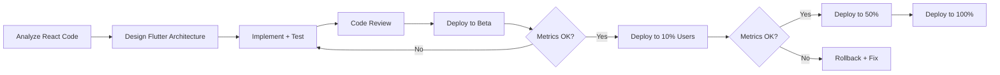

# 🚀 **Complete Senior-Level Flutter Refactoring Framework**
### Production-Ready Edition with All Improvements

---

## 📋 **Table of Contents**
1. [Context & Scope](#1-context--scope)
2. [Architecture Principles](#2-architecture-principles)
3. [Migration Strategy](#3-migration-strategy)
4. [Code Standards](#4-code-standards)
5. [UI/UX Standards](#5-uiux-standards)
6. [Testing Strategy](#6-testing-strategy)
7. [Performance Standards](#7-performance-standards)
8. [Documentation Requirements](#8-documentation-requirements)
9. [CI/CD Pipeline](#9-cicd-pipeline)
10. [Quality Gates](#10-quality-gates)
11. [Output Format](#11-output-format)

---

## **1. Context & Scope**

### 🎯 **Mission**
You are a **senior full-stack mobile engineer** refactoring a production React application into a **scalable, maintainable, production-ready Flutter codebase** using industry best practices.

### 🔍 **Original React App Characteristics**
- Multiple feature modules (auth, dashboard, profile, settings, etc.)
- REST/GraphQL APIs with complex data flows
- Global + local state management (Redux/Zustand/Context)
- Responsive layouts (mobile-first, tablet, desktop)
- User authentication and authorization
- Real-time features (if applicable)

### ✅ **Success Criteria**
- **Feature Parity**: 100% functional equivalence
- **Performance**: ≤React load times, 60fps scrolling
- **Quality**: <2% crash rate in production
- **Maintainability**: New features added in <50% time vs React
- **Test Coverage**: ≥70% overall, ≥90% critical paths

---

## **2. Architecture Principles**

### 🏗️ **Clean Architecture Layers**

```
lib/
├── core/                          # Shared infrastructure
│   ├── di/                        # Dependency injection
│   │   ├── injection.dart         # get_it container setup
│   │   └── injection.config.dart  # Generated by injectable
│   ├── errors/                    # Error handling
│   │   ├── failures.dart          # Abstract failure types
│   │   └── exceptions.dart        # Data layer exceptions
│   ├── network/                   # HTTP client setup
│   │   ├── dio_client.dart
│   │   ├── interceptors/
│   │   │   ├── auth_interceptor.dart
│   │   │   ├── logging_interceptor.dart
│   │   │   └── retry_interceptor.dart
│   │   └── network_info.dart      # Connectivity checker
│   ├── constants/                 # App-wide constants
│   │   ├── api_constants.dart
│   │   ├── app_constants.dart
│   │   └── storage_constants.dart
│   ├── theme/                     # Design system
│   │   ├── app_theme.dart
│   │   ├── app_colors.dart
│   │   ├── app_text_styles.dart
│   │   └── app_dimensions.dart
│   ├── responsive/                # Responsive utilities
│   │   ├── breakpoints.dart
│   │   └── responsive_builder.dart
│   ├── utils/                     # Helper functions
│   │   ├── validators.dart
│   │   ├── formatters.dart
│   │   └── extensions.dart
│   └── widgets/                   # Reusable widgets
│       ├── custom_button.dart
│       ├── custom_text_field.dart
│       ├── loading_indicator.dart
│       └── error_display.dart
│
├── features/                      # Feature modules
│   ├── auth/
│   │   ├── data/
│   │   │   ├── datasources/
│   │   │   │   ├── auth_remote_datasource.dart
│   │   │   │   └── auth_local_datasource.dart
│   │   │   ├── models/
│   │   │   │   ├── user_model.dart
│   │   │   │   └── auth_response_model.dart
│   │   │   └── repositories/
│   │   │       └── auth_repository_impl.dart
│   │   ├── domain/
│   │   │   ├── entities/
│   │   │   │   └── user.dart
│   │   │   ├── repositories/
│   │   │   │   └── auth_repository.dart
│   │   │   └── usecases/
│   │   │       ├── login_usecase.dart
│   │   │       ├── logout_usecase.dart
│   │   │       ├── signup_usecase.dart
│   │   │       └── check_auth_status_usecase.dart
│   │   └── presentation/
│   │       ├── bloc/
│   │       │   ├── auth_bloc.dart
│   │       │   ├── auth_event.dart
│   │       │   └── auth_state.dart
│   │       ├── cubit/
│   │       │   ├── login_form_cubit.dart
│   │       │   └── login_form_state.dart
│   │       ├── pages/
│   │       │   ├── login_page.dart
│   │       │   └── signup_page.dart
│   │       └── widgets/
│   │           ├── login_form.dart
│   │           └── social_login_buttons.dart
│   │
│   ├── dashboard/
│   │   └── [same structure]
│   │
│   └── [other features]/
│
├── config/
│   ├── routes/
│   │   └── app_router.dart        # go_router configuration
│   ├── env/
│   │   ├── env.dart               # Environment config
│   │   └── .env.example           # Template
│   └── app_config.dart            # App-level config
│
└── main.dart                      # App entry point
```

### 🔧 **Dependency Injection Setup**

```dart
// 📁 lib/core/di/injection.dart
import 'package:get_it/get_it.dart';
import 'package:injectable/injectable.dart';
import 'injection.config.dart';

final getIt = GetIt.instance;

@InjectableInit(
  initializerName: 'init',
  preferRelativeImports: true,
  asExtension: true,
)
Future<void> configureDependencies() async {
  await getIt.init();
}

// 📁 lib/main.dart
void main() async {
  WidgetsFlutterBinding.ensureInitialized();
  
  // Initialize DI container
  await configureDependencies();
  
  // Initialize other services
  await Firebase.initializeApp();
  
  // Setup error handlers
  FlutterError.onError = (details) {
    getIt<CrashAnalytics>().recordFlutterError(details);
  };
  
  runApp(const MyApp());
}
```

### 📦 **Module Registration Example**

```dart
// 📁 lib/core/network/network_module.dart
import 'package:injectable/injectable.dart';

@module
abstract class NetworkModule {
  @lazySingleton
  Dio get dio => Dio(
    BaseOptions(
      baseUrl: AppConfig.apiBaseUrl,
      connectTimeout: const Duration(seconds: 10),
      receiveTimeout: const Duration(seconds: 15),
      headers: {
        'Content-Type': 'application/json',
        'Accept': 'application/json',
      },
    ),
  )..interceptors.addAll([
    AuthInterceptor(),
    LogInterceptor(requestBody: true, responseBody: true),
    RetryInterceptor(dio: Dio(), retries: 3),
  ]);

  @lazySingleton
  NetworkInfo get networkInfo => NetworkInfoImpl(
    DataConnectionChecker(),
  );
}
```

---

## **3. Migration Strategy**

### 📅 **Phased Rollout Plan**

#### **Phase 1: Foundation (Week 1-2)** 🏗️

**Goals:**
- Set up project structure
- Configure core infrastructure
- Establish CI/CD pipeline
- Create design system

**Deliverables:**
```bash
✓ Clean Architecture skeleton
✓ DI container configured (get_it + injectable)
✓ Core layer complete:
  - Error handling (Failure classes)
  - Network client (Dio + interceptors)
  - Theme system
  - Responsive utilities
✓ CI/CD pipeline running:
  - flutter analyze (0 issues)
  - flutter test (passing)
  - Build verification
✓ README + ARCHITECTURE.md documentation
```

**Validation:**
- [ ] Project compiles without errors
- [ ] All core utilities have unit tests (≥80% coverage)
- [ ] CI pipeline passes on every commit
- [ ] Team can run project locally with setup script

---

#### **Phase 2: Vertical Slice (Week 3-4)** 🎯

**Goals:**
- Implement ONE complete feature end-to-end
- Validate architecture decisions
- Establish patterns for team

**Feature Selection Criteria:**
- Low business risk (not auth, not payments)
- Representative complexity (CRUD + API + state)
- Moderate UI complexity
- **Recommended:** Settings, Profile, or simple list feature

**Deliverables:**
```bash
✓ Complete feature implementation:
  - Domain layer (entities, repositories, use cases)
  - Data layer (API integration, models, repository impl)
  - Presentation layer (BLoC/Cubit, pages, widgets)
✓ Comprehensive testing:
  - Unit tests for use cases (100%)
  - Widget tests for key screens (≥70%)
  - Integration test for happy path
✓ Responsive design (mobile/tablet/desktop)
✓ Error handling + loading states
✓ Deploy to staging/TestFlight/Internal Testing
```

**Success Metrics:**
- [ ] Feature works identically to React version
- [ ] <2% crash rate in staging (7 days)
- [ ] Load time ≤React equivalent
- [ ] Team review: architecture is understandable

**React Comparison Checklist:**
```markdown
| Functionality | React ✓ | Flutter ✓ | Notes |
|--------------|---------|-----------|-------|
| Load data from API | ✓ | ✓ | |
| Display in responsive grid | ✓ | ✓ | |
| Search/filter | ✓ | ✓ | |
| Pull-to-refresh | ✓ | ✓ | |
| Error handling | ✓ | ✓ | |
| Loading states | ✓ | ✓ | |
| Empty states | ✓ | ✓ | |
| Accessibility | ✓ | ✓ | Screen reader tested |
```

---

#### **Phase 3: Incremental Feature Migration (Week 5-12)** 🔄

**Strategy: Priority Matrix**

```
High Business Value + Low Risk → Migrate First
High Business Value + High Risk → Migrate Last (with extra testing)
Low Business Value + Low Risk → Migrate Middle
Low Business Value + High Risk → Consider skipping if deprecated
```

**Migration Order Example:**
1. ✅ Settings (Week 5)
2. 🔄 User Profile (Week 6)
3. 🔄 Dashboard/Home (Week 7-8)
4. 🔄 Search/Discover (Week 9)
5. 🔄 Authentication (Week 10) ⚠️ High Risk
6. 🔄 Payments/Checkout (Week 11-12) ⚠️ High Risk

**Per-Feature Process:**


**Feature Flags Configuration:**
```dart
// 📁 lib/config/feature_flags.dart
import 'package:firebase_remote_config/firebase_remote_config.dart';

@singleton
class FeatureFlags {
  final FirebaseRemoteConfig _remoteConfig;
  
  FeatureFlags(this._remoteConfig);
  
  Future<void> initialize() async {
    await _remoteConfig.setConfigSettings(RemoteConfigSettings(
      fetchTimeout: const Duration(minutes: 1),
      minimumFetchInterval: const Duration(hours: 1),
    ));
    
    await _remoteConfig.setDefaults({
      'enable_new_dashboard': false,
      'enable_new_auth': false,
      'enable_new_profile': false,
    });
    
    await _remoteConfig.fetchAndActivate();
  }
  
  bool get isNewDashboardEnabled => 
      _remoteConfig.getBool('enable_new_dashboard');
  
  bool get isNewAuthEnabled => 
      _remoteConfig.getBool('enable_new_auth');
}

// Usage in router
if (featureFlags.isNewDashboardEnabled) {
  return const NewDashboardPage(); // Flutter
} else {
  return const WebViewDashboard(url: reactAppUrl); // React fallback
}
```

---

#### **Phase 4: Validation & Optimization (Week 13-14)** 🔍

**Goals:**
- Ensure feature parity
- Optimize performance
- Stabilize production

**Activities:**
- [ ] Cross-functional QA (designers, PMs, QA team)
- [ ] Performance profiling (DevTools)
- [ ] Accessibility audit (TalkBack, VoiceOver)
- [ ] Load testing (concurrent users, API stress)
- [ ] Security audit (penetration testing if high-risk app)

**Go/No-Go Criteria:**
```markdown
✓ 100% feature parity confirmed by PM
✓ <2% crash-free rate (30 days)
✓ Performance metrics ≥React baseline:
  - App startup: <2s
  - Page transitions: <300ms
  - API response handling: <100ms
✓ Test coverage ≥70% overall, ≥90% critical paths
✓ Zero critical security vulnerabilities
✓ Accessibility score ≥90 (Lighthouse or equivalent)
```

---

#### **Phase 5: React Decommission (Week 15+)** 🗑️

**Criteria for Decommissioning:**
- [ ] 90 days stable in production (Flutter at 100% traffic)
- [ ] All critical bugs resolved
- [ ] Team trained on Flutter codebase
- [ ] Documentation complete

**Decommission Process:**
1. **Archive React codebase** (don't delete!)
   ```bash
   git tag react-final-version
   git branch -m main react-legacy
   git checkout -b main flutter-main
   ```

2. **Remove feature flags** (clean up codebase)
3. **Update CI/CD** (remove React builds)
4. **Monitor for 30 more days** (ensure no unexpected issues)

**Rollback Plan (If Needed):**
```markdown
IF critical Flutter bug discovered:
  1. Immediately rollback via feature flag (0% Flutter traffic)
  2. Root cause analysis (RCA) within 24h
  3. Fix + test in staging
  4. Gradual re-rollout (10% → 50% → 100%)
  
IF multiple critical bugs:
  - Consider pausing migration
  - Re-evaluate architecture decisions
  - Add more testing before continuing
```

---

## **4. Code Standards**

### 4.1 **State Management** 🎛️

#### **Decision Matrix: Cubit vs BLoC**

| Use Case | State Management | Reasoning |
|----------|------------------|-----------|
| Form validation | **Cubit** | Simple state changes, no complex events |
| Toggle switches | **Cubit** | Single state property |
| Tab navigation | **Cubit** | Direct state updates |
| API data fetching | **BLoC** | Async operations, multiple events |
| Search with debounce | **BLoC** | Event stream transformation |
| Real-time updates | **BLoC** | Continuous event stream |
| Multi-step flows | **BLoC** | Complex event sequences |

#### **Cubit Example (Simple Form)**

```dart
// 📁 lib/features/auth/presentation/cubit/login_form_cubit.dart
// 🎯 Purpose: Manage login form UI state
// 🔄 Maps to: src/features/auth/hooks/useLoginForm.ts

import 'package:freezed_annotation/freezed_annotation.dart';
import 'package:flutter_bloc/flutter_bloc.dart';

part 'login_form_state.freezed.dart';
part 'login_form_cubit.freezed.dart';

@freezed
class LoginFormState with _$LoginFormState {
  const factory LoginFormState({
    @Default('') String email,
    @Default('') String password,
    @Default(false) bool isPasswordVisible,
    @Default(false) bool isEmailValid,
    @Default(false) bool isPasswordValid,
  }) = _LoginFormState;
}

@injectable
class LoginFormCubit extends Cubit<LoginFormState> {
  LoginFormCubit() : super(const LoginFormState());
  
  void emailChanged(String email) {
    emit(state.copyWith(
      email: email,
      isEmailValid: _validateEmail(email),
    ));
  }
  
  void passwordChanged(String password) {
    emit(state.copyWith(
      password: password,
      isPasswordValid: password.length >= 8,
    ));
  }
  
  void togglePasswordVisibility() {
    emit(state.copyWith(isPasswordVisible: !state.isPasswordVisible));
  }
  
  bool _validateEmail(String email) {
    return RegExp(r'^[\w-\.]+@([\w-]+\.)+[\w-]{2,4}$').hasMatch(email);
  }
  
  bool get isFormValid => state.isEmailValid && state.isPasswordValid;
}
```

#### **BLoC Example (Complex Auth Flow)**

```dart
// 📁 lib/features/auth/presentation/bloc/auth_bloc.dart
// 🎯 Purpose: Handle authentication business logic
// 🔄 Maps to: src/features/auth/store/authSlice.ts

import 'package:flutter_bloc/flutter_bloc.dart';
import 'package:freezed_annotation/freezed_annotation.dart';
import 'package:injectable/injectable.dart';

part 'auth_event.dart';
part 'auth_state.dart';
part 'auth_bloc.freezed.dart';

@injectable
class AuthBloc extends Bloc<AuthEvent, AuthState> {
  final LoginUseCase _loginUseCase;
  final LogoutUseCase _logoutUseCase;
  final CheckAuthStatusUseCase _checkAuthStatusUseCase;
  
  AuthBloc(
    this._loginUseCase,
    this._logoutUseCase,
    this._checkAuthStatusUseCase,
  ) : super(const AuthState.initial()) {
    on<AuthEvent>(
      (event, emit) async {
        await event.when(
          checkAuthStatus: () => _onCheckAuthStatus(emit),
          loginRequested: (email, password) => 
              _onLoginRequested(emit, email, password),
          logoutRequested: () => _onLogoutRequested(emit),
        );
      },
    );
  }
  
  Future<void> _onCheckAuthStatus(Emitter<AuthState> emit) async {
    emit(const AuthState.loading());
    
    final result = await _checkAuthStatusUseCase(NoParams());
    
    result.fold(
      (failure) => emit(AuthState.unauthenticated(failure.userMessage)),
      (user) => emit(AuthState.authenticated(user)),
    );
  }
  
  Future<void> _onLoginRequested(
    Emitter<AuthState> emit,
    String email,
    String password,
  ) async {
    emit(const AuthState.loading());
    
    final result = await _loginUseCase(
      LoginParams(email: email, password: password),
    );
    
    result.fold(
      (failure) => emit(AuthState.failure(failure.userMessage)),
      (user) => emit(AuthState.authenticated(user)),
    );
  }
  
  Future<void> _onLogoutRequested(Emitter<AuthState> emit) async {
    await _logoutUseCase(NoParams());
    emit(const AuthState.unauthenticated(null));
  }
}

// Events
@freezed
class AuthEvent with _$AuthEvent {
  const factory AuthEvent.checkAuthStatus() = _CheckAuthStatus;
  const factory AuthEvent.loginRequested(String email, String password) = 
      _LoginRequested;
  const factory AuthEvent.logoutRequested() = _LogoutRequested;
}

// States
@freezed
class AuthState with _$AuthState {
  const factory AuthState.initial() = _Initial;
  const factory AuthState.loading() = _Loading;
  const factory AuthState.authenticated(User user) = _Authenticated;
  const factory AuthState.unauthenticated(String? message) = _Unauthenticated;
  const factory AuthState.failure(String message) = _Failure;
}
```

#### **UseCase Pattern (Business Logic Isolation)**

```dart
// 📁 lib/features/auth/domain/usecases/login_usecase.dart
// 🎯 Purpose: Login business logic (validation, API call, token storage)
// 🔄 Maps to: src/features/auth/services/authService.login()

import 'package:dartz/dartz.dart';
import 'package:injectable/injectable.dart';

@injectable
class LoginUseCase implements UseCase<User, LoginParams> {
  final AuthRepository _repository;
  
  LoginUseCase(this._repository);
  
  @override
  Future<Either<Failure, User>> call(LoginParams params) async {
    // Pre-validation
    if (!_isValidEmail(params.email)) {
      return Left(ValidationFailure('Invalid email format'));
    }
    
    if (params.password.length < 8) {
      return Left(ValidationFailure('Password must be at least 8 characters'));
    }
    
    // Delegate to repository
    return await _repository.login(
      email: params.email,
      password: params.password,
    );
  }
  
  bool _isValidEmail(String email) {
    return RegExp(r'^[\w-\.]+@([\w-]+\.)+[\w-]{2,4}$').hasMatch(email);
  }
}

@freezed
class LoginParams with _$LoginParams {
  const factory LoginParams({
    required String email,
    required String password,
  }) = _LoginParams;
}

// Base UseCase interface
abstract class UseCase<Type, Params> {
  Future<Either<Failure, Type>> call(Params params);
}

class NoParams extends Equatable {
  @override
  List<Object?> get props => [];
}
```

---

### 4.2 **Error Handling** ⚠️

#### **Failure Hierarchy**

```dart
// 📁 lib/core/errors/failures.dart
// 🎯 Purpose: Type-safe error handling across all layers

import 'package:equatable/equatable.dart';

/// Base class for all failures in the application.
/// 
/// Failures represent expected error conditions that should be
/// handled gracefully (network issues, validation errors, etc).
/// 
/// For unexpected errors, throw exceptions instead.
abstract class Failure extends Equatable {
  final String message;
  final String? code;
  final StackTrace? stackTrace;
  
  const Failure(
    this.message, {
    this.code,
    this.stackTrace,
  });
  
  /// User-facing error message (sanitized, localized).
  String get userMessage;
  
  /// Whether this operation can be retried.
  bool get isRetryable;
  
  /// Log level for this failure.
  LogLevel get logLevel => LogLevel.error;
  
  @override
  List<Object?> get props => [message, code];
}

// Network Failures
class NetworkFailure extends Failure {
  const NetworkFailure(
    String message, {
    String? code,
    StackTrace? stackTrace,
  }) : super(message, code: code, stackTrace: stackTrace);
  
  @override
  String get userMessage => 
      'Connection issue. Please check your internet and try again.';
  
  @override
  bool get isRetryable => true;
  
  @override
  LogLevel get logLevel => LogLevel.warning; // Expected in mobile
}

class ServerFailure extends Failure {
  final int? statusCode;
  
  const ServerFailure(
    String message, {
    this.statusCode,
    String? code,
    StackTrace? stackTrace,
  }) : super(message, code: code, stackTrace: stackTrace);
  
  @override
  String get userMessage {
    switch (statusCode) {
      case 503:
        return 'Service temporarily unavailable. Please try again in a few minutes.';
      case 429:
        return 'Too many requests. Please wait a moment and try again.';
      case 500:
      case 502:
      case 504:
        return 'Server error. Our team has been notified.';
      default:
        return 'Something went wrong. Please try again.';
    }
  }
  
  @override
  bool get isRetryable => statusCode == 503 || statusCode == 429;
}

class AuthenticationFailure extends Failure {
  const AuthenticationFailure(
    String message, {
    String? code,
  }) : super(message, code: code);
  
  @override
  String get userMessage => 'Authentication failed. Please log in again.';
  
  @override
  bool get isRetryable => false;
}

class ValidationFailure extends Failure {
  const ValidationFailure(String message) : super(message);
  
  @override
  String get userMessage => message; // Already user-friendly
  
  @override
  bool get isRetryable => false;
  
  @override
  LogLevel get logLevel => LogLevel.info; // User error, not system error
}

class CacheFailure extends Failure {
  const CacheFailure(String message) : super(message);
  
  @override
  String get userMessage => 
      'Failed to load cached data. Please refresh.';
  
  @override
  bool get isRetryable => false;
}

class NotFoundFailure extends Failure {
  const NotFoundFailure(String message) : super(message);
  
  @override
  String get userMessage => 'The requested item was not found.';
  
  @override
  bool get isRetryable => false;
}

enum LogLevel { info, warning, error, critical }
```

#### **Exception Handling in Data Layer**

```dart
// 📁 lib/core/errors/exceptions.dart

/// Exceptions are thrown in the data layer and caught by repositories.
/// Repositories convert exceptions → failures.
class ServerException implements Exception {
  final String message;
  final int? statusCode;
  
  ServerException(this.message, {this.statusCode});
}

class NetworkException implements Exception {
  final String message;
  
  NetworkException(this.message);
}

class CacheException implements Exception {
  final String message;
  
  CacheException(this.message);
}

// 📁 lib/features/auth/data/repositories/auth_repository_impl.dart

@LazySingleton(as: AuthRepository)
class AuthRepositoryImpl implements AuthRepository {
  final AuthRemoteDataSource _remoteDataSource;
  final AuthLocalDataSource _localDataSource;
  final NetworkInfo _networkInfo;
  
  AuthRepositoryImpl(
    this._remoteDataSource,
    this._localDataSource,
    this._networkInfo,
  );
  
  @override
  Future<Either<Failure, User>> login({
    required String email,
    required String password,
  }) async {
    // Check connectivity first
    if (!await _networkInfo.isConnected) {
      return const Left(NetworkFailure('No internet connection'));
    }
    
    try {
      final userModel = await _remoteDataSource.login(
        email: email,
        password: password,
      );
      
      // Cache user data
      await _localDataSource.cacheUser(userModel);
      
      // Convert model → entity
      return Right(userModel.toEntity());
      
    } on ServerException catch (e, stackTrace) {
      // Log exception
      _logError(e, stackTrace);
      
      return Left(ServerFailure(
        e.message,
        statusCode: e.statusCode,
        stackTrace: stackTrace,
      ));
      
    } on NetworkException catch (e, stackTrace) {
      _logError(e, stackTrace);
      return Left(NetworkFailure(e.message, stackTrace: stackTrace));
      
    } on CacheException catch (e, stackTrace) {
      // Cache failure is non-critical for login
      _logWarning('Cache write failed: ${e.message}');
      
      // Still return success if API call worked
      try {
        final userModel = await _remoteDataSource.login(
          email: email,
          password: password,
        );
        return Right(userModel.toEntity());
      } catch (_) {
        return Left(CacheFailure(e.message));
      }
      
    } catch (e, stackTrace) {
      // Unexpected error - log as critical
      _logCritical('Unexpected error in login', e, stackTrace);
      
      return Left(ServerFailure(
        'An unexpected error occurred',
        stackTrace: stackTrace,
      ));
    }
  }
  
  void _logError(Exception e, StackTrace stackTrace) {
    getIt<CrashAnalytics>().recordException(e, stackTrace);
  }
  
  void _logWarning(String message) {
    getIt<Logger>().warning(message);
  }
  
  void _logCritical(String message, Object error, StackTrace stackTrace) {
    getIt<CrashAnalytics>().recordCriticalError(message, error, stackTrace);
  }
}
```

#### **Retry Logic with Exponential Backoff**

```dart
// 📁 lib/core/network/interceptors/retry_interceptor.dart

class RetryInterceptor extends Interceptor {
  final Dio dio;
  final int retries;
  final Duration initialDelay;
  
  RetryInterceptor({
    required this.dio,
    this.retries = 3,
    this.initialDelay = const Duration(seconds: 1),
  });
  
  @override
  Future<void> onError(
    DioException err,
    ErrorInterceptorHandler handler,
  ) async {
    if (!_shouldRetry(err)) {
      return handler.next(err);
    }
    
    final attempt = err.requestOptions.extra['retry_attempt'] as int? ?? 0;
    
    if (attempt >= retries) {
      return handler.next(err);
    }
    
    // Exponential backoff: 1s, 2s, 4s
    final delay = initialDelay * (1 << attempt);
    await Future.delayed(delay);
    
    try {
      final response = await dio.fetch(
        err.requestOptions..extra['retry_attempt'] = attempt + 1,
      );
      return handler.resolve(response);
    } on DioException catch (e) {
      return handler.next(e);
    }
  }
  
  bool _shouldRetry(DioException err) {
    // Retry on network errors
    if (err.type == DioExceptionType.connectionTimeout ||
        err.type == DioExceptionType.receiveTimeout ||
        err.type == DioExceptionType.connectionError) {
      return true;
    }
    
    // Retry on 503 (service unavailable) or 429 (rate limit)
    final statusCode = err.response?.statusCode;
    return statusCode == 503 || statusCode == 429;
  }
}
```

---

### 4.3 **API Layer** 🌐

#### **Dio Client Configuration**

```dart
// 📁 lib/core/network/dio_client.dart

@module
abstract class NetworkModule {
  @lazySingleton
  Dio dio(AuthInterceptor authInterceptor) {
    final dio = Dio(
      BaseOptions(
        baseUrl: AppConfig.apiBaseUrl,
        connectTimeout: const Duration(seconds: 10),
        receiveTimeout: const Duration(seconds: 15),
        sendTimeout: const Duration(seconds: 10),
        headers: {
          'Content-Type': 'application/json',
          'Accept': 'application/json',
          'X-App-Version': AppConfig.appVersion,
          'X-Platform': Platform.operatingSystem,
        },
      ),
    );
    
    // Add interceptors in order
    dio.interceptors.addAll([
      authInterceptor, // Must be first (adds auth token)
      
      // Logging (dev/staging only)
      if (AppConfig.isDevelopment)
        LogInterceptor(
          requestBody: true,
          responseBody: true,
          requestHeader: false,
          responseHeader: false,
          error: true,
          logPrint: (obj) => developer.log(obj.toString(), name: 'API'),
        ),
      
      // Retry logic
      RetryInterceptor(dio: dio, retries: 3),
      
      // Cache (for GET requests)
      DioCacheInterceptor(
        options: CacheOptions(
          store: MemCacheStore(),
          policy: CachePolicy.request,
          maxStale: const Duration(days: 7),
        ),
      ),
    ]);
    
    return dio;
  }
  
  @lazySingleton
  NetworkInfo networkInfo(DataConnectionChecker checker) => 
      NetworkInfoImpl(checker);
}

// 📁 lib/core/network/interceptors/auth_interceptor.dart

@injectable
class AuthInterceptor extends Interceptor {
  final AuthLocalDataSource _localDataSource;
  
  AuthInterceptor(this._localDataSource);
  
  @override
  Future<void> onRequest(
    RequestOptions options,
    RequestInterceptorHandler handler,
  ) async {
    // Skip auth for public endpoints
    if (options.extra['requiresAuth'] == false) {
      return handler.next(options);
    }
    
    try {
      final token = await _localDataSource.getAuthToken();
      
      if (token != null) {
        options.headers['Authorization'] = 'Bearer $token';
      }
      
      handler.next(options);
    } catch (e) {
      // Token retrieval failed - proceed without token
      // (API will return 401 if auth required)
      handler.next(options);
    }
  }
  
  @override
  Future<void> onError(
    DioException err,
    ErrorInterceptorHandler handler,
  ) async {
    // Handle 401 (unauthorized) - refresh token
    if (err.response?.statusCode == 401) {
      try {
        final newToken = await _refreshToken();
        
        if (newToken != null) {
          // Retry original request with new token
          final options = err.requestOptions;
          options.headers['Authorization'] = 'Bearer $newToken';
          
          final response = await Dio().fetch(options);
          return handler.resolve(response);
        }
      } catch (e) {
        // Refresh failed - user must re-login
        _localDataSource.clearAuthToken();
        // Emit logout event via event bus or global BLoC
      }
    }
    
    handler.next(err);
  }
  
  Future<String?> _refreshToken() async {
    try {
      final refreshToken = await _localDataSource.getRefreshToken();
      if (refreshToken == null) return null;
      
      // Call refresh endpoint
      final response = await Dio().post(
        '${AppConfig.apiBaseUrl}/auth/refresh',
        data: {'refresh_token': refreshToken},
      );
      
      final newToken = response.data['access_token'] as String;
      await _localDataSource.cacheAuthToken(newToken);
      
      return newToken;
    } catch (e) {
      return null;
    }
  }
}
```

#### **Remote Data Source Example**

```dart
// 📁 lib/features/auth/data/datasources/auth_remote_datasource.dart
// 🎯 Purpose: API calls for authentication
// 🔄 Maps to: src/api/authApi.ts

abstract class AuthRemoteDataSource {
  /// Calls POST /auth/login
  /// Throws [ServerException] on API errors
  /// Throws [NetworkException] on connection errors
  Future<UserModel> login({
    required String email,
    required String password,
  });
  
  Future<UserModel> signup({
    required String email,
    required String password,
    required String name,
  });
  
  Future<void> logout();
}

@LazySingleton(as: AuthRemoteDataSource)
class AuthRemoteDataSourceImpl implements AuthRemoteDataSource {
  final Dio _dio;
  
  AuthRemoteDataSourceImpl(this._dio);
  
  @override
  Future<UserModel> login({
    required String email,
    required String password,
  }) async {
    try {
      final response = await _dio.post(
        '/auth/login',
        data: {
          'email': email,
          'password': password,
        },
      );
      
      if (response.statusCode == 200) {
        return UserModel.fromJson(response.data['user']);
      } else {
        throw ServerException(
          'Login failed',
          statusCode: response.statusCode,
        );
      }
      
    } on DioException catch (e) {
      if (e.type == DioExceptionType.connectionTimeout ||
          e.type == DioExceptionType.receiveTimeout ||
          e.type == DioExceptionType.connectionError) {
        throw NetworkException('Connection failed');
      }
      
      final statusCode = e.response?.statusCode;
      final message = e.response?.data['message'] as String? ?? 
          'Server error occurred';
      
      throw ServerException(message, statusCode: statusCode);
    } catch (e) {
      throw ServerException('Unexpected error: ${e.toString()}');
    }
  }
  
  // ... other methods
}
```

#### **Model with json_serializable**

```dart
// 📁 lib/features/auth/data/models/user_model.dart
// 🎯 Purpose: Data transfer object for User
// 🔄 Maps to: src/types/User.ts

import 'package:freezed_annotation/freezed_annotation.dart';
import '../../domain/entities/user.dart';

part 'user_model.freezed.dart';
part 'user_model.g.dart';

@freezed
class UserModel with _$UserModel {
  const UserModel._(); // Private constructor for methods
  
  const factory UserModel({
    required String id,
    required String email,
    required String name,
    @JsonKey(name: 'avatar_url') String? avatarUrl,
    @JsonKey(name: 'created_at') required DateTime createdAt,
  }) = _UserModel;
  
  /// Convert JSON → Model
  factory UserModel.fromJson(Map<String, dynamic> json) => 
      _$UserModelFromJson(json);
  
  /// Convert Model → Entity (domain layer)
  User toEntity() {
    return User(
      id: id,
      email: email,
      name: name,
      avatarUrl: avatarUrl,
      createdAt: createdAt,
    );
  }
  
  /// Convert Entity → Model (for caching)
  factory UserModel.fromEntity(User user) {
    return UserModel(
      id: user.id,
      email: user.email,
      name: user.name,
      avatarUrl: user.avatarUrl,
      createdAt: user.createdAt,
    );
  }
}
```

---

### 4.4 **Security** 🔒

#### **Secure Storage**

```dart
// 📁 lib/core/storage/secure_storage.dart

@singleton
class SecureStorage {
  final FlutterSecureStorage _storage;
  
  SecureStorage() 
      : _storage = const FlutterSecureStorage(
          aOptions: AndroidOptions(
            encryptedSharedPreferences: true,
          ),
          iOptions: IOSOptions(
            accessibility: KeychainAccessibility.first_unlock,
          ),
        );
  
  // Auth tokens
  Future<void> saveAuthToken(String token) async {
    await _storage.write(key: 'auth_token', value: token);
  }
  
  Future<String?> getAuthToken() async {
    return await _storage.read(key: 'auth_token');
  }
  
  Future<void> saveRefreshToken(String token) async {
    await _storage.write(key: 'refresh_token', value: token);
  }
  
  Future<String?> getRefreshToken() async {
    return await _storage.read(key: 'refresh_token');
  }
  
  // Clear all secure data (on logout)
  Future<void> clearAll() async {
    await _storage.deleteAll();
  }
}

// ❌ NEVER DO THIS:
// ❌ SharedPreferences.setString('auth_token', token); // NOT SECURE!
```

#### **Environment Configuration**

```dart
// 📁 lib/config/env/env.dart

import 'package:envied/envied.dart';

part 'env.g.dart';

@Envied(path: '.env')
abstract class Env {
  @EnviedField(varName: 'API_BASE_URL')
  static const String apiBaseUrl = _Env.apiBaseUrl;
  
  @EnviedField(varName: 'API_KEY', obfuscate: true) // Obfuscated
  static final String apiKey = _Env.apiKey;
  
  @EnviedField(varName: 'SENTRY_DSN', obfuscate: true)
  static final String sentryDsn = _Env.sentryDsn;
}

// 📁 .env.example (committed to git)
// API_BASE_URL=https://api.example.com
// API_KEY=your_api_key_here
// SENTRY_DSN=your_sentry_dsn_here

// 📁 .env (NOT committed - in .gitignore)
// API_BASE_URL=https://api.production.com
// API_KEY=prod_key_abc123
// SENTRY_DSN=https://sentry.io/xxx

// 📁 .gitignore
// .env
// *.env
// !.env.example
```

#### **Certificate Pinning (High Security Apps)**

```dart
// 📁 lib/core/network/certificate_pinning.dart

@singleton
class CertificatePinning {
  Future<bool> verifyCertificate(X509Certificate cert, String host) {
    // SHA-256 fingerprints of your server's certificate
    const trustedFingerprints = [
      'sha256/AAAAAAAAAAAAAAAAAAAAAAAAAAAAAAAAAAAAAAAAAAA=',
      'sha256/BBBBBBBBBBBBBBBBBBBBBBBBBBBBBBBBBBBBBBBBBBB=', // Backup cert
    ];
    
    final certFingerprint = _getCertificateFingerprint(cert);
    return trustedFingerprints.contains(certFingerprint);
  }
  
  String _getCertificateFingerprint(X509Certificate cert) {
    final bytes = cert.der;
    final digest = sha256.convert(bytes);
    return 'sha256/${base64.encode(digest.bytes)}';
  }
}

// Usage with Dio
final dio = Dio();
(dio.httpClientAdapter as DefaultHttpClientAdapter).onHttpClientCreate = 
    (client) {
  client.badCertificateCallback = (cert, host, port) {
    return getIt<CertificatePinning>().verifyCertificate(cert, host);
  };
  return client;
};
```

#### **Code Obfuscation (Release Builds)**

```bash
# 📁 Build script with obfuscation

# Android
flutter build apk --release \
  --obfuscate \
  --split-debug-info=build/app/outputs/symbols

# iOS
flutter build ipa --release \
  --obfuscate \
  --split-debug-info=build/ios/symbols

# Upload symbols to crash reporting
# (Firebase Crashlytics, Sentry, etc.)
```

---

## **5. UI/UX Standards**

### 5.1 **Responsive Design** 📱💻

#### **Breakpoint System**

```dart
// 📁 lib/core/responsive/breakpoints.dart

class Breakpoints {
  // Standard breakpoints (Material Design)
  static const double mobile = 600;
  static const double tablet = 900;
  static const double desktop = 1200;
  static const double largeDesktop = 1600;
  
  // Getters for current context
  static bool isMobile(BuildContext context) =>
      MediaQuery.of(context).size.width < mobile;
  
  static bool isTablet(BuildContext context) {
    final width = MediaQuery.of(context).size.width;
    return width >= mobile && width < desktop;
  }
  
  static bool isDesktop(BuildContext context) =>
      MediaQuery.of(context).size.width >= desktop;
  
  static bool isLargeDesktop(BuildContext context) =>
      MediaQuery.of(context).size.width >= largeDesktop;
  
  // Orientation helpers
  static bool isLandscape(BuildContext context) =>
      MediaQuery.of(context).orientation == Orientation.landscape;
  
  // Safe area helpers
  static EdgeInsets safeArea(BuildContext context) =>
      MediaQuery.of(context).padding;
}
```

#### **Responsive Builder Widget**

```dart
// 📁 lib/core/responsive/responsive_builder.dart

class ResponsiveBuilder extends StatelessWidget {
  final Widget mobile;
  final Widget? tablet;
  final Widget? desktop;
  final Widget? largeDesktop;
  
  const ResponsiveBuilder({
    Key? key,
    required this.mobile,
    this.tablet,
    this.desktop,
    this.largeDesktop,
  }) : super(key: key);
  
  @override
  Widget build(BuildContext context) {
    if (Breakpoints.isLargeDesktop(context) && largeDesktop != null) {
      return largeDesktop!;
    }
    
    if (Breakpoints.isDesktop(context) && desktop != null) {
      return desktop!;
    }
    
    if (Breakpoints.isTablet(context) && tablet != null) {
      return tablet!;
    }
    
    return mobile;
  }
}

// Usage Example
class DashboardPage extends StatelessWidget {
  @override
  Widget build(BuildContext context) {
    return ResponsiveBuilder(
      mobile: _buildMobileLayout(),
      tablet: _buildTabletLayout(),
      desktop: _buildDesktopLayout(),
    );
  }
  
  Widget _buildMobileLayout() {
    return ListView(
      children: [
        // Single column layout
      ],
    );
  }
  
  Widget _buildTabletLayout() {
    return Row(
      children: [
        // Sidebar + content
        Container(width: 250, child: Sidebar()),
        Expanded(child: ContentArea()),
      ],
    );
  }
  
  Widget _buildDesktopLayout() {
    return Row(
      children: [
        // Sidebar + main content + details panel
        Container(width: 250, child: Sidebar()),
        Expanded(flex: 2, child: ContentArea()),
        Container(width: 300, child: DetailsPanel()),
      ],
    );
  }
}
```

#### **Responsive Value Helper**

```dart
// 📁 lib/core/responsive/responsive_value.dart

class ResponsiveValue<T> {
  final T mobile;
  final T? tablet;
  final T? desktop;
  
  ResponsiveValue({
    required this.mobile,
    this.tablet,
    this.desktop,
  });
  
  T getValue(BuildContext context) {
    if (Breakpoints.isDesktop(context) && desktop != null) {
      return desktop!;
    }
    if (Breakpoints.isTablet(context) && tablet != null) {
      return tablet!;
    }
    return mobile;
  }
}

// Usage
final padding = ResponsiveValue<EdgeInsets>(
  mobile: const EdgeInsets.all(16),
  tablet: const EdgeInsets.all(24),
  desktop: const EdgeInsets.all(32),
).getValue(context);

final columns = ResponsiveValue<int>(
  mobile: 1,
  tablet: 2,
  desktop: 3,
).getValue(context);
```

---

### 5.2 **Accessibility** ♿

```dart
// 📁 lib/core/widgets/accessible_button.dart

class AccessibleButton extends StatelessWidget {
  final String label;
  final VoidCallback onPressed;
  final Widget child;
  final bool enabled;
  
  const AccessibleButton({
    Key? key,
    required this.label,
    required this.onPressed,
    required this.child,
    this.enabled = true,
  }) : super(key: key);
  
  @override
  Widget build(BuildContext context) {
    return Semantics(
      label: label,
      button: true,
      enabled: enabled,
      child: ExcludeSemantics(
        child: ElevatedButton(
          onPressed: enabled ? onPressed : null,
          child: child,
        ),
      ),
    );
  }
}

// Usage
AccessibleButton(
  label: 'Submit login form',
  onPressed: _handleLogin,
  child: const Text('Login'),
)
```

#### **Accessibility Checklist**

```markdown
- [ ] All interactive widgets have semantic labels
- [ ] Color contrast ratio ≥4.5:1 for normal text (WCAG AA)
- [ ] Color contrast ratio ≥3:1 for large text (≥18pt)
- [ ] Support for screen readers (TalkBack, VoiceOver)
- [ ] Font scaling respected (use Theme.of(context).textTheme, not fixed sizes)
- [ ] Focus traversal order is logical
- [ ] Form fields have labels and error messages
- [ ] Images have alt text (via Semantics widget)
- [ ] Loading states announced to screen readers
- [ ] Error messages accessible and descriptive
```

---

### 5.3 **Theme System** 🎨

```dart
// 📁 lib/core/theme/app_theme.dart

class AppTheme {
  static ThemeData lightTheme = ThemeData(
    useMaterial3: true,
    colorScheme: ColorScheme.fromSeed(
      seedColor: AppColors.primary,
      brightness: Brightness.light,
    ),
    textTheme: AppTextStyles.textTheme,
    elevatedButtonTheme: ElevatedButtonThemeData(
      style: ElevatedButton.styleFrom(
        minimumSize: const Size(120, 48),
        shape: RoundedRectangleBorder(
          borderRadius: BorderRadius.circular(8),
        ),
      ),
    ),
    inputDecorationTheme: InputDecorationTheme(
      border: OutlineInputBorder(
        borderRadius: BorderRadius.circular(8),
      ),
      contentPadding: const EdgeInsets.symmetric(
        horizontal: 16,
        vertical: 12,
      ),
    ),
  );
  
  static ThemeData darkTheme = ThemeData(
    useMaterial3: true,
    colorScheme: ColorScheme.fromSeed(
      seedColor: AppColors.primary,
      brightness: Brightness.dark,
    ),
    textTheme: AppTextStyles.textTheme,
    // ... same overrides as light theme
  );
}

// 📁 lib/core/theme/app_colors.dart

class AppColors {
  // Primary palette
  static const Color primary = Color(0xFF6200EE);
  static const Color primaryVariant = Color(0xFF3700B3);
  static const Color secondary = Color(0xFF03DAC6);
  
  // Semantic colors
  static const Color success = Color(0xFF4CAF50);
  static const Color error = Color(0xFFB00020);
  static const Color warning = Color(0xFFFFA726);
  static const Color info = Color(0xFF2196F3);
  
  // Neutral palette
  static const Color background = Color(0xFFF5F5F5);
  static const Color surface = Color(0xFFFFFFFF);
  static const Color onSurface = Color(0xFF000000);
}

// 📁 lib/core/theme/app_text_styles.dart

class AppTextStyles {
  static const TextTheme textTheme = TextTheme(
    displayLarge: TextStyle(
      fontSize: 57,
      fontWeight: FontWeight.w400,
      letterSpacing: -0.25,
    ),
    headlineLarge: TextStyle(
      fontSize: 32,
      fontWeight: FontWeight.w600,
    ),
    bodyLarge: TextStyle(
      fontSize: 16,
      fontWeight: FontWeight.w400,
      height: 1.5,
    ),
    // ... other styles
  );
}
```

---

## **6. Testing Strategy**

### 6.1 **Unit Tests** (60% coverage minimum)

```dart
// 📁 test/features/auth/domain/usecases/login_usecase_test.dart

import 'package:dartz/dartz.dart';
import 'package:flutter_test/flutter_test.dart';
import 'package:mocktail/mocktail.dart';

class MockAuthRepository extends Mock implements AuthRepository {}

void main() {
  late LoginUseCase useCase;
  late MockAuthRepository mockRepository;
  
  setUp(() {
    mockRepository = MockAuthRepository();
    useCase = LoginUseCase(mockRepository);
  });
  
  group('LoginUseCase', () {
    const tEmail = 'test@example.com';
    const tPassword = 'password123';
    const tUser = User(
      id: '1',
      email: tEmail,
      name: 'Test User',
      createdAt: DateTime(2024, 1, 1),
    );
    
    test('should return User when repository succeeds', () async {
      // Arrange
      when(() => mockRepository.login(
        email: any(named: 'email'),
        password: any(named: 'password'),
      )).thenAnswer((_) async => const Right(tUser));
      
      // Act
      final result = await useCase(
        const LoginParams(email: tEmail, password: tPassword),
      );
      
      // Assert
      expect(result, const Right(tUser));
      verify(() => mockRepository.login(
        email: tEmail,
        password: tPassword,
      )).called(1);
      verifyNoMoreInteractions(mockRepository);
    });
    
    test('should return ValidationFailure for invalid email', () async {
      // Arrange
      const tInvalidEmail = 'invalid-email';
      
      // Act
      final result = await useCase(
        const LoginParams(email: tInvalidEmail, password: tPassword),
      );
      
      // Assert
      expect(result, isA<Left<Failure, User>>());
      expect(
        (result as Left).value,
        isA<ValidationFailure>()
            .having((f) => f.message, 'message', 'Invalid email format'),
      );
      verifyZeroInteractions(mockRepository); // Validation happens before repo call
    });
    
    test('should return ValidationFailure for short password', () async {
      // Act
      final result = await useCase(
        const LoginParams(email: tEmail, password: 'short'),
      );
      
      // Assert
      expect(result, isA<Left<Failure, User>>());
      expect(
        (result as Left).value,
        isA<ValidationFailure>().having(
          (f) => f.message,
          'message',
          contains('8 characters'),
        ),
      );
    });
    
    test('should return ServerFailure when repository fails', () async {
      // Arrange
      const tFailure = ServerFailure('Server error', statusCode: 500);
      when(() => mockRepository.login(
        email: any(named: 'email'),
        password: any(named: 'password'),
      )).thenAnswer((_) async => const Left(tFailure));
      
      // Act
      final result = await useCase(
        const LoginParams(email: tEmail, password: tPassword),
      );
      
      // Assert
      expect(result, const Left(tFailure));
    });
  });
}
```

---

### 6.2 **Widget Tests**

```dart
// 📁 test/features/auth/presentation/pages/login_page_test.dart

import 'package:bloc_test/bloc_test.dart';
import 'package:flutter/material.dart';
import 'package:flutter_bloc/flutter_bloc.dart';
import 'package:flutter_test/flutter_test.dart';
import 'package:mocktail/mocktail.dart';

class MockAuthBloc extends MockBloc<AuthEvent, AuthState> 
    implements AuthBloc {}

class MockLoginFormCubit extends MockCubit<LoginFormState> 
    implements LoginFormCubit {}

void main() {
  late MockAuthBloc mockAuthBloc;
  late MockLoginFormCubit mockLoginFormCubit;
  
  setUp(() {
    mockAuthBloc = MockAuthBloc();
    mockLoginFormCubit = MockLoginFormCubit();
  });
  
  Widget makeTestableWidget(Widget child) {
    return MultiBlocProvider(
      providers: [
        BlocProvider<AuthBloc>.value(value: mockAuthBloc),
        BlocProvider<LoginFormCubit>.value(value: mockLoginFormCubit),
      ],
      child: MaterialApp(home: child),
    );
  }
  
  group('LoginPage', () {
    testWidgets('displays email and password fields', (tester) async {
      // Arrange
      when(() => mockAuthBloc.state).thenReturn(const AuthState.initial());
      when(() => mockLoginFormCubit.state).thenReturn(
        const LoginFormState(),
      );
      
      // Act
      await tester.pumpWidget(makeTestableWidget(const LoginPage()));
      
      // Assert
      expect(find.byType(TextField), findsNWidgets(2));
      expect(find.text('Email'), findsOneWidget);
      expect(find.text('Password'), findsOneWidget);
    });
    
    testWidgets('shows loading indicator when state is loading', 
        (tester) async {
      // Arrange
      whenListen(
        mockAuthBloc,
        Stream.fromIterable([
          const AuthState.initial(),
          const AuthState.loading(),
        ]),
        initialState: const AuthState.initial(),
      );
      when(() => mockLoginFormCubit.state).thenReturn(
        const LoginFormState(),
      );
      
      // Act
      await tester.pumpWidget(makeTestableWidget(const LoginPage()));
      await tester.pump(); // Trigger rebuild
      
      // Assert
      expect(find.byType(CircularProgressIndicator), findsOneWidget);
    });
    
    testWidgets('shows error message on login failure', (tester) async {
      // Arrange
      const tErrorMessage = 'Invalid credentials';
      whenListen(
        mockAuthBloc,
        Stream.fromIterable([
          const AuthState.initial(),
          const AuthState.failure(tErrorMessage),
        ]),
        initialState: const AuthState.initial(),
      );
      when(() => mockLoginFormCubit.state).thenReturn(
        const LoginFormState(),
      );
      
      // Act
      await tester.pumpWidget(makeTestableWidget(const LoginPage()));
      await tester.pump(); // Trigger rebuild
      
      // Assert
      expect(find.text(tErrorMessage), findsOneWidget);
      expect(find.byType(SnackBar), findsOneWidget);
    });
    
    testWidgets('calls login event when button pressed with valid form',
        (tester) async {
      // Arrange
      const tEmail = 'test@example.com';
      const tPassword = 'password123';
      
      when(() => mockAuthBloc.state).thenReturn(const AuthState.initial());
      when(() => mockLoginFormCubit.state).thenReturn(
        const LoginFormState(
          email: tEmail,
          password: tPassword,
          isEmailValid: true,
          isPasswordValid: true,
        ),
      );
      when(() => mockLoginFormCubit.isFormValid).thenReturn(true);
      
      // Act
      await tester.pumpWidget(makeTestableWidget(const LoginPage()));
      
      final button = find.text('Login');
      await tester.tap(button);
      await tester.pump();
      
      // Assert
      verify(() => mockAuthBloc.add(
        const AuthEvent.loginRequested(tEmail, tPassword),
      )).called(1);
    });
    
    testWidgets('disables login button when form is invalid', 
        (tester) async {
      // Arrange
      when(() => mockAuthBloc.state).thenReturn(const AuthState.initial());
      when(() => mockLoginFormCubit.state).thenReturn(
        const LoginFormState(isEmailValid: false),
      );
      when(() => mockLoginFormCubit.isFormValid).thenReturn(false);
      
      // Act
      await tester.pumpWidget(makeTestableWidget(const LoginPage()));
      
      // Assert
      final button = tester.widget<ElevatedButton>(
        find.byType(ElevatedButton),
      );
      expect(button.onPressed, isNull); // Button disabled
    });
  });
}
```

---

### 6.3 **Integration Tests**

```dart
// 📁 integration_test/features/auth/login_flow_test.dart

import 'package:flutter_test/flutter_test.dart';
import 'package:integration_test/integration_test.dart';
import 'package:my_app/main.dart' as app;

void main() {
  IntegrationTestWidgetsFlutterBinding.ensureInitialized();
  
  group('Login Flow Integration Test', () {
    testWidgets('complete login flow with valid credentials', 
        (tester) async {
      // Start app
      app.main();
      await tester.pumpAndSettle();
      
      // Verify we're on login page
      expect(find.text('Login'), findsOneWidget);
      
      // Enter email
      final emailField = find.byKey(const Key('email_field'));
      await tester.enterText(emailField, 'test@example.com');
      await tester.pump();
      
      // Enter password
      final passwordField = find.byKey(const Key('password_field'));
      await tester.enterText(passwordField, 'password123');
      await tester.pump();
      
      // Tap login button
      final loginButton = find.text('Login');
      await tester.ensureVisible(loginButton);
      await tester.tap(loginButton);
      
      // Wait for navigation
      await tester.pumpAndSettle(const Duration(seconds: 3));
      
      // Verify we're on dashboard
      expect(find.text('Dashboard'), findsOneWidget);
      expect(find.text('Welcome'), findsOneWidget);
    });
    
    testWidgets('shows error message with invalid credentials', 
        (tester) async {
      app.main();
      await tester.pumpAndSettle();
      
      // Enter invalid credentials
      await tester.enterText(
        find.byKey(const Key('email_field')),
        'wrong@example.com',
      );
      await tester.enterText(
        find.byKey(const Key('password_field')),
        'wrongpassword',
      );
      
      // Tap login
      await tester.tap(find.text('Login'));
      await tester.pumpAndSettle(const Duration(seconds: 3));
      
      // Verify error is shown
      expect(find.text('Invalid credentials'), findsOneWidget);
      
      // Verify still on login page
      expect(find.text('Login'), findsOneWidget);
    });
  });
}
```

---

### 6.4 **Golden Tests** (Visual Regression)

```dart
// 📁 test/features/auth/presentation/pages/login_page_golden_test.dart

void main() {
  testWidgets('LoginPage matches golden - light theme', (tester) async {
    await tester.pumpWidget(
      MaterialApp(
        theme: AppTheme.lightTheme,
        home: BlocProvider<AuthBloc>.value(
          value: MockAuthBloc(),
          child: const LoginPage(),
        ),
      ),
    );
    
    await expectLater(
      find.byType(LoginPage),
      matchesGoldenFile('goldens/login_page_light.png'),
    );
  });
  
  testWidgets('LoginPage matches golden - dark theme', (tester) async {
    await tester.pumpWidget(
      MaterialApp(
        theme: AppTheme.darkTheme,
        home: BlocProvider<AuthBloc>.value(
          value: MockAuthBloc(),
          child: const LoginPage(),
        ),
      ),
    );
    
    await expectLater(
      find.byType(LoginPage),
      matchesGoldenFile('goldens/login_page_dark.png'),
    );
  });
  
  testWidgets('LoginPage with error matches golden', (tester) async {
    final mockBloc = MockAuthBloc();
    whenListen(
      mockBloc,
      Stream.value(const AuthState.failure('Error message')),
      initialState: const AuthState.initial(),
    );
    
    await tester.pumpWidget(
      MaterialApp(
        home: BlocProvider<AuthBloc>.value(
          value: mockBloc,
          child: const LoginPage(),
        ),
      ),
    );
    await tester.pump();
    
    await expectLater(
      find.byType(LoginPage),
      matchesGoldenFile('goldens/login_page_error.png'),
    );
  });
}

// Generate goldens:
// flutter test --update-goldens test/features/auth/presentation/pages/login_page_golden_test.dart
```

---

## **7. Performance Standards**

### 📊 **Performance Metrics**

```markdown
**Target Benchmarks:**
- [ ] App startup (cold): <2s to first interactive frame
- [ ] App startup (warm): <1s
- [ ] Page transitions: <300ms
- [ ] List scroll FPS: 60fps minimum (check with DevTools)
- [ ] Image load (cached): <500ms
- [ ] Image load (network): <2s
- [ ] API response handling: <100ms from response to UI update
- [ ] Memory usage: <200MB typical, <500MB peak
- [ ] Build times (CI): <5min for tests, <10min for release builds
```

### 🔬 **Profiling Commands**

```bash
# Profile mode (close to release performance)
flutter run --profile

# Enable performance overlay
flutter run --profile --enable-software-rendering

# Trace performance (generates timeline.json)
flutter run --profile --trace-startup

# Memory profiling
flutter run --profile --trace-skia

# DevTools (comprehensive profiling)
flutter pub global activate devtools
flutter pub global run devtools
```

### ⚡ **Optimization Checklist**

```dart
// ✅ DO: Use const constructors
const Text('Hello');
const SizedBox(height: 16);

// ❌ DON'T: Create new instances unnecessarily
Text('Hello'); // New instance every rebuild

// ✅ DO: Use ListView.builder for long lists
ListView.builder(
  itemCount: 1000,
  itemBuilder: (context, index) => ListTile(title: Text('Item $index')),
)

// ❌ DON'T: Use ListView with children for long lists
ListView(
  children: List.generate(1000, (i) => ListTile(...)), // Creates all at once!
)

// ✅ DO: Use buildWhen to prevent unnecessary rebuilds
BlocBuilder<CounterBloc, int>(
  buildWhen: (previous, current) => previous != current,
  builder: (context, state) => Text('$state'),
)

// ✅ DO: Cache expensive computations
class ExpensiveWidget extends StatelessWidget {
  final String data;
  
  const ExpensiveWidget(this.data);
  
  @override
  Widget build(BuildContext context) {
    final processedData = useMemoized(
      () => _expensiveComputation(data),
      [data], // Only recompute when data changes
    );
    
    return Text(processedData);
  }
}

// ✅ DO: Use RepaintBoundary for isolated animations
RepaintBoundary(
  child: AnimatedWidget(...), // Limits repaint scope
)

// ✅ DO: Optimize images
CachedNetworkImage(
  imageUrl: url,
  placeholder: (context, url) => CircularProgressIndicator(),
  errorWidget: (context, url, error) => Icon(Icons.error),
  maxHeightDiskCache: 1000, // Limit cache size
  memCacheHeight: 500,
)

// ✅ DO: Lazy load heavy features
import 'package:deferred_import/deferred_import.dart';

import 'package:my_app/features/admin/admin_page.dart' deferred as admin;

// Later
await admin.loadLibrary();
Navigator.push(context, MaterialPageRoute(
  builder: (_) => admin.AdminPage(),
));
```

---

## **8. Documentation Requirements**

### 📝 **Code-Level Documentation**

```dart
// ✅ GOOD: DartDoc with examples

/// Retrieves a user by their unique identifier.
///
/// This method fetches user data from the remote API and caches it locally
/// for offline access. If the network is unavailable, it returns cached data.
///
/// **Parameters:**
/// * [userId]: The unique identifier of the user (UUIDv4 format)
///
/// **Returns:**
/// * [User] on success
/// * [NotFoundFailure] if user doesn't exist (404)
/// * [NetworkFailure] if network is unavailable
/// * [ServerFailure] for other API errors (5xx, etc.)
///
/// **Example:**
/// ```dart
/// final result = await repository.getUser('123e4567-e89b-12d3-a456-426614174000');
/// result.fold(
///   (failure) => print('Error: ${failure.userMessage}'),
///   (user) => print('User: ${user.name}'),
/// );
/// ```
///
/// **See also:**
/// * [updateUser] for modifying user data
/// * [deleteUser] for removing users
Future<Either<Failure, User>> getUser(String userId);
```

### 📚 **Project-Level Documentation**

#### **README.md Structure**

```markdown
# Project Name

Brief description of the app (1-2 sentences).

## 🚀 Quick Start

### Prerequisites
- Flutter 3.24.0 or higher
- Dart 3.5.0 or higher
- iOS 12.0+ / Android 6.0+

### Installation
\```bash
# Clone repository
git clone https://github.com/org/project.git

# Install dependencies
flutter pub get

# Generate code (freezed, injectable)
dart run build_runner build --delete-conflicting-outputs

# Run app
flutter run
\```

## 🏗️ Architecture

This project follows **Clean Architecture** with feature-first organization.

See [ARCHITECTURE.md](docs/ARCHITECTURE.md) for detailed explanation.

## 🧪 Testing

\```bash
# Run all tests
flutter test

# Run with coverage
flutter test --coverage

# Run integration tests
flutter test integration_test
\```

## 📦 Key Dependencies

- **State Management**: `flutter_bloc` (^8.1.0)
- **Dependency Injection**: `get_it` + `injectable`
- **API Client**: `dio` (^5.0.0)
- **Code Generation**: `freezed` + `json_serializable`
- **Routing**: `go_router` (^14.0.0)

## 🔧 Environment Setup

\```bash
# Copy environment template
cp .env.example .env

# Fill in API keys (see .env.example for details)
\```

## 📱 Build

\```bash
# Android APK (debug)
flutter build apk --debug

# iOS (requires Mac)
flutter build ios --release

# Release builds with obfuscation
flutter build apk --release --obfuscate --split-debug-info=build/symbols
\```

## 🤝 Contributing

See [CONTRIBUTING.md](docs/CONTRIBUTING.md)

## 📄 License

MIT License - see [LICENSE](LICENSE)
```

---

#### **ARCHITECTURE.md Template**

```markdown
# Architecture Documentation

## Overview

This application follows **Clean Architecture** principles with a **feature-first** folder structure.

## Layers

### 1. Domain Layer (`domain/`)
- **Purpose**: Pure business logic, no dependencies on frameworks
- **Contents**:
  - `entities/`: Core business objects (immutable)
  - `repositories/`: Abstract interfaces for data access
  - `usecases/`: Application-specific business rules

**Example: User Entity**
\```dart
class User extends Equatable {
  final String id;
  final String email;
  final String name;
  
  const User({required this.id, required this.email, required this.name});
  
  @override
  List<Object?> get props => [id, email, name];
}
\```

### 2. Data Layer (`data/`)
- **Purpose**: Data retrieval and persistence
- **Contents**:
  - `datasources/`: API clients, local storage (abstract + implementation)
  - `models/`: Data transfer objects (JSON serialization)
  - `repositories/`: Repository implementations (orchestrate datasources)

**Data Flow:**
\```
API → RemoteDataSource → Model → Repository → Entity → UseCase
\```

### 3. Presentation Layer (`presentation/`)
- **Purpose**: UI and user interaction
- **Contents**:
  - `bloc/` or `cubit/`: State management
  - `pages/`: Full-screen widgets
  - `widgets/`: Reusable UI components

**State Flow:**
\```
User Action → Event → BLoC → UseCase → State → UI Update
\```

## Dependency Injection

We use `get_it` + `injectable` for DI.

**Registration:**
\```dart
@injectable
class LoginUseCase { ... }

@LazySingleton(as: AuthRepository)
class AuthRepositoryImpl implements AuthRepository { ... }
\```

**Container Initialization:**
\```dart
void main() async {
  await configureDependencies();
  runApp(MyApp());
}
\```

## Feature Structure

\```
features/auth/
├── data/
│   ├── datasources/
│   ├── models/
│   └── repositories/
├── domain/
│   ├── entities/
│   ├── repositories/
│   └── usecases/
└── presentation/
    ├── bloc/
    ├── pages/
    └── widgets/
\```

## Key Patterns

### Repository Pattern
Abstracts data sources from business logic.

### UseCase Pattern
Encapsulates a single business operation.

### BLoC Pattern
Manages UI state reactively.

## Testing Strategy

- **Unit Tests**: UseCases, Entities (≥90% coverage)
- **Widget Tests**: BLoC integration (≥70% coverage)
- **Integration Tests**: Critical user flows

See [TESTING.md](TESTING.md) for details.
```

---

## **9. CI/CD Pipeline**

### 🔄 **GitHub Actions Configuration**

```yaml
# 📁 .github/workflows/flutter_ci.yml

name: Flutter CI

on:
  pull_request:
    branches: [main, develop]
  push:
    branches: [main, develop]

jobs:
  analyze:
    name: Code Analysis
    runs-on: ubuntu-latest
    
    steps:
      - uses: actions/checkout@v4
      
      - name: Setup Flutter
        uses: subosito/flutter-action@v2
        with:
          flutter-version: '3.24.3'
          channel: 'stable'
          cache: true
      
      - name: Install dependencies
        run: flutter pub get
      
      - name: Generate code
        run: dart run build_runner build --delete-conflicting-outputs
      
      - name: Verify formatting
        run: dart format --set-exit-if-changed .
      
      - name: Analyze code
        run: flutter analyze
      
      - name: Check for unused files
        run: |
          dart pub global activate dart_code_metrics
          dart pub global run dart_code_metrics:metrics check-unused-files lib

  test:
    name: Unit & Widget Tests
    runs-on: ubuntu-latest
    needs: analyze
    
    steps:
      - uses: actions/checkout@v4
      
      - name: Setup Flutter
        uses: subosito/flutter-action@v2
        with:
          flutter-version: '3.24.3'
          channel: 'stable'
          cache: true
      
      - name: Install dependencies
        run: flutter pub get
      
      - name: Generate code
        run: dart run build_runner build --delete-conflicting-outputs
      
      - name: Run tests with coverage
        run: flutter test --coverage
      
      - name: Upload coverage to Codecov
        uses: codecov/codecov-action@v4
        with:
          token: ${{ secrets.CODECOV_TOKEN }}
          files: coverage/lcov.info
          fail_ci_if_error: true
      
      - name: Check coverage threshold
        run: |
          lcov --summary coverage/lcov.info | grep "lines......:" | awk '{print $2}' | sed 's/%//' > coverage_pct.txt
          COVERAGE=$(cat coverage_pct.txt)
          if (( $(echo "$COVERAGE < 70" | bc -l) )); then
            echo "Coverage is $COVERAGE%, which is below 70% threshold"
            exit 1
          fi

  build:
    name: Build APK
    runs-on: ubuntu-latest
    needs: test
    
    steps:
      - uses: actions/checkout@v4
      
      - name: Setup Flutter
        uses: subosito/flutter-action@v2
        with:
          flutter-version: '3.24.3'
          channel: 'stable'
          cache: true
      
      - name: Install dependencies
        run: flutter pub get
      
      - name: Generate code
        run: dart run build_runner build --delete-conflicting-outputs
      
      - name: Build APK
        run: flutter build apk --debug
      
      - name: Upload APK artifact
        uses: actions/upload-artifact@v4
        with:
          name: app-debug.apk
          path: build/app/outputs/flutter-apk/app-debug.apk

  integration_test:
    name: Integration Tests
    runs-on: macos-latest
    needs: test
    
    steps:
      - uses: actions/checkout@v4
      
      - name: Setup Flutter
        uses: subosito/flutter-action@v2
        with:
          flutter-version: '3.24.3'
          channel: 'stable'
      
      - name: Install dependencies
        run: flutter pub get
      
      - name: Generate code
        run: dart run build_runner build --delete-conflicting-outputs
      
      - name: Start iOS Simulator
        run: |
          DEVICE_ID=$(xcrun simctl list devices available | grep "iPhone 15" | head -1 | grep -o '[A-F0-9-]\{36\}')
          xcrun simctl boot $DEVICE_ID
      
      - name: Run integration tests
        run: flutter test integration_test --verbose
```

---

### 🚀 **Deployment Pipeline (Fastlane)**

```ruby
# 📁 fastlane/Fastfile

default_platform(:android)

platform :android do
  desc "Deploy to Firebase App Distribution (Staging)"
  lane :deploy_staging do
    flutter_build(build: 'apk', flavor: 'staging')
    
    firebase_app_distribution(
      app: ENV['FIREBASE_APP_ID_ANDROID'],
      testers: "qa@example.com, product@example.com",
      release_notes: changelog_from_git_commits,
      firebase_cli_token: ENV['FIREBASE_TOKEN']
    )
  end
  
  desc "Deploy to Google Play Internal Testing"
  lane :deploy_internal do
    flutter_build(build: 'appbundle')
    
    upload_to_play_store(
      track: 'internal',
      aab: '../build/app/outputs/bundle/release/app-release.aab',
      skip_upload_screenshots: true,
      skip_upload_metadata: true
    )
  end
  
  desc "Promote Internal → Beta"
  lane :promote_to_beta do
    upload_to_play_store(
      track: 'internal',
      track_promote_to: 'beta',
      skip_upload_aab: true
    )
  end
end

platform :ios do
  desc "Deploy to TestFlight"
  lane :deploy_testflight do
    setup_ci if ENV['CI']
    
    match(type: "appstore", readonly: true)
    
    flutter_build(build: 'ipa')
    
    upload_to_testflight(
      skip_waiting_for_build_processing: true,
      distribute_external: true,
      groups: ["QA Team", "Product Team"],
      changelog: changelog_from_git_commits
    )
  end
end

# Helper to build Flutter app
def flutter_build(options)
  Dir.chdir("..") do
    sh("flutter", "build", options[:build], 
       "--release", 
       "--obfuscate", 
       "--split-debug-info=build/symbols")
  end
end
```

---

## **10. Quality Gates**

### ✅ **Pre-Merge Checklist**

Every PR must pass these checks before merging:

#### **Code Quality**
- [ ] `flutter analyze` returns 0 issues
- [ ] `dart format .` produces no changes
- [ ] No `// ignore` comments without justification
- [ ] No `print()` statements (use proper logging)
- [ ] No hardcoded strings (use localization or constants)

#### **Architecture**
- [ ] No direct API calls in presentation layer
- [ ] All repositories abstracted behind interfaces in `domain/`
- [ ] BLoC/Cubit states are immutable (`@freezed` or `@immutable`)
- [ ] Business logic isolated in UseCases, not in BLoCs
- [ ] DI annotations present (`@injectable`, `@lazySingleton`)

#### **Testing**
- [ ] All new UseCases have unit tests
- [ ] Test coverage ≥70% for new code
- [ ] Widget tests for new pages/complex widgets
- [ ] Integration tests for critical flows (if applicable)
- [ ] Tests pass locally: `flutter test`

#### **UI/UX**
- [ ] Responsive design tested (mobile, tablet, desktop)
- [ ] Uses `LayoutBuilder` or `ResponsiveBuilder`, not hardcoded sizes
- [ ] Dark mode works correctly
- [ ] Loading states implemented
- [ ] Error states handled gracefully
- [ ] Accessibility labels present (`Semantics`)

#### **Performance**
- [ ] Uses `const` constructors where possible
- [ ] Long lists use `.builder()` constructors
- [ ] Images optimized (WebP format, proper sizing)
- [ ] No performance warnings in DevTools

#### **Security**
- [ ] No secrets in code (use `.env` or secure storage)
- [ ] Auth tokens stored in `flutter_secure_storage`
- [ ] API keys obfuscated (`@EnviedField(obfuscate: true)`)
- [ ] HTTPS enforced for all network calls

#### **Documentation**
- [ ] Public APIs have DartDoc comments
- [ ] Complex logic explained with inline comments
- [ ] README updated if new setup steps required
- [ ] CHANGELOG updated with notable changes

---

### 🚨 **Automated Quality Gates (CI)**

These run automatically on every PR:

```yaml
✓ Formatting check (dart format)
✓ Static analysis (flutter analyze)
✓ Unit tests (flutter test)
✓ Coverage threshold (≥70%)
✓ Build verification (flutter build apk --debug)
✓ Integration tests (on main branch only)
```

**Failure = Merge Blocked**

---

### 🏆 **Production Readiness Checklist**

Before releasing to production:

#### **Testing**
- [ ] All tests passing (unit, widget, integration)
- [ ] Manual QA completed on:
  - [ ] Physical iPhone (iOS)
  - [ ] Physical Android device
  - [ ] Tablet (iPad/Android)
- [ ] Stress tested (poor network, low memory, interruptions)
- [ ] Accessibility tested (TalkBack, VoiceOver)

#### **Performance**
- [ ] App startup <2s (cold), <1s (warm)
- [ ] Smooth scrolling (60fps confirmed in DevTools)
- [ ] Memory usage <200MB typical
- [ ] No frame drops in common flows
- [ ] Battery usage acceptable (<5% per hour typical use)

#### **Security**
- [ ] Security audit completed (if handling sensitive data)
- [ ] Certificate pinning enabled (if high-security app)
- [ ] Obfuscation enabled (`--obfuscate`)
- [ ] No leaked secrets (audit with `gitleaks` or similar)

#### **Deployment**
- [ ] Beta testing completed (≥100 users, 7 days)
- [ ] Crash-free rate ≥98%
- [ ] Critical bugs resolved
- [ ] Rollback plan documented
- [ ] Feature flags configured (for gradual rollout)

#### **Monitoring**
- [ ] Crash reporting configured (Firebase Crashlytics, Sentry)
- [ ] Analytics configured (Firebase, Mixpanel, etc.)
- [ ] Error alerting set up (PagerDuty, Slack)
- [ ] Performance monitoring enabled (Firebase Performance)

---

## **11. Output Format**

When generating code or guidance, always use this format:

```dart
// 📁 Path: lib/features/[feature]/[layer]/[file].dart
// 🎯 Purpose: [1-sentence description]
// 🔄 Maps to React: [e.g., src/features/auth/Login.tsx]
// 📦 Dependencies: [if any non-standard packages used]

[Generated Dart code here with proper formatting]
```

### **Example Output**

```dart
// 📁 Path: lib/features/auth/domain/usecases/login_usecase.dart
// 🎯 Purpose: Handles login business logic (validation + auth)
// 🔄 Maps to React: src/features/auth/services/authService.login()
// 📦 Dependencies: dartz (for Either), injectable

import 'package:dartz/dartz.dart';
import 'package:injectable/injectable.dart';
import '../entities/user.dart';
import '../repositories/auth_repository.dart';
import '../../../../core/errors/failures.dart';
import '../../../../core/usecases/usecase.dart';

@injectable
class LoginUseCase implements UseCase<User, LoginParams> {
  final AuthRepository _repository;
  
  LoginUseCase(this._repository);
  
  @override
  Future<Either<Failure, User>> call(LoginParams params) async {
    // Pre-validation
    if (!_isValidEmail(params.email)) {
      return Left(ValidationFailure('Invalid email format'));
    }
    
    if (params.password.length < 8) {
      return Left(ValidationFailure('Password must be at least 8 characters'));
    }
    
    // Delegate to repository
    return await _repository.login(
      email: params.email,
      password: params.password,
    );
  }
  
  bool _isValidEmail(String email) {
    return RegExp(r'^[\w-\.]+@([\w-]+\.)+[\w-]{2,4}$').hasMatch(email);
  }
}

@freezed
class LoginParams with _$LoginParams {
  const factory LoginParams({
    required String email,
    required String password,
  }) = _LoginParams;
}
```

---

## 🎯 **How to Use This Framework**

### **Option 1: Feature-by-Feature Refactoring**

```
USER: Using this framework, refactor my React UserProfile component:
- Located at: src/features/user/UserProfile.jsx
- Uses Redux for state
- Calls GET /api/users/:id
- Displays user info with edit functionality
- Responsive (mobile/desktop)

ASSISTANT: [Generates complete Flutter feature with all layers]
```

### **Option 2: Architecture Review**

```
USER: Review my Flutter auth implementation against this framework

ASSISTANT: [Evaluates code against quality gates, suggests improvements]
```

### **Option 3: Team Onboarding**

```
Turn this framework into:
- README.md (Quick Start)
- ARCHITECTURE.md (Deep Dive)
- CONTRIBUTING.md (Team Guidelines)
- ADRs (Architecture Decision Records)
```

---

## 📝 **Summary**

This framework provides:

✅ **Complete architecture** (Clean Architecture + Feature-First)  
✅ **Migration strategy** (Phased rollout with safety nets)  
✅ **Code standards** (State management, errors, API, security)  
✅ **UI/UX guidelines** (Responsive, accessible, themed)  
✅ **Testing strategy** (Unit, widget, integration, golden)  
✅ **Performance benchmarks** (With optimization checklist)  
✅ **Documentation templates** (README, Architecture, ADRs)  
✅ **CI/CD pipeline** (GitHub Actions + Fastlane)  
✅ **Quality gates** (Automated + manual checklists)

---

**Ready to start refactoring?** Share your React component and I'll apply this framework to generate production-ready Flutter code! 🚀